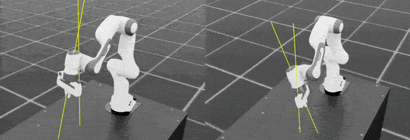
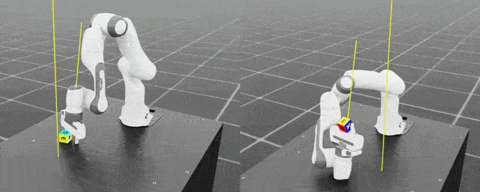

## Move from locomotion to interaction

Before continuing, complete the previous [Isaac Sim and Isaac Lab Learning Path](/learning-paths/laptops-and-desktops/dgx_spark_isaac_robotics/). By completing the Learning Path, you'll build Isaac Sim and install Isaac Lab. You'll configure both Isaac Sim and Isaac Lab on an Arm-based [DGX Spark](https://www.nvidia.com/en-gb/products/workstations/dgx-spark/) system.

{}

Use one compatible Isaac Lab API version set when completing this Learning Path:

| Command tab | Isaac Lab | Isaac Sim | Python |
|---|---|---|---|
| Isaac Lab 2.3 API | `v2.3.2` | 5.1.0 | 3.11 |
| Isaac Lab 3.0 API | `v3.0.0-beta2.patch1` | 6.0.0 or 6.0.1 | 3.12 |

For a direct continuation from the previous Learning Path, use the 2.3 version set. Use the 3.0 version set only if you've installed the [3.0 Beta 2 release](https://isaac-sim.github.io/IsaacLab/release/3.0.0-beta2/source/setup/installation/index.html).

By completing the previous Learning Path, you'll install packages into the Isaac Sim Python environment. There's no virtual environment to activate.

Restore the environment variables and check the installed versions before selecting a tab:

```console
source ~/.bashrc
cd ~/IsaacLab
git describe --tags --always
head -n 1 "${ISAACSIM_PATH}/VERSION"
"${ISAACSIM_PYTHON_EXE}" --version
```

If the versions don't match, follow the documentation for your installed release before continuing. Isaac Lab 3.0 uses the unified `train` and `play` commands.

{}


You'll start by training policies for a seven-degree-of-freedom Franka arm on two tasks:

- Reach: Move the arm's end effector to a target pose
- Lift: Grasp a cube and move it to a target position

These tasks continue the same source-built Isaac Sim and Isaac Lab workflow from the previous Learning Path.

{}

DGX Spark has one GPU, so run the tasks in this Learning Path as single-GPU jobs. If you move the same checkout to a system with two GPUs, Isaac Lab supports distributed training.

PyTorch's distributed launcher creates one process per GPU. Replace `<example task>` with the task to train on a two-GPU system:



python -m torch.distributed.run --nnodes=1 --nproc_per_node=2 \
    scripts/reinforcement_learning/rsl_rl/train.py \
    --task=<example task> \
    --headless \
    --distributed


python -m torch.distributed.run --nnodes=1 --nproc_per_node=2 \
    scripts/reinforcement_learning/train.py \
    --rl_library rsl_rl \
    --task=<example task> \
    --viz none \
    --distributed



For multi-node options and troubleshooting, use the guide for [Isaac Lab 2.3.2](https://isaac-sim.github.io/IsaacLab/v2.3.2/source/features/multi_gpu.html) or [Isaac Lab 3.0 Beta 2](https://isaac-sim.github.io/IsaacLab/release/3.0.0-beta2/source/features/multi_gpu.html).

{}

## Build spatial control

The reach task trains the Franka 7-DOF arm to move its end-effector to a randomly sampled target pose. This is your first manipulation baseline because it teaches position control before adding grasping.

### Run the reach task

Use your existing Isaac Lab setup from the previous Learning Path. Run the following command to train the `Isaac-Reach-Franka-v0` task from the `rsl_rl` library:



cd ~/IsaacLab

# Improve runtime compatibility on aarch64 systems
export LD_PRELOAD="$LD_PRELOAD:/lib/aarch64-linux-gnu/libgomp.so.1"

./isaaclab.sh -p scripts/reinforcement_learning/rsl_rl/train.py \
    --task=Isaac-Reach-Franka-v0 \
    --headless \
    --num_envs=2048


cd ~/IsaacLab

# Improve runtime compatibility on aarch64 systems
export LD_PRELOAD="$LD_PRELOAD:/lib/aarch64-linux-gnu/libgomp.so.1"

./isaaclab.sh train \
    --rl_library rsl_rl \
    --task=Isaac-Reach-Franka-v0 \
    --viz none \
    --num_envs=2048



This training flow uses the RSL-RL implementation of proximal policy optimization (PPO). Its hyperparameters and actor-critic network sizes are defined in `source/isaaclab_tasks/isaaclab_tasks/manager_based/manipulation/<task>/config/franka/agents/rsl_rl_ppo_cfg.py`.

In these config files, the example PPO model sizes are:

* Reach actor and critic: `[64, 64]`
* Lift actor and critic: `[256, 128, 64]`

The default training iterations are:

* Reach: `1000` iterations
* Lift: `1500` iterations

Training the reach task on the DGX Spark will take approximately 10 minutes.

The entry point controls the task configuration, the RL library, and runtime options such as visualization and environment count.

An environment is one simulated task instance. With `--num_envs=2048`, Isaac Lab runs 2048 Franka arms and targets in parallel. PPO uses their combined trajectories to update the actor and critic each iteration.

### Verify the reach task

Set `--checkpoint` to the model file that you want to evaluate. Two environments keep the simulation quick to load:



./isaaclab.sh -p scripts/reinforcement_learning/rsl_rl/play.py \
    --task=Isaac-Reach-Franka-Play-v0 \
    --num_envs=2 \
    --checkpoint=logs/rsl_rl/franka_reach/<run_timestamp>/model_<iteration>.pt


./isaaclab.sh play \
    --rl_library rsl_rl \
    --task=Isaac-Reach-Franka-Play-v0 \
    --num_envs=2 \
    --checkpoint=logs/rsl_rl/franka_reach/<run_timestamp>/model_<iteration>.pt



{}

To inspect the Franka arm, right-click in the viewport and use the **W**, **A**, **S**, and **D** keys to fly the camera. These are standard industry viewport navigation controls used in many 3D tools.

{}



After training, confirm the following:

- The robotic arm can consistently move its end-effector to the target position.
- Multiple environments execute the reaching behavior in parallel.
- The policy no longer shows obvious random oscillation or unstable motion.

The coherent unified memory lets you quickly start and stop training with little data transfer overhead and flexibly scale memory for large environments. The Arm CPU orchestrates training, enabling rapid experimentation and iteration.

## Add physical interaction

After the robot can reach reliably, the next step is physical interaction. In the lift task, you'll train the arm to grasp a cube on the table and lift it to a target height. The policy must coordinate approach, alignment, gripper closure, and stable lifting under contact and gravity.

### Run the lift task

Run the following command to train the `Isaac-Lift-Cube-Franka-v0` task with the PPO algorithm from the `rsl_rl` library:



./isaaclab.sh -p scripts/reinforcement_learning/rsl_rl/train.py \
    --task=Isaac-Lift-Cube-Franka-v0 \
    --headless \
    --num_envs=2048


./isaaclab.sh train \
    --rl_library rsl_rl \
    --task=Isaac-Lift-Cube-Franka-v0 \
    --viz none \
    --num_envs=2048



{}

After an initial run, the end-effector might still fail to lift consistently. To continue training from a checkpoint, rerun with the following additional arguments:



./isaaclab.sh -p scripts/reinforcement_learning/rsl_rl/train.py \
  --task=Isaac-Lift-Cube-Franka-v0 \
  --headless \
  --num_envs=2048 \
  --resume \
  --experiment_name=franka_lift \
  --load_run=<run_timestamp_folder> \
  --checkpoint=model_<iteration>.pt \
  --max_iterations=<additional_iterations>


./isaaclab.sh train \
  --rl_library rsl_rl \
  --task=Isaac-Lift-Cube-Franka-v0 \
  --viz none \
  --num_envs=2048 \
  --resume \
  --experiment_name=franka_lift \
  --load_run=<run_timestamp_folder> \
  --checkpoint=model_<iteration>.pt \
  --max_iterations=<additional_iterations>



Use the run folder format `YYYY-MM-DD_HH-MM-SS` for `--load_run`. Note the underscore between date and time, for example `2026-05-15_09-24-13`.

{}

The output is similar to:

```output
Learning iteration 902/2650
Episode_Reward/lifting_object: 11.2984
ETA: 00:23:11
```

Watch `Episode_Reward/lifting_object` to assess whether the policy is learning to lift the cube without explicitly running a visual simulation of the model. You can see jumps and plateaus during PPO training, so short flat periods are normal. Use the broader trend across many iterations, together with ETA, to decide whether to keep training.

### Verify the lift task

After training, confirm the following:

- The robotic arm can approach the cube and adjust its gripper position.
- The gripper closes at an appropriate time.
- The cube is lifted off the table rather than slipping away or bouncing after collision.


Set `--checkpoint` to the model file that you want to evaluate:



./isaaclab.sh -p scripts/reinforcement_learning/rsl_rl/play.py \
    --task=Isaac-Lift-Cube-Franka-v0 \
    --num_envs=2 \
    --checkpoint=<path_to_checkpoint>


./isaaclab.sh play \
    --rl_library rsl_rl \
    --task=Isaac-Lift-Cube-Franka-v0 \
    --num_envs=2 \
    --checkpoint=<path_to_checkpoint>






## What you've accomplished and what's next

You've evaluated policies for reaching a target pose and lifting a cube, and trained the Franka robotic to complete reach and lift tasks. The arm now has basic grasping ability. However, objects in the real world often introduce more complex mechanical constraints.

Next, you'll explore how a robot can interact with joint-constrained objects such as drawers, and move one step closer to high-precision industrial manipulation tasks.
