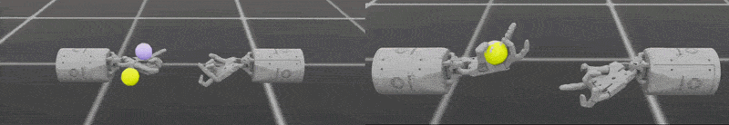

## Coordinate two agents with MAPPO

You'll now use multi-agent reinforcement learning (MARL) to coordinate two Shadow Hands in one simulation.

Multi-agent tasks add coordination and shared success criteria to the control problem.

You'll use the `skrl` library with Multi-Agent Proximal Policy Optimization (MAPPO). MAPPO uses shared state for its critic during training, while each hand acts from its own observations.

Isaac Lab also provides Independent PPO (IPPO), where each agent learns independently. The [Isaac Lab environment list](https://isaac-sim.github.io/IsaacLab/v2.3.2/source/overview/environments.html#comprehensive-list-of-environments) shows supported task and library combinations.

## Coordinate transfer between Shadow Hands

In this task, the policy must solve a classic cooperation scenario. One Shadow Hand holds an object and transfers it to the other hand. Each agent controls only its own motion but must learn to anticipate the other agent's behavior and timing from partial local observations.

MAPPO is well suited for this task because the shared critic can encourage coordinated behavior during training, even though each hand uses only local observations during execution.

### Run the transfer task

From `~/IsaacLab`, use `skrl` and select MAPPO with `--algorithm`:


  
./isaaclab.sh -p scripts/reinforcement_learning/skrl/train.py \
    --task=Isaac-Shadow-Hand-Over-Direct-v0 \
    --headless \
    --algorithm MAPPO
  
  
./isaaclab.sh train \
    --rl_library skrl \
    --task=Isaac-Shadow-Hand-Over-Direct-v0 \
    --viz none \
    --algorithm MAPPO
  


The command loads the task, selects MAPPO, and disables visualization during training.

{}

Training this task can take up to 30 minutes on a DGX Spark.

To try a published checkpoint, skip training and add `--use_pretrained_checkpoint` to the play command. A checkpoint might not be available for every task and Isaac Lab version.
{}

### Verify the transfer task

After training, look for the following behaviors:

- The two hands coordinate rather than moving independently.
- The hand holding the object adjusts its pose to create a feasible transfer path.
- Drops, collisions, and action conflicts decrease as training progresses.

Set `--checkpoint` to the trained MAPPO model you want to evaluate:


  
./isaaclab.sh -p scripts/reinforcement_learning/skrl/play.py \
    --task=Isaac-Shadow-Hand-Over-Direct-v0 \
    --num_envs=1 \
    --algorithm=MAPPO \
    --real-time \
    --checkpoint=<path_to_checkpoint>
  
  
./isaaclab.sh play \
    --rl_library skrl \
    --task=Isaac-Shadow-Hand-Over-Direct-v0 \
    --num_envs=1 \
    --algorithm=MAPPO \
    --real-time \
    --checkpoint=<path_to_checkpoint>
  


### (Optional) Train an example using IPPO

You can also try training an example using the Independent Proximal Policy Optimization (IPPO) algorithm.

To do this, change the `--algorithm` flag to `IPPO` in your training command:


  
./isaaclab.sh -p scripts/reinforcement_learning/skrl/train.py \
    --task=Isaac-Shadow-Hand-Over-Direct-v0 \
    --headless \
    --algorithm IPPO
  
  
./isaaclab.sh train \
    --rl_library skrl \
    --task=Isaac-Shadow-Hand-Over-Direct-v0 \
    --viz none \
    --algorithm IPPO
  


IPPO treats each agent independently. Compare its coordination and convergence with the MAPPO run.

For more environments and supported algorithms, see the [comprehensive list of Isaac Lab environments](https://isaac-sim.github.io/IsaacLab/v2.3.2/source/overview/environments.html#comprehensive-list-of-environments).

## Compare single-agent and multi-agent training

When you move from single-agent tasks to multi-agent training, the change isn't just about adding more controllers. The problem definition itself becomes different.

| Feature | Single-agent | Multi-agent (MAPPO and IPPO) |
| --- | --- | --- |
| Policy | One policy controls the whole robot | Each agent has its own policy, or partially shared policies |
| Observations | Often one observation vector | Each agent receives its own local observations |
| Actions | One action vector | Each agent outputs its own actions |
| Training paradigm | Standard PPO or other single-agent RL | Centralized training with decentralized execution, or independent learning |
| Algorithm flag | Usually not required | Selected with `--algorithm MAPPO` or optionally `--algorithm IPPO` |

{}
Isaac Lab's `skrl` integration supports MAPPO and IPPO directly. Workflows without multi-agent support convert the environment to a single-agent interface.
{}

## What you've accomplished and what's next

You've now configured multiple agents to coordinate two Shadow Hands. Instead of focusing only on whether one robot moves correctly, you now have to think about how multiple agents form a coordinated strategy under partial information.

Your robots can now perform precise actions and even cooperate, but the resulting motion might still look rigid. For humanoid robots that must coexist with people, moving in a more natural way is another important challenge.

Next, you'll explore Adversarial Motion Priors (AMP) and learn how robots can use reference motion data to produce more natural and fluent behavior.
