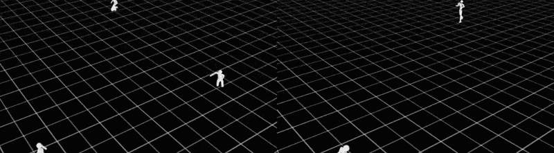

## From completing tasks to moving naturally

In the previous section, you used an Arm-based Isaac Sim / Isaac Lab environment to run manipulation, contact-rich interaction, and multi-agent training tasks. This section continues on the same platform and introduces **Adversarial Motion Priors (AMP)**, a workflow that helps reinforcement learning policies produce motion that looks more natural and human-like.

Traditional reinforcement learning can teach a robot to walk, run, or satisfy control objectives, but the resulting motion is often effective rather than natural. For robots that must coexist with people, interact in human environments, or demonstrate expressive behavior, that is usually not enough. Isaac Lab therefore supports **AMP**, which uses reference **motion-capture data** to guide policy learning toward smoother and more realistic movement.

AMP comes from the SIGGRAPH 2021 paper by researchers at UC Berkeley and collaborators: [Adversarial Motion Priors for Stylized Physics-Based Character Control](https://arxiv.org/abs/2104.02180). At a high level, AMP works like a generative adversarial setup. A policy generates simulated motion, while a discriminator compares that motion against an unlabeled set of natural movement clips, often from motion capture. The policy then learns not only to complete the task reward, but also to produce trajectories that look statistically closer to the reference motion.

In this section, you will use the **skrl** library with the `--algorithm AMP` flag to run humanoid walking, running, and dancing tasks.

As in the previous section, the Arm value in this workflow is mainly about **workflow control**. Developers can use Python scripts, task flags, and algorithm options to switch tasks, control training flow, and iterate on experiments, while the GPU continues to support the heavy simulation and training workload.

## Task 1: Humanoid Walk — learning a natural gait

### Scenario goal

Use human walking reference data to train a humanoid robot to produce stable and natural walking behavior.

### Run

From `~/IsaacLab`, launch skrl training with `--algorithm AMP`:



./isaaclab.sh -p scripts/reinforcement_learning/skrl/train.py \
  --task=Isaac-Humanoid-AMP-Walk-Direct-v0 \
  --headless \
  --algorithm AMP \
  --max_iterations=1000


./isaaclab.sh train \
  --rl_library skrl \
  --task=Isaac-Humanoid-AMP-Walk-Direct-v0 \
  --viz none \
  --algorithm AMP \
  --max_iterations=1000



These commands use 1,000 iterations for a short baseline. The upstream task configuration defaults to 5,000 iterations; resume training to compare with the later examples.

### Verify

After training, look for the following behaviors:

* The humanoid moves forward stably instead of losing balance frequently.
* The gait shows smoother center-of-mass transfer instead of stiff hopping-like motion.
* The left and right leg timing resembles a more natural walking pattern.



./isaaclab.sh -p scripts/reinforcement_learning/skrl/play.py \
  --task=Isaac-Humanoid-AMP-Walk-Direct-v0 \
  --algorithm=AMP \
  --num_envs=16 \
  --checkpoint=logs/skrl/humanoid_amp_walk/<run_timestamp>/checkpoints/best_agent.pt \
  --real-time


./isaaclab.sh play \
  --rl_library skrl \
  --task=Isaac-Humanoid-AMP-Walk-Direct-v0 \
  --algorithm=AMP \
  --num_envs=16 \
  --checkpoint=logs/skrl/humanoid_amp_walk/<run_timestamp>/checkpoints/best_agent.pt \
  --real-time



## Task 2: Humanoid Run — adding speed and coordination

If walking is mainly about stability and rhythm, running introduces a higher level of dynamic coordination. The robot must generate propulsion in a shorter contact window, keep the body balanced, and avoid losing control as motion amplitude increases.

### Scenario goal

Use human running reference data to train a humanoid robot to maintain a natural and controllable running pattern at higher speed.

### Run



./isaaclab.sh -p scripts/reinforcement_learning/skrl/train.py \
    --task=Isaac-Humanoid-AMP-Run-Direct-v0 \
    --headless \
    --algorithm AMP \
    --max_iterations=1000 


./isaaclab.sh train \
    --rl_library skrl \
    --task=Isaac-Humanoid-AMP-Run-Direct-v0 \
    --viz none \
    --algorithm AMP \
    --max_iterations=1000



### What changes in the workflow

Keep the same entry point and AMP algorithm. Change only `--task` to select running instead of walking.

### Verify

After training, confirm the following:

* As forward speed increases, the robot remains stable rather than falling immediately.
* Arm swing, leg lift, and landing timing become more coordinated.
* The motion looks like a recognizable running pattern rather than uncontrolled forward movement.



./isaaclab.sh -p scripts/reinforcement_learning/skrl/play.py \
  --task=Isaac-Humanoid-AMP-Run-Direct-v0 \
  --algorithm=AMP \
  --num_envs=16 \
  --checkpoint=logs/skrl/humanoid_amp_run/<run_timestamp>/checkpoints/best_agent.pt \
  --real-time


./isaaclab.sh play \
  --rl_library skrl \
  --task=Isaac-Humanoid-AMP-Run-Direct-v0 \
  --algorithm=AMP \
  --num_envs=16 \
  --checkpoint=logs/skrl/humanoid_amp_run/<run_timestamp>/checkpoints/best_agent.pt \
  --real-time



{}

To continue training from a checkpoint, run:



./isaaclab.sh -p scripts/reinforcement_learning/skrl/train.py \
    --task=Isaac-Humanoid-AMP-Run-Direct-v0 \
    --headless \
    --algorithm AMP \
    --max_iterations=<number of additional iterations (Epochs)> \
    --checkpoint=<path_to_checkpoint>


./isaaclab.sh train \
    --rl_library skrl \
    --task=Isaac-Humanoid-AMP-Run-Direct-v0 \
    --viz none \
    --algorithm AMP \
    --max_iterations=<number of additional iterations (Epochs)> \
    --checkpoint=<path_to_checkpoint>



{}

Try training the model further to see if the skipping-like motion evolves into a run.

## Optional task 3: Humanoid Dance

To optionally test style-heavy motion generation, run this AMP dance task:



./isaaclab.sh -p scripts/reinforcement_learning/skrl/train.py \
    --task=Isaac-Humanoid-AMP-Dance-Direct-v0 \
    --headless \
    --algorithm AMP


./isaaclab.sh train \
    --rl_library skrl \
    --task=Isaac-Humanoid-AMP-Dance-Direct-v0 \
    --viz none \
    --algorithm AMP



{}

As of May 2026, training this model with the default number of iterations typically takes several hours on a DGX Spark. A pre-trained checkpoint for this task is not available at this time, so you will need to train the model from scratch.

{}

## AMP task overview

| Task | Reference motion data | Expected outcome |
|---|---|---|
| Isaac-Humanoid-AMP-Walk-Direct-v0 | Human walking capture data | Natural and stable walking gait |
| Isaac-Humanoid-AMP-Run-Direct-v0 | Human running capture data | Smoother high-speed running behavior |
| Isaac-Humanoid-AMP-Dance-Direct-v0 | Human dance capture data | Rhythmic and expressive dance motion |

AMP combines the task reward with a learned motion-style reward from the reference data.

## Next up

You have now worked through the main workflows in this series, from basic manipulation to high-precision assembly, multi-agent cooperation, and natural-motion imitation.

In the next section, you will summarize the full tutorial and compare the main RL libraries supported by Isaac Lab.
