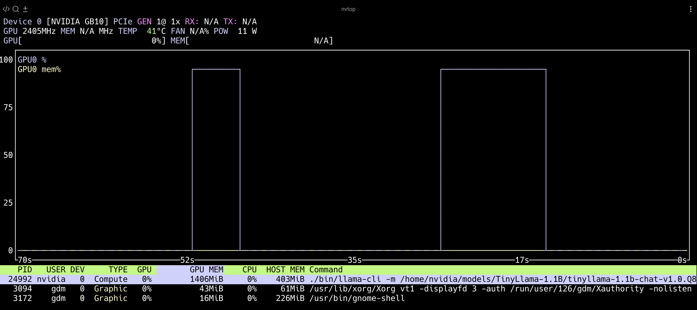

## How do I build the GPU version of llama.cpp on GB10?

In the previous section, you verified that your DGX Spark system is correctly configured with the Grace CPU, Blackwell GPU, and CUDA 13 environment.

Now that your hardware and drivers are ready, this section focuses on building the GPU-enabled version of llama.cpp, a lightweight, portable inference engine optimized for quantized LLM workloads on NVIDIA Blackwell GPUs.

llama.cpp is an open-source project by Georgi Gerganov that provides efficient and dependency-free large language model inference on both CPUs and GPUs. 

### Step 1: Preparation

In this step, you will install the necessary build tools and download a small quantized model for validation.

```bash
sudo apt update
sudo apt install -y git cmake build-essential nvtop htop
```

These packages provide the C/C++ compiler toolchain, CMake build system, and GPU monitoring utility (nvtop) required to compile and test llama.cpp.

To verify your GPU build later, you need at least one quantized model for testing.

First, ensure that you have the latest Hugging Face Hub CLI installed and download models:

```bash
mkdir ~/models
cd ~/models
python3 -m venv venv
pip install -U huggingface_hub
hf download TheBloke/TinyLlama-1.1B-Chat-v1.0-GGUF --local-dir TinyLlama-1.1B
```

After the download completes, the models will be available in the `~/models` directory.

Great! You’ve installed all the required build tools and downloaded a quantized model for validation. Your environment is ready for source code setup.

### Step 2: Clone the llama.cpp repository

Use the commands below to download the source code for llama.cpp from GitHub.

```bash
cd ~
git clone https://github.com/ggerganov/llama.cpp.git
cd ~/llama.cpp
```

Nice work! You now have the latest llama.cpp source code on your DGX Spark system.

### Step 3: Configure and Build the CUDA-Enabled Version (GPU Mode)

Run the following `cmake` command to configure the build system for GPU acceleration.

This command enables CUDA support and prepares llama.cpp for compiling GPU-optimized kernels.

```bash
mkdir -p build-gpu
cd build-gpu
cmake .. \
	-DCMAKE_BUILD_TYPE=Release \
	-DGGML_CUDA=ON \
	-DGGML_CUDA_F16=ON \
	-DCMAKE_CUDA_ARCHITECTURES=121 \
	-DCMAKE_C_COMPILER=gcc \
	-DCMAKE_CXX_COMPILER=g++ \
	-DCMAKE_CUDA_COMPILER=nvcc
```

Explanation of Key Flags:

| **Feature** | **Description / Impact** |
|--------------|------------------------------|
| -DGGML_CUDA=ON | Enables the CUDA backend in llama.cpp, allowing matrix operations and transformer layers to be offloaded to the GPU for acceleration.|
| -DGGML_CUDA_F16=ON | Enables FP16 (half-precision) CUDA kernels, reducing memory usage and increasing throughput — especially effective for quantized models (e.g., Q4, Q5). |
| -DCMAKE_CUDA_ARCHITECTURES=121 | Specifies the compute capability for the NVIDIA Blackwell GPU (GB10 = sm_121), ensuring the CUDA compiler (nvcc) generates optimized GPU kernels. |

When the configuration process completes successfully, the terminal should display output similar to the following:

```output
-- Configuring done (2.0s)
-- Generating done (0.1s)
-- Build files have been written to: /home/nvidia/llama.cpp/build-gpu
```

{}
1. For systems with multiple CUDA versions installed, explicitly specifying the compilers (`-DCMAKE_C_COMPILER`, `-DCMAKE_CXX_COMPILER`, `-DCMAKE_CUDA_COMPILER`) ensures that CMake uses the correct CUDA 13.0 toolchain.  
2. In case of configuration errors, revisit the previous section to verify that your CUDA toolkit and driver versions are properly installed and aligned with Blackwell (sm_121) support.
{}

Once CMake configuration succeeds, start the compilation process:

```bash
make -j"$(nproc)"
```

This command compiles all CUDA and C++ source files in parallel, utilizing all available CPU cores for optimal build performance. On the Grace CPU in the DGX Spark system, the build process typically completes within 2–4 minutes, demonstrating the efficiency of the Arm-based architecture for software development.

The build output is shown below:

```output
[  0%] Building C object examples/gguf-hash/CMakeFiles/sha1.dir/deps/sha1/sha1.c.o
[ 15%] Building CUDA object ggml/src/ggml-cuda/CMakeFiles/ggml-cuda.dir/cpy.cu.o
[ 50%] Building CXX object src/CMakeFiles/llama.dir/llama-sampling.cpp.o
[100%] Built target test-backend-ops
[100%] Linking CXX executable ../../bin/llama-server
[100%] Built target llama-server
```

After the build completes, the GPU-accelerated binaries will be located under `~/llama.cpp/build-gpu/bin/`

These binaries provide all necessary tools for quantized model inference (llama-cli) and for serving GPU inference via HTTP API (llama-server). You are now ready to test quantized LLMs with full GPU acceleration in the next step.

Excellent! The CUDA-enabled build is complete. Your binaries are optimized for the Blackwell GPU and ready for validation.

Together, these options ensure that the build targets the Grace Blackwell GPU with full CUDA 13 compatibility.

### Step 4: Validate the CUDA-enabled build

After the build completes successfully, verify that the GPU-enabled binary of *llama.cpp is correctly linked to the NVIDIA CUDA runtime.

To verify CUDA linkage, run the following command:

```bash
ldd bin/llama-cli | grep cuda
```

The output is similar to:

```output
	libggml-cuda.so => /home/nvidia/llama.cpp/build-gpu/bin/libggml-cuda.so (0x0000eee1e8e30000)
	libcudart.so.13 => /usr/local/cuda/targets/sbsa-linux/lib/libcudart.so.13 (0x0000eee1e83b0000)
	libcublas.so.13 => /usr/local/cuda/targets/sbsa-linux/lib/libcublas.so.13 (0x0000eee1e4860000)
	libcuda.so.1 => /lib/aarch64-linux-gnu/libcuda.so.1 (0x0000eee1debd0000)
	libcublasLt.so.13 => /usr/local/cuda/targets/sbsa-linux/lib/libcublasLt.so.13 (0x0000eee1b36c0000)
```

If the CUDA library is correctly linked, it confirms that the binary can access the GPU through the system driver.

Next, confirm that the binary initializes the GPU correctly by checking device detection and compute capability.

```bash
./bin/llama-server --version
```

The expected output is:

```output
ggml_cuda_init: GGML_CUDA_FORCE_MMQ:    no
ggml_cuda_init: GGML_CUDA_FORCE_CUBLAS: no
ggml_cuda_init: found 1 CUDA devices:
  Device 0: NVIDIA GB10, compute capability 12.1, VMM: yes
version: 6819 (19a5a3ed)
built with gcc (Ubuntu 12.4.0-2ubuntu1~24.04) 12.4.0 for aarch64-linux-gnu
```

The message "compute capability 12.1" confirms that the build was compiled specifically for the Blackwell GPU (sm_121) and that CUDA 13.0 is functioning correctly.

Next, use the downloaded quantized model (for example, TinyLlama-1.1B) to verify that inference executes successfully on the GPU:

```bash
./bin/llama-cli \
	-m ~/models/TinyLlama-1.1B/tinyllama-1.1b-chat-v1.0.Q8_0.gguf \
	-ngl 32 \
	-t 16 \
	-p "Explain the advantages of the Armv9 architecture."
```

If the build is successful, you will see text generation begin within a few seconds.

While `nvidia-smi` can display basic GPU information, `nvtop` provides real-time visualization of utilization, temperature, and power metrics which are useful for verifying CUDA kernel activity during inference.

```bash
nvtop
```

The following screenshot shows GPU utilization during TinyLlama inference on DGX Spark.



The nvtop interface shows:

 - GPU Utilization (%): Confirms CUDA kernels are active.
 - Memory Usage (VRAM): Shows model loading and runtime footprint.
 - Temperature / Power Draw: Monitors thermal stability under sustained workloads.

You have now successfully built and validated the CUDA-enabled version of llama.cpp on DGX Spark.

Success! You’ve confirmed that the GPU-accelerated version of llama.cpp is correctly built and can run quantized LLM inference on your DGX Spark.

## What have I achieved?

You have:
- Installed all required tools and dependencies
- Downloaded a quantized model for testing
- Built the CUDA-enabled version of llama.cpp
- Verified GPU linkage and successful inference

You’re ready to move on to building and testing the CPU-only version! You will build the optimized CPU-only version of llama.cpp and explore how the Grace CPU executes Armv9 vector instructions during inference.
