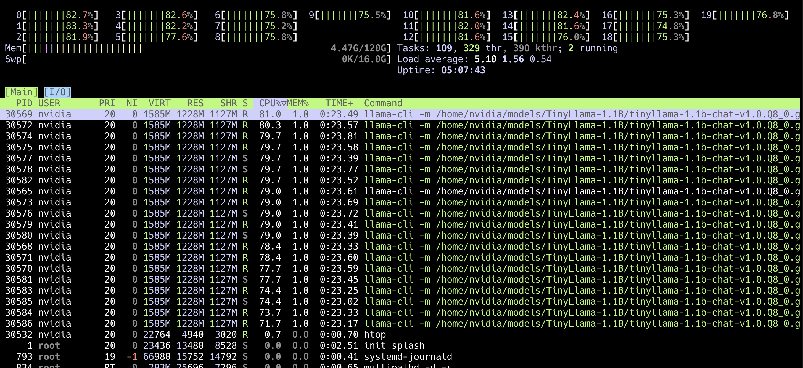

## How do I build the CPU version of llama.cpp on GB10?

Use the steps below to build and test the CPU only versoin of llama.cpp.

### Step 1: Configure and Build the CPU-Only Version

In this session, you will configure and build the CPU-only version of llama.cpp, optimized for the Armv9-based Grace CPU.

This build runs entirely on the Grace CPU (Arm Cortex-X925 and Cortex-A725), which supports advanced Armv9 vector extensions including SVE2, BFloat16, and I8MM, making it highly efficient for quantized inference workloads even without GPU acceleration.

Start from a clean directory to ensure a clean separation from the GPU build artifacts.

Run the following commands to configure the build system for the CPU-only version of llama.cpp.

```bash
cd ~/llama.cpp
mkdir -p build-cpu
cd build-cpu

cmake .. \
	-DCMAKE_BUILD_TYPE=Release \
	-DCMAKE_SYSTEM_PROCESSOR=aarch64 \
	-DLLAMA_ACCELERATE=ON \
	-DLLAMA_BLAS=OFF \
	-DCMAKE_C_COMPILER=gcc \
	-DCMAKE_CXX_COMPILER=g++ \
	-DCMAKE_C_FLAGS="-O3 -march=armv9-a+sve2+bf16+i8mm -mtune=native -fopenmp" \
	-DCMAKE_CXX_FLAGS="-O3 -march=armv9-a+sve2+bf16+i8mm -mtune=native -fopenmp"
```

Explanation of Key Flags:

| **Feature** | **Description / Impact** |
|--------------|------------------------------|
| -march=armv9-a | Targets the Armv9-A architecture used by the Grace CPU and enables advanced vector extensions.|
| +sve2+bf16+i8mm | Activates Scalable Vector Extensions (SVE2), INT8 matrix multiply (I8MM), and BFloat16 operations for quantized inference.|
| -fopenmp | Enables multi-threaded execution via OpenMP, allowing all 20 Grace cores to be utilized.|
| -mtune=native | Optimizes code generation for the local Grace CPU microarchitecture.|
| -DLLAMA_ACCELERATE=ON | Enables llama.cpp’s internal Arm acceleration path (Neon/SVE optimized kernels).|

When the configuration process completes successfully, the terminal should display output similar to the following:

```output
-- Configuring done (1.1s)
-- Generating done (0.1s)
-- Build files have been written to: /home/nvidia/llama.cpp/build-cpu
```

Then, start the compilation process:

```bash
make -j"$(nproc)"
```

{}
If the build fails after modifying optimization flags, it is likely due to a stale CMake cache.
Run the following commands to perform a clean reconfiguration:

```bash
cmake --fresh .
make -j"$(nproc)"
```
{}


The CPU build on the DGX Spark completes in about 20 seconds, even faster than the GPU build.

The build output is shown below:

```output
[ 25%] Building CXX object src/CMakeFiles/llama.dir/llama-model-loader.cpp.o
[ 50%] Linking CXX executable ../bin/test-tokenizer-0
[ 75%] Linking CXX executable ../bin/test-alloc
[100%] Linking CXX executable ../../bin/llama-server
[100%] Built target llama-server
```

After the build finishes, the CPU-optimized binaries will be available under `~/llama.cpp/build-cpu/bin/`

### Step 2: Validate the CPU-Enabled Build (CPU Mode)

In this step, you will validate that the binary was compiled in CPU-only mode and runs correctly on the Grace CPU.

```bash
./bin/llama-server --version
```

Expected output:

```output
version: 6819 (19a5a3ed)
built with gcc (Ubuntu 12.4.0-2ubuntu1~24.04) 12.4.0 for aarch64-linux-gnu
```

The message indicates the build is a CPU-only binary optimized for the Grace CPU.

Next, use the downloaded quantized model (for example, TinyLlama-1.1B) to verify that inference executes successfully on the CPU:

```bash
./bin/llama-cli \
	-m ~/models/TinyLlama-1.1B/tinyllama-1.1b-chat-v1.0.Q8_0.gguf \
	-ngl 0 \
	-t 20 \
	-p "Explain the advantages of the Armv9 architecture."
```

Here is an explanation of the key flags:

- `-ngl 0` disables GPU offloading (CPU-only execution)
- `-t 20` uses 20 threads (1 per Grace CPU core)

If the build is successful, you will observe smooth model initialization and token generation, with CPU utilization increasing across all cores.

For live CPU utilization and power metrics, use `htop`:

```bash
htop
```

The following screenshot shows CPU utilization and thread activity during TinyLlama inference on DGX Spark, confirming full multi-core engagement.


The `htop` interface shows:

- CPU Utilization: All 20 cores operate between 75–85%, confirming efficient multi-thread scaling.
- Load Average: Around 5.0, indicating balanced workload distribution.
- Memory Usage: Approximately 4.5 GB total for the TinyLlama Q8_0 model.
- Process List: Displays multiple `llama-cli` threads (each 7–9% CPU), confirming OpenMP parallelism 

{}
In htop, press F6 to sort by CPU% and verify load distribution, or press `t` to toggle the tree view, which shows the `llama-cli` main process and its worker threads.
{}

In this section you have:
- Built and validated the CPU-only version of llama.cpp.
- Optimized the Grace CPU build using Armv9 vector extensions (SVE2, BF16, I8MM).
- Tested quantized model inference using the TinyLlama Q8_0 model.
- Used monitoring tools (htop) to confirm efficient CPU utilization.

You have now successfully built and validated the CPU-only version of llama.cpp on the Grace CPU.

In the next section, you will learn how to use the Process Watch tool to visualize instruction-level execution and better understand how Armv9 vectorization (SVE2 and NEON) accelerates quantized LLM inference on the Grace CPU.
