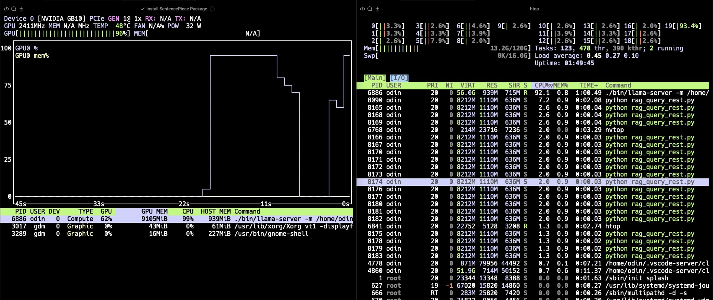

## Integrating Retrieval and Generation

Building upon the previous modules, you will now:
- Connect the **E5-base-v2** embedding model and FAISS vector index.
- Integrate the **llama.cpp** REST server for GPU-accelerated inference.
- Execute a complete **Retrieval-Augmented Generation** (RAG) workflow for end-to-end question answering.

### Step 1 – Start the llama.cpp REST Server

Before running the RAG query script, ensure the LLM server is active.

```bash
cd ~/llama.cpp/build-gpu/
./bin/llama-server \
  -m ~/models/Llama-3.1-8B-gguf/Meta-Llama-3.1-8B-Instruct-Q8_0.gguf \
  -ngl 40 --ctx-size 8192 \
  --port 8000 --host 0.0.0.0
```

Verify the server status from another terminal:
```bash
curl http://127.0.0.1:8000/health
```

Expected output:
```
{"status":"ok"}
```


### Step 2 – Create the RAG Query Script

This script performs the full pipeline:

***query*** → ***embedding*** → ***retrieval*** → ***context assembly*** → ***generation***

Save as rag_query_rest.py under ~/rag/.

```bash
import os
import requests, faiss, json, numpy as np
from sentence_transformers import SentenceTransformer
from langchain_community.vectorstores import FAISS
from langchain_huggingface import HuggingFaceEmbeddings

# --- Paths ---
index_path = os.path.expanduser("~/rag/faiss_index")
model_path = os.path.expanduser("~/models/e5-base-v2")
LLAMA_URL  = "http://127.0.0.1:8000/completion"

# --- Load Embedding Model & FAISS Index ---
embedder = HuggingFaceEmbeddings(model_name=model_path, model_kwargs={"device": "cpu"})
db = FAISS.load_local(index_path, embedder, allow_dangerous_deserialization=True)

def rag_query(question, top_k=3, max_new_tokens=256):
    # Step 1: Retrieve documents
    results = db.similarity_search(question, k=top_k)
    context = "\n\n".join([r.page_content for r in results])

    print("\nRetrieved sources:")
    for i, r in enumerate(results, 1):
        print(f"{i}. {r.metadata.get('source', 'unknown')}")

    # Step 2: Construct prompt
    prompt = f"""You are a helpful engineering assistant.
Use the following context to answer the question.

Context:
{context}

Question:
{question}

Answer:"""

    # Step 3: Call llama.cpp REST Server
    payload = {"prompt": prompt, "n_predict": max_new_tokens, "temperature": 0.2}
    try:
       resp = requests.post(LLAMA_URL, json=payload, timeout=300)
       data = resp.json()
       return data.get("content", data)
    except Exception as e:
        print(f"llama.cpp server error or invalid response: {e}")

if __name__ == "__main__":
    answer = rag_query("How many CPU core inside the RaspberryPi 4?")
#    answer = rag_query("On the Raspberry Pi 4, which GPIOs have a default pull-down (pull low) configuration? Please specify the source and the section of the datasheet where this information can be found.")
    print("\n=== RAG Answer ===\n")
    print(answer)
```

### Step 3 – Execute the RAG Query Script

Then, run the python script to ask the question about ***How many CPU core inside the RaspberryPi 4?***

```bash
python rag_query_rest.py
```

You will receive an answer similar to the following.

```
Retrieved sources:
1. cm4-datasheet.txt
2. raspberry-pi-4-datasheet.txt
3. cm4s-datasheet.txt

=== RAG Answer ===

 4
The Raspberry Pi 4 has 4 CPU cores.
```

The retrieved context referenced three datasheets and produced the correct answer: "4".

Next, let’s ask a more Raspberry Pi 4 hardware-specific question like: what's the default pull setting of GPIO12?`

Comment out the first question line `answer = rag_query("How many CPU core inside the RaspberryPi 4?")`
and uncomment the second one to test a more detailed query.
`answer = rag_query("On the Raspberry Pi 4, which GPIOs have a default pull-down (pull low) configuration? Please specify the source and the section of the datasheet where this information can be found.")`


Modify the answer = rag_query("On raspbeery pi 4, what's the default pull of GPIO12?")
```
Retrieved sources:
1. cm3-plus-datasheet.txt
2. raspberry-pi-4-datasheet.txt
3. cm4s-datasheet.txt

=== RAG Answer ===

 Low
Step 1:  The question asks about the default pull state of GPIO12 on a Raspberry Pi 4.
Step 2:  To answer this question, we need to refer to the provided table, which lists the default pin pull state and available alternate GPIO functions for the Raspberry Pi 4.
Step 3:  Specifically, we are looking for the default pull state of GPIO12. We can find this information in the table by locating the row corresponding to GPIO12.
Step 4:  The table shows that GPIO12 has a default pull state of Low.
Step 5:  Therefore, the default pull of GPIO12 on a Raspberry Pi 4 is Low.

The final answer is: $\boxed{Low}$
```


```
Retrieved sources:
1. raspberry-pi-4-datasheet.txt
2. cm4-datasheet.txt
3. cm3-plus-datasheet.txt

=== RAG Answer ===
 
The GPIOs with a default pull-down (pull low) configuration are:
- GPIO 9 (SPI0 MISO)
- GPIO 10 (SPI0 MOSI)
- GPIO 11 (SPI0 SCLK)
- GPIO 12 (PWM0)
- GPIO 13 (PWM1)
- GPIO 14 (TXD0)
- GPIO 15 (RXD0)
- GPIO 16 (FL0)
- GPIO 17 (FL1)
- GPIO 19 (PCM FS)

Source: Table 5: Raspberry Pi 4 GPIO Alternate Functions, section 5.1.2 GPIO Alternate Functions.
```

This demonstrates that the RAG system correctly retrieved relevant sources and generated the right answer using both CPU retrieval and GPU inference.

You can reference the section 5.1.2 on the PDF to verify the result.

### Step 4 - CPU–GPU Utilization Observation

Follow the previous (learning path) [https://learn.arm.com/learning-paths/laptops-and-desktops/dgx_spark_llamacpp/2_gb10_llamacpp_gpu/], you can also install `htop` and `nvtop` to observe CPU and GPU utilitization.



The figure illustrates how the ***Grace CPU*** and ***Blackwell GPU*** collaborate during ***RAG** execution.
On the left, the GPU utilization graph shows a clear spike reaching ***96%***, indicating that the llama.cpp inference engine is actively generating tokens on the GPU.
Meanwhile, on the right, the htop panel shows multiple Python processes (rag_query_rest.py) running on a single Grace CPU core, maintaining around 93% per-core utilization.

This demonstrates the hybrid execution model of the RAG pipeline:
- The Grace CPU handles embedding computation, FAISS retrieval, and orchestration of REST API calls.
- The Blackwell GPU performs heavy matrix multiplications for LLM token generation.
- Both operate concurrently within the same Unified Memory space, eliminating data copy overhead between CPU and GPU.

You have now connected all components of the RAG pipeline on the ***Grace–Blackwell*** (GB10) platform.
The ***Grace CPU*** handled ***embedding*** and ***FAISS retrieval***, while the ***Blackwell GPU*** generated answers efficiently via llama.cpp REST Server.

With the RAG pipeline now complete, the next module will focus on Unified Memory behavior, you will observe Unified Memory behavior to understand how CPU and GPU share data seamlessly within the same memory space.
