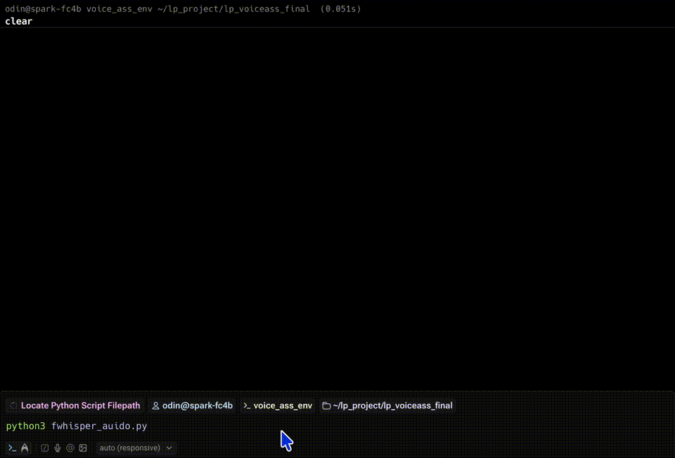

## Build a CPU-based speech-to-text engine

In this section, you'll build a real-time speech-to-text (STT) pipeline using only the CPU. Starting from a basic 10-second recorder, you'll incrementally add noise filtering, sentence segmentation, and parallel audio processing to achieve a transcription engine for Arm-based systems like DGX Spark.

You'll start from a minimal loop and iterate toward a multithreaded, VAD-enhanced STT engine.

### Step 1: Upgrade model and add Voice Activity Detection

Build on the `transcribe.py` script from the previous section by upgrading to a more accurate model and adding Voice Activity Detection (VAD) to filter out silence and background noise.

This step makes two important improvements:

**Model upgrade**: Replace `small.en` with `medium.en` for better transcription quality, especially for conversational speech or uncommon vocabulary. The medium model provides significantly better recognition for less common words and accents, while `compute_type="int8"` on CPU provides the best balance of speed and accuracy.

**Voice Activity Detection**: Add webrtcvad to classify each 30ms audio frame as either speech or silence. If no speech is detected in the 10-second window, transcription is skipped. This provides an efficient first filter before buffering or turn detection, avoiding wasted processing on silent periods.

Update your existing `transcribe.py` with the following complete code:

```python
import sounddevice as sd
import numpy as np
import webrtcvad
from faster_whisper import WhisperModel

SAMPLE_RATE = 16000
DURATION = 10  # seconds per loop
device = "cpu"  # or "gpu"
compute_type = "int8"  # or "float16", "int8", "int4"

FRAME_DURATION_MS = 30
FRAME_SIZE = int(SAMPLE_RATE * FRAME_DURATION_MS / 1000)

VAD_MODE = 3   # Aggressive mode
vad = webrtcvad.Vad(VAD_MODE)

def record_audio():
    print(" Recording for 10 seconds...")
    with sd.InputStream(samplerate=SAMPLE_RATE, channels=1, dtype='float32') as stream:
        audio = stream.read(int(SAMPLE_RATE * DURATION))[0]
    sd.wait()
    print(" Recording complete.")
    return audio.flatten()

def contains_speech(audio):
    pcm = (audio * 32768).astype(np.int16).tobytes()
    for i in range(0, len(pcm), FRAME_SIZE * 2):
        frame = pcm[i:i + FRAME_SIZE * 2]
        if len(frame) < FRAME_SIZE * 2:
            break
        if vad.is_speech(frame, SAMPLE_RATE):
            return True
    return False

def transcribe_audio(audio):
    model = WhisperModel("medium.en", device=device, compute_type=compute_type)
    print(" Transcribing...")
    segments, _ = model.transcribe(audio, language="en")
    for segment in segments:
        print(f"[{segment.start:.2f}s - {segment.end:.2f}s] {segment.text.strip()}")
    print(" Done.\n")

if __name__ == "__main__":
    try:
        while True:
            audio_data = record_audio()
            if contains_speech(audio_data):
                transcribe_audio(audio_data)
            else:
                print(" No speech detected. Skipping transcription.")
    except KeyboardInterrupt:
        print(" Stopped by user.")
```

Run the updated script:

```bash
python3 ./transcribe.py
```

When you speak to the device, the output is similar to:

```output
 Recording for 10 seconds...
 Recording complete.
 No speech detected. Skipping transcription.
 Recording for 10 seconds...
 Recording complete.
 Transcribing...
[0.00s - 10.00s] Hi, I forgot my account password and need help resetting it as soon as possible.
 Done.

 Recording for 10 seconds...
 Recording complete.
 Transcribing...
[0.00s - 10.00s] I want to cancel my subscription this month.
 Done.
```

{}
faster-whisper supports many models like tiny, base, small, medium and large-v1/2/3.
See the [GitHub repository](https://github.com/openai/whisper?tab=readme-ov-file#available-models-and-languages) for more model details.
{}


### Step 2: Add turn segmentation with multi-threaded audio capture

While VAD helps detect the presence of speech, natural conversations require more sophisticated handling. Users often pause briefly or trail off in their speech, and if a voice assistant transcribes audio too early, it produces incomplete or fragmented sentences.

This step adds two critical improvements:

**Turn segmentation with timing thresholds**: Use `SILENCE_LIMIT_SEC` to wait until the user is silent for a set duration before deciding a speech segment has ended, and `MIN_SPEECH_SEC` to discard segments that are too short to be meaningful (such as false starts or background chatter). This ensures the assistant captures full sentences before running inference.

**Multi-threaded audio collection**: Separate audio input into a background thread while keeping transcription in the main loop. This enables continuous frame capture with no blocking, smooth real-time responsiveness, and modular code that's easier to scale or extend. Use Python's `threading.Thread` to read audio in the background and a thread-safe `queue.Queue` to pass frames to the main loop.

Here's the complete implementation:

```python
import pyaudio
import numpy as np
import webrtcvad
import time
import torch
import threading
import queue
from faster_whisper import WhisperModel
from collections import deque

# --- Parameters ---
SAMPLE_RATE = 16000
FRAME_DURATION_MS = 30
FRAME_SIZE = int(SAMPLE_RATE * FRAME_DURATION_MS / 1000)
VAD_MODE = 3
SILENCE_LIMIT_SEC = 1.0
MIN_SPEECH_SEC = 2.0

# --- Init VAD and buffers ---
vad = webrtcvad.Vad(VAD_MODE)
speech_buffer = deque()
speech_started = False
last_speech_time = time.time()

# --- Init Thread and Queue ---
audio_queue = queue.Queue()
stop_event = threading.Event()

# --- Init Whisper model ---
device = "cpu"  # "cpu" or "gpu"
compute_type = "int8"  # "int8" or "float16", "int8", "int4"
model = WhisperModel("medium.en", device=device, compute_type=compute_type)

# --- Audio capture thread ---
def audio_capture():
    pa = pyaudio.PyAudio()
    stream = pa.open(format=pyaudio.paInt16,
                     channels=1,
                     rate=SAMPLE_RATE,
                     input=True,
                     frames_per_buffer=FRAME_SIZE)
    print(" Listening... Press Ctrl+C to stop")
    try:
        while not stop_event.is_set():
            frame = stream.read(FRAME_SIZE, exception_on_overflow=False)
            audio_queue.put(frame)
    finally:
        stream.stop_stream()
        stream.close()
        pa.terminate()

# --- Start audio capture thread ---
threading.Thread(target=audio_capture, daemon=True).start()

# --- Main loop: process queue and transcribe ---
try:
    while True:
        if audio_queue.empty():
            time.sleep(0.01)
            continue

        frame = audio_queue.get()
        is_speech = vad.is_speech(frame, SAMPLE_RATE)

        if is_speech:
            speech_buffer.append(frame)
            speech_started = True
            last_speech_time = time.time()
        elif speech_started:
            speech_duration = len(speech_buffer) * (FRAME_DURATION_MS / 1000.0)
            silence_duration = time.time() - last_speech_time

            if silence_duration > SILENCE_LIMIT_SEC:
                if speech_duration >= MIN_SPEECH_SEC:
                    print(" Transcribing buffered speech...")
                    audio_bytes = b"".join(speech_buffer)
                    audio_np = np.frombuffer(audio_bytes, dtype=np.int16).astype(np.float32) / 32768.0

                    segments, _ = model.transcribe(audio_np, language="en")
                    for seg in segments:
                        print(f"[{seg.start:.2f}s - {seg.end:.2f}s] {seg.text.strip()}")
                    print(" Segment done.\n")
                else:
                    print(f" Skipped short segment ({speech_duration:.2f}s < {MIN_SPEECH_SEC}s)")

                speech_buffer.clear()
                speech_started = False
except KeyboardInterrupt:
    print(" Stopped")
finally:
    stop_event.set()
```

Run the updated code:

```bash
python transcribe.py
```

Speak into your microphone. The system now captures audio in a background thread, buffers speech segments, and transcribes them when you pause. You'll see cleaner turn segmentation with minimal latency.

When you say a long sentence with multiple clauses, the output is similar to:

```output
 Skipped short segment (0.81s < 2.0s)
 Transcribing buffered speech...
[0.00s - 3.76s] Hi, I forgot my account password and I need to help in resetting
 Segment done.
 Transcribing buffered speech...
[0.00s - 5.36s] Please help me to tracking my recent order and let me know when I can have my package.
 Segment done.
 Transcribing buffered speech...
[0.00s - 3.76s] I want to cancel my subscription and ensure I will not be charged.
[3.76s - 7.60s] I would like to speak to the live customer support representative.
 Segment done.
```

The result is a smoother and more accurate voice UX - particularly important when integrating with downstream LLMs in later sections.

### Demo: Real-time speech transcription on Arm CPU with faster-whisper

This demo shows the real-time transcription pipeline in action, running on an Arm-based DGX Spark system. Using a USB microphone and the faster-whisper model (`medium.en`), the system records voice input, processes it on the CPU, and returns accurate transcriptions with timestamps - all without relying on cloud services.

Notice the clean terminal output and low latency, demonstrating how the pipeline is optimized for local, real-time voice recognition on resource-efficient hardware.



The device runs audio capture and transcription in parallel. Use `threading.Thread` to collect audio without blocking, store audio frames in a `queue.Queue`, and in the main thread, poll for new data and run STT.


## What you've accomplished and what's next

You've implemented a complete real-time voice-to-text (STT) system running on the CPU. Each stage in the pipeline is open-source, modular, tunable, and optimized for offline usage.

```
USB Microphone (16kHz mono)
        ↓
PyAudio (32ms frames via stream.read)
        ↓
WebRTC VAD (speech vs silence classification)
        ↓
Audio Buffer (deque of active frames)
        ↓
Smart Turn Detection
  ├── silence_limit: wait for user pause
  └── min_speech: skip too-short segments
        ↓
WhisperModel ("medium.en" via faster-whisper)
        ↓
Print Transcription Result (timestamped text)
```

With this, you have a complete, low-latency, CPU-optimized STT engine. The next section covers optional fine-tuning of segmentation parameters for different environments. After that, you'll integrate this STT system with vLLM to build a full local voice assistant.
