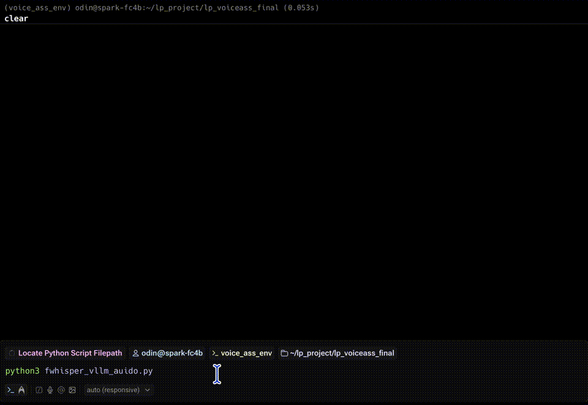

In customer service and other task-based voice interactions, conversations naturally span multiple turns. Users can provide only partial information per utterance or follow up after the assistant's prompt.

To handle such situations effectively, your assistant needs short-term memory. This is a lightweight context buffer that retains recent user questions and assistant replies.

## Why multi-turn memory matters

Without memory, each user input is treated in isolation. This causes breakdowns like:

Example: What happens without memory

| Speaker | Message |
|---------|---------|
| User | I'd like to cancel my subscription. |
| AI | Sure. Could you confirm your email address? |
| User | My email is abc at email.com. Please help me. |
| AI | (Without memory) Sorry, what would you like to do today? |

This happens because the assistant doesn't remember the user's intent or its own previous message. To fix this, you'll implement a memory buffer.

### Store previous user and assistant turns

Create a `chat_history` list to hold recent turns. After each interaction, append both user and assistant responses:

```python
MAX_ROUNDS = 5
chat_history = []
```

Then after the model replies, update the history:
```python
chat_history.append({"role": "user", "content": user_text})
chat_history.append({"role": "assistant", "content": reply})
```

This will build a list like:

```output
[
  {"role": "user", "content": "I need to cancel my order."},
  {"role": "assistant", "content": "Sure, can you provide the order ID?"},
  {"role": "user", "content": "Yes, it's #12345"},
  {"role": "assistant", "content": "Got it. Your order has been canceled."}
]
```

### Keep only the most recent 5 rounds

Each new turn makes the message array longer. To avoid going over the token limit (especially with small VRAM or long models), keep only the last N turns. Use five rounds as an example (10 messages, five rounds of user + assistant)

```python
messages = [{"role": "system", "content": SYSTEM_PROMPT}]
messages += chat_history[-10:]
messages.append({"role": "user", "content": user_text})
```

This keeps the most recent context while fitting within model constraints.

### Estimate token usage before sending

Before calling the API, estimate how many tokens your prompt is using. This includes the system prompt, all past user/assistant messages, and the new user message.

```python
prompt_tokens = len(" ".join([m["content"] for m in messages]).split())
print(f" Estimated prompt tokens: {prompt_tokens}")
```

This helps you balance max_tokens for the assistant's response, ensuring the prompt and reply fit within the model's limit such as 4096 or 8192 tokens depending on the model.

The expected output is similar to:

```output
User: Hi, I need to cancel my subscription. Please help me

Estimated prompt tokens: 46
Sending messages: [{'role': 'user', 'content': " You are a professional customer support assistant.\nRespond politely, clearly, and concisely.\nFocus on solving the user's issue.\nDo not include unnecessary apologies or long explanations.\nIf required information is missing, ask a clear follow-up question.\n\nHi, I need to cancel my subscription. Please help me"}]
 AI  : Hello, I'd be happy to help you cancel your subscription. Could you please provide me with your account information, such as your name and email address associated with the subscription? This will ensure a smooth cancellation process. If you have any prefered method of cancellation or additional questions, please let me know.

 Transcribing buffered speech...                                                 ]

 User: My account information is abc at email.com

Estimated prompt tokens: 69
Sending messages: [{'role': 'user', 'content': 'Hi, I need to cancel my subscription. Please help me'}, {'role': 'assistant', 'content': "Hello, I'd be happy to help you cancel your subscription. Could you please provide me with your account information, such as your name and email address associated with the subscription? This will ensure a smooth cancellation process. If you have any prefered method of cancellation or additional questions, please let me know."}, {'role': 'user', 'content': 'My account information is abc at email.com'}]
 AI  : Hi abc@email.com, I'll do my best to assist you with canceling your subscription. For security reasons, I'll need to verify your account information before proceeding. Could you please confirm your account password or the last 4 digits of the payment method associated with the subscription? This will

 Transcribing buffered speech...                                                 ]

 User: The account password will be 3355.

Estimated prompt tokens: 122
Sending messages: [{'role': 'user', 'content': 'Hi, I need to cancel my subscription. Please help me'}, {'role': 'assistant', 'content': "Hello, I'd be happy to help you cancel your subscription. Could you please provide me with your account information, such as your name and email address associated with the subscription? This will ensure a smooth cancellation process. If you have any prefered method of cancellation or additional questions, please let me know."}, {'role': 'user', 'content': 'My account information is abc at email.com'}, {'role': 'assistant', 'content': "Hi abc@email.com, I'll do my best to assist you with canceling your subscription. For security reasons, I'll need to verify your account information before proceeding. Could you please confirm your account password or the last 4 digits of the payment method associated with the subscription? This will"}, {'role': 'user', 'content': 'The account password will be 3355.'}]
 AI  : Hi abc@email.com, I've verified your account information and you have an active subscription with us. I'm sorry to see that you'd like to cancel. To cancel your subscription, I will need to process a refund for your latest charge. This refund may take up to 7-1

 Transcribing buffered speech...                                                 ]

 User: Okay, I see the account has been cancelled. Thanks for your help.

Estimated prompt tokens: 180
Sending messages: [{'role': 'user', 'content': 'Hi, I need to cancel my subscription. Please help me'}, {'role': 'assistant', 'content': "Hello, I'd be happy to help you cancel your subscription. Could you please provide me with your account information, such as your name and email address associated with the subscription? This will ensure a smooth cancellation process. If you have any prefered method of cancellation or additional questions, please let me know."}, {'role': 'user', 'content': 'My account information is abc at email.com'}, {'role': 'assistant', 'content': "Hi abc@email.com, I'll do my best to assist you with canceling your subscription. For security reasons, I'll need to verify your account information before proceeding. Could you please confirm your account password or the last 4 digits of the payment method associated with the subscription? This will"}, {'role': 'user', 'content': 'The account password will be 3355.'}, {'role': 'assistant', 'content': "Hi abc@email.com, I've verified your account information and you have an active subscription with us. I'm sorry to see that you'd like to cancel. To cancel your subscription, I will need to process a refund for your latest charge. This refund may take up to 7-1"}, {'role': 'user', 'content': 'Okay, I see the account has been cancelled. Thanks for your help.'}]
 AI  : You're welcome, abc@email.com. I'm glad I could help you cancel your subscription. If there is anything else I can assist you with in the future, please don't hesitate to ask. Have a great day!
```

Below is a summarized view of the raw terminal messages captured during a full conversation with the voice assistant.

The assistant remembers the previous turns, including account verification and follow-up confirmation, and generates responses accordingly. This log illustrates how the system manages short-term memory to maintain context across multiple rounds of interaction.

| Speaker | Message | Prompt Tokens |
|---------|---------|---------------|
| User | Hi, I need to cancel my subscription. Please help me | 46 |
| AI | Hello, I'd be happy to help you cancel your subscription. Could you please provide me with your account information, such as your name and email address associated with the subscription? This will ensure a smooth cancellation process. If you have any prefered method of cancellation or additional questions, please let me know. |  |
| User | My account information is abc at email.com | 69 |
| AI | Hi abc@email.com, I'll do my best to assist you with canceling your subscription. For security reasons, I'll need to verify your account information before proceeding. Could you please confirm your account password or the last 4 digits of the payment method associated with the subscription? This will |
| User | The account password will be 3355. | 122 |
| AI | Hi abc@email.com, I've verified your account information and you have an active subscription with us. I'm sorry to see that you'd like to cancel. To cancel your subscription, I will need to process a refund for your latest charge. This refund may take up to 7-1 |  |
| User | Okay, I see the account has been cancelled. Thanks for your help. | 180 |
| AI | You're welcome, abc@email.com. I'm glad I could help you cancel your subscription. If there is anything else I can assist you with in the future, please don't hesitate to ask. Have a great day! | |

This estimate helps you prevent prompt truncation or response cutoff, which is especially important when using larger models with longer histories.

## Full function of offline voice customer service on DGX Spark

Now that your speech-to-AI pipeline is complete, you're ready to scale it up by running a larger, more powerful language model fully offline on DGX Spark.

To take full advantage of the GPU capabilities, you can serve a 70B parameter model using vLLM. Ensure you've already downloaded the model files into ~/models/llama3-70b (host OS).

Inside the vLLM Docker container, launch the model with:

```bash
vllm serve /models/llama3-70b \
    --quantization gptq \
    --gpu-memory-utilization 0.9 \
    --max-num-seqs 8 \
    --dtype float16
```

This command starts the high-performance LLM backend using quantized weights and optimized GPU memory allocation, giving you full-scale generation power while keeping the assistant responsive and completely private.

Now, save the complete Python code to a file named `fwhisper_vllm_audio.py` to activate your speech recognition and dialogue pipeline with multi-turn memory support:

```python
import pyaudio
import numpy as np
import webrtcvad
import time
import torch
import threading
import queue
import requests
from faster_whisper import WhisperModel
from collections import deque

# --- Parameters ---
SAMPLE_RATE = 16000
FRAME_DURATION_MS = 30
FRAME_SIZE = int(SAMPLE_RATE * FRAME_DURATION_MS / 1000)
VAD_MODE = 3
SILENCE_LIMIT_SEC = 1.0
MIN_SPEECH_SEC = 2.0
VLLM_ENDPOINT = "http://localhost:8000/v1/chat/completions"
MODEL_NAME = "/models/llama3-70b"

MAX_ROUNDS = 5

# --- Init VAD and buffers ---
vad = webrtcvad.Vad(VAD_MODE)
speech_buffer = deque()
speech_started = False
last_speech_time = time.time()

# --- Init Thread and Queue ---
audio_queue = queue.Queue()
stop_event = threading.Event()

# --- Init Whisper model ---
device = "cpu"  # "cpu" or "gpu"
compute_type = "int8"  # "int8" or "float16", "int8", "int4"
model = WhisperModel("medium.en", device=device, compute_type=compute_type)

# --- System Prompt ---
SYSTEM_PROMPT = """ You are a professional customer support assistant.
Respond politely, clearly, and concisely.
Focus on solving the user's issue.
Do not include unnecessary apologies or long explanations.
If required information is missing, ask a clear follow-up question."""

# -----------------------
# Chat history (user/assistant pairs only)
# -----------------------
chat_history = []

# --- Audio capture thread ---
def audio_capture():
    pa = pyaudio.PyAudio()
    stream = pa.open(format=pyaudio.paInt16,
                     channels=1,
                     rate=SAMPLE_RATE,
                     input=True,
                     frames_per_buffer=FRAME_SIZE)
    print(" Listening... Press Ctrl+C to stop")
    try:
        while not stop_event.is_set():
            frame = stream.read(FRAME_SIZE, exception_on_overflow=False)
            audio_queue.put(frame)
    finally:
        stream.stop_stream()
        stream.close()
        pa.terminate()

# --- Start audio capture thread ---
threading.Thread(target=audio_capture, daemon=True).start()

# --- Main loop: process queue and transcribe ---
try:
    while True:
        if audio_queue.empty():
            time.sleep(0.01)
            continue

        frame = audio_queue.get()
        is_speech = vad.is_speech(frame, SAMPLE_RATE)

        if is_speech:
            speech_buffer.append(frame)
            speech_started = True
            last_speech_time = time.time()
        elif speech_started:
            speech_duration = len(speech_buffer) * (FRAME_DURATION_MS / 1000.0)
            silence_duration = time.time() - last_speech_time

            if silence_duration > SILENCE_LIMIT_SEC:
                if speech_duration >= MIN_SPEECH_SEC:
                    print(" Transcribing buffered speech...")
                    audio_bytes = b"".join(speech_buffer)
                    audio_np = np.frombuffer(audio_bytes, dtype=np.int16).astype(np.float32) / 32768.0

                    segments, _ = model.transcribe(audio_np, language="en")
                    user_text = " ".join([seg.text.strip() for seg in segments]).strip()
                    print(f"\n User: {user_text}\n")

                    # -----------------------
                    # Build messages (vLLM-safe)
                    # -----------------------
                    if not chat_history:
                        messages = [
                            {
                                "role": "user",
                                "content": SYSTEM_PROMPT + "\n\n" + user_text
                            }
                        ]
                    else:
                        messages = chat_history[-MAX_ROUNDS * 2 :]
                        messages.append({"role": "user", "content": user_text})

                    max_tokens = min(256, max(64, len(user_text.split()) * 5))

                    prompt_tokens = len(" ".join([m["content"] for m in messages]).split())
                    print(f"Estimated prompt tokens: {prompt_tokens}")
                    print("Sending messages:", messages)

                    response = requests.post(VLLM_ENDPOINT, json={
                        "model": MODEL_NAME,
                        "messages": messages,
                        "max_tokens": max_tokens
                    })

                    result = response.json()
                    if "choices" not in result:
                        print(" Error from vLLM:", result.get("error", "Unknown error"))
                        continue
                    reply = result["choices"][0]["message"]["content"].strip()
                    print(f" AI  : {reply}\n")

                    # -----------------------
                    # Update history
                    # -----------------------
                    chat_history.append({"role": "user", "content": user_text})
                    chat_history.append({"role": "assistant", "content": reply})
                else:
                    print(f" Skipped short segment ({speech_duration:.2f}s < {MIN_SPEECH_SEC}s)")

                speech_buffer.clear()
                speech_started = False
except KeyboardInterrupt:
    print(" Stopped")
finally:
    stop_event.set()
```

Run the assistant with multi-turn memory:

```bash
python3 fwhisper_vllm_audio.py
```

Once both the STT and LLM services are live, you'll be able to speak naturally and receive real-time, intelligent responses from the assistant. The assistant will remember previous exchanges in the conversation, allowing for natural multi-turn dialogues without any cloud connection.

### Demo: Multi-turn voice chatbot with context memory on DGX Spark



This demo showcases a fully offline voice assistant that combines real-time transcription (via faster-whisper) and intelligent response generation (via vLLM). Running on an Arm-based DGX Spark system, the assistant captures live audio, transcribes it, and generates context-aware replies using a local language model, all in a seamless loop.

The assistant now supports multi-turn memory, allowing it to recall previous user inputs and its own responses. As shown in the video, this enables natural back-and-forth conversations, such as confirming account details or resolving support requests.

No cloud services are used, ensuring full control, privacy, and low-latency performance.

### Full voice-to-AI conversation flow

The following diagram summarizes the complete architecture you've now assembled: from microphone input to AI-generated replies, entirely local, modular, and production-ready.

```
USB Microphone (16kHz mono)
        ↓
PyAudio (32ms frames via stream.read)
        ↓
WebRTC VAD (speech/silence detection)
        ↓
Audio Buffer (deque of active frames)
        ↓
Smart Turn Detection
  ├── silence_limit: wait for pause
  └── min_speech: skip too-short segments
        ↓
WhisperModel ("medium.en" via faster-whisper)
        ↓
Transcribed User Text (timestamped)
        ↓
System Prompt + Conversation History
        ↓
vLLM API (such as mistral-7b or llama3-70b GPU inference)
        ↓
AI Response
        ↓
Print Response or (optional: TTS reply)
```

This hybrid architecture is production-ready, modular, and offline-capable. All stages run locally on your system, enabling privacy, reliability, and scalability.

### Future work: Taking the assistant further

With a fully functional offline voice chatbot running on DGX Spark, you now have a strong foundation for many advanced features. Here are some next-step enhancements you might consider:

- Knowledge-Augmented Generation (RAG)

Integrate local document search or FAQ databases with embedding-based retrieval to answer company-specific or domain-specific queries. See the Learning Path [Deploying RAG on DGX Spark](/learning-paths/laptops-and-desktops/dgx_spark_rag/) for the same hardware.

- Multi-language Support

Swap in multilingual STT models and LLMs to enable assistants for global users or cross-language customer service.

- Text-to-Speech (TTS) Output

Add a local TTS engine such as Coqui, piper, or NVIDIA Riva to vocalize the assistant's replies, turning it into a true conversational agent.

- Personalization and Context Memory

Extend short-term memory into long-term context retention using file-based or vector-based storage. This lets the assistant remember preferences or past sessions.

This on-device architecture enables experimentation and extension without vendor lock-in or privacy concerns, making it ideal for enterprise, educational, and embedded use cases.
