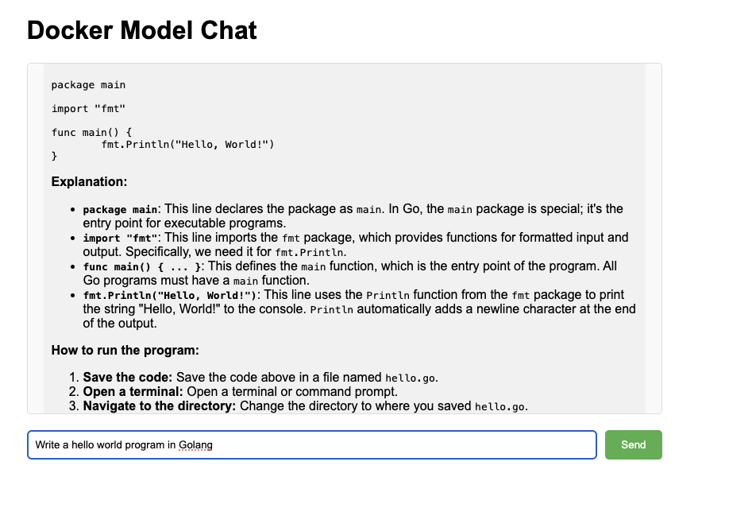

Docker Compose makes it easy to run multi-container applications. Docker Compose can also include AI models in your project.

In this section, you'll learn how to use Docker Compose to deploy a web-based AI chat application that uses Docker Model Runner as the backend for AI inference.

## Clone the example project

The example project, named [docker-model-runner-chat](https://github.com/jasonrandrews/docker-model-runner-chat) is available on GitHub. It provides a simple web interface to interact with local AI models such as Llama 3.2 or Gemma 3.

First, clone the example repository:

```console
git clone https://github.com/jasonrandrews/docker-model-runner-chat.git
cd docker-model-runner-chat
```

## Review the Docker Compose file

The `compose.yaml` file defines how the application is deployed using Docker Compose. 

It sets up two services:

- **ai-chat**: A Flask-based web application that provides the chat user interface. It is built from the local directory, exposes port 5000 for browser access, mounts the project directory as a volume for live code updates, loads environment variables from `vars.env`, and waits for the `ai-runner` service to be ready before starting.
- **ai-runner**: This service uses the Docker Model Runner provider to run the selected AI model (for example, `ai/gemma3`). The configuration under `provider` tells Docker to use the model runner extension and specifies which model to load.

The setup allows the web app to communicate with the model runner service as if it were an OpenAI-compatible API, making it easy to swap models or update endpoints by changing environment variables or compose options.

Review the `compose.yaml` file to see the two services.

```yaml
services:
  ai-chat:
    build:
      context: .
    ports:
      - "5000:5000"
    volumes:
      - ./:/app
    env_file:
      - vars.env
    depends_on:
      - ai-runner
  ai-runner:
    provider:
      type: model
      options:
        model: ai/gemma3
```

## Start the application

From the project directory, start the app with:

```console
docker compose up --build
```

Docker Compose will build the web app image and start both services.

## Access the chat interface

Open your browser and copy and paste the local URL below: 

```console
http://localhost:5000
```

You can now chat with the AI model using the web interface. Enter your prompt and view the response in real time.



## Configuration

You can change the AI model or endpoint by editing the `vars.env` file before starting the containers. The file contains environment variables used by the web application:

- `BASE_URL`: The base URL for the AI model API. By default, it is set to `http://model-runner.docker.internal/engines/v1/`, which allows the web app to communicate with the Docker Model Runner service. This is the default endpoint setup by Docker to access the model. 
- `MODEL`: The AI model to use (for example, `ai/gemma3` or `ai/llama3.2`).

The `vars.env` file is shown below. 

```console
BASE_URL=http://model-runner.docker.internal/engines/v1/
MODEL=ai/gemma3
```

To use a different model, change the `MODEL` value. For example:

```console
MODEL=ai/llama3.2
```

Make sure to change the model in the `compose.yaml` file also. 

You can also change the `temperature` and `max_tokens` values in `app.py` to further customize the application.

## Stop the application

To stop the services, press `Ctrl+C` in the terminal.

You can also run the command below in another terminal to stop the services.

```console
docker compose down
```

## Troubleshooting

Use the steps below if you have any issues running the application:

- Ensure Docker and Docker Compose are installed and running
- Make sure port 5000 is not in use by another application
- Check logs with:

```console
docker compose logs
```

In this section, you learned how to use Docker Compose to run a containerized AI chat application with a web interface and local model inference from Docker Model Runner. 
