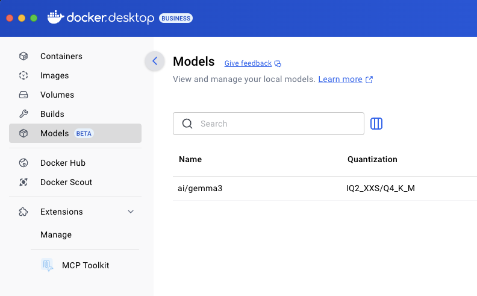

Docker Model Runner is an official Docker extension that allows you to run Large Language Models (LLMs) on your local computer. It provides a convenient way to deploy and use AI models across different environments, including Arm-based systems, without complex setup or cloud dependencies.

Docker uses [llama.cpp](https://github.com/ggml-org/llama.cpp), an open source C/C++ project developed by Georgi Gerganov that enables efficient LLM inference on a variety of hardware, but you do not need to download, build, or install any LLM frameworks. 

Docker Model Runner provides a easy to use CLI that is familiar to Docker users. 

## Before you begin

Verify Docker is running with:

```console
docker version
```

You should see output showing your Docker version. 

Confirm the Docker Desktop version is 4.40 or above, for example:

```output
Server: Docker Desktop 4.41.2 (191736)
```

Make sure the Docker Model Runner is enabled.

```console
docker model --help
```

You should see the usage message:

```output
Usage:  docker model COMMAND

Docker Model Runner

Commands:
  inspect     Display detailed information on one model
  list        List the available models that can be run with the Docker Model Runner
  logs        Fetch the Docker Model Runner logs
  pull        Download a model
  push        Upload a model
  rm          Remove models downloaded from Docker Hub
  run         Run a model with the Docker Model Runner
  status      Check if the Docker Model Runner is running
  tag         Tag a model
  version     Show the Docker Model Runner version
```

If Docker Model Runner is not enabled, enable it using the [Docker Model Runner documentation](https://docs.docker.com/model-runner/).

You should also see the Models icon in your Docker Desktop sidebar.
 


## Running your first AI model with Docker Model Runner

Docker Model Runner is an extension for Docker Desktop that simplifies running AI models locally. 

Docker Model Runner automatically selects compatible model versions and optimizes performance for the Arm architecture.

You can try Docker Model Runner by using an LLM from Docker Hub. 

The example below uses the [SmolLM2 model](https://hub.docker.com/r/ai/smollm2), a compact language model with 360 million parameters, designed to run efficiently on-device while performing a wide range of language tasks. You can explore additional [models in Docker Hub](https://hub.docker.com/u/ai).

Download the model using:

```console
docker model pull ai/smollm2
```

For a simple chat interface, run the model:

```console
docker model run ai/smollm2
```

Enter a prompt at the CLI:

```console
write a simple hello world program in C++
```

You see the output from the SmolLM2 model:

```output
#include <iostream>

int main() {
    std::cout << "Hello, World!" << std::endl;
    return 0;
}
```

You can ask more questions and continue to chat.

To exit the chat use the `/bye` command.

You can print the list of models on your computer using:

```console
docker model list
```

Your list will be different based on the models you have downloaded. 

```output
MODEL NAME   PARAMETERS  QUANTIZATION    ARCHITECTURE  MODEL ID      CREATED       SIZE
ai/gemma3    3.88 B      IQ2_XXS/Q4_K_M  gemma3        0b329b335467  2 months ago  2.31 GiB
ai/phi4      14.66 B     IQ2_XXS/Q4_K_M  phi3          03c0bc8e0f5a  2 months ago  8.43 GiB
ai/smollm2   361.82 M    IQ2_XXS/Q4_K_M  llama         354bf30d0aa3  2 months ago  256.35 MiB
ai/llama3.2  3.21 B      IQ2_XXS/Q4_K_M  llama         436bb282b419  2 months ago  1.87 GiB
```

## Use the OpenAI endpoint to call the model

From your host computer you can access the model using the OpenAI endpoint and a TCP port. 

First, enable the TCP port to connect with the model:

```console
docker desktop enable model-runner --tcp 12434
```

Next, use a text editor to save the code below in a file named `curl-test.sh`:

```bash
#!/bin/sh

curl http://localhost:12434/engines/llama.cpp/v1/chat/completions \
  -H "Content-Type: application/json" \
  -d '{
    "model": "ai/smollm2",
    "messages": [
      {
        "role": "system",
        "content": "You are a helpful assistant."
      },
      {
        "role": "user",
        "content": "Please write a hello world program in Java."
      }
    ]
  }'
```

Run the shell script:

```console
bash ./curl-test.sh | jq
```

If you don't have `jq` installed, you eliminate piping the output.

The output, including the performance information, is shown below:

```output
{
  "choices": [
    {
      "finish_reason": "stop",
      "index": 0,
      "message": {
        "role": "assistant",
        "content": "Here's a simple \"Hello World\" program in Java:\n\n```java\npublic class HelloWorld {\n    public static void main(String[] args) {\n        System.out.println(\"Hello, World!\");\n    }\n}\n```\n\nThis program declares a `HelloWorld` class, defines a `main` method that contains the program's execution, and then uses `System.out.println` to print \"Hello, World!\" to the console."
      }
    }
  ],
  "created": 1748622685,
  "model": "ai/smollm2",
  "system_fingerprint": "b1-a0f7016",
  "object": "chat.completion",
  "usage": {
    "completion_tokens": 101,
    "prompt_tokens": 28,
    "total_tokens": 129
  },
  "id": "chatcmpl-uZGBuFoS2ERodT4KilStxDwhySLQBTN9",
  "timings": {
    "prompt_n": 28,
    "prompt_ms": 32.349,
    "prompt_per_token_ms": 1.1553214285714284,
    "prompt_per_second": 865.5599863983431,
    "predicted_n": 101,
    "predicted_ms": 469.524,
    "predicted_per_token_ms": 4.648752475247525,
    "predicted_per_second": 215.11147459980745
  }
}
```

In this section you learned how to run AI models using Docker Model Runner. Continue to see how to use Docker Compose to build an application with a built-in AI model. 
