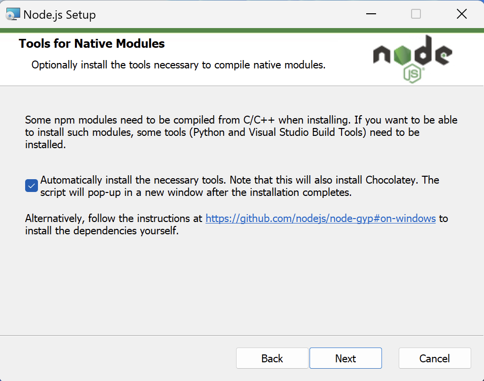
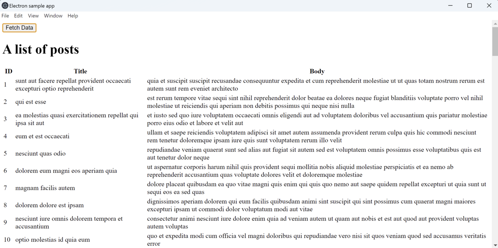
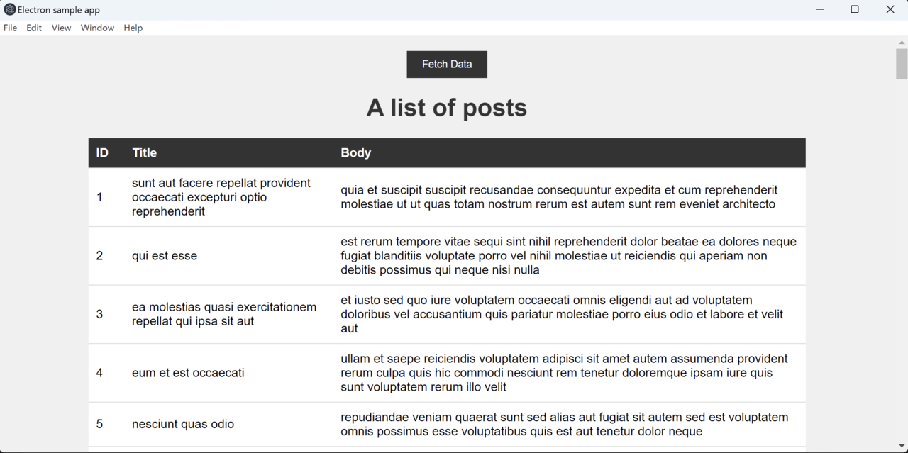
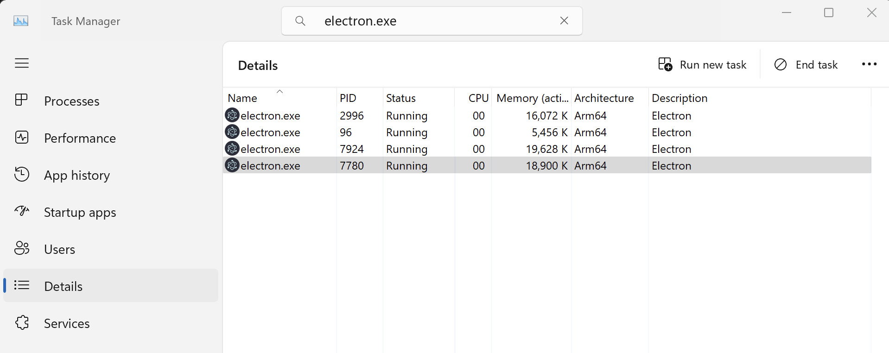

## Introduction
Electron is an open-source framework to develop cross-platform desktop applications using web technologies such as HTML, CSS, and JavaScript. Developed and maintained by GitHub, Electron provides a seamless way to build native-like applications for Windows, macOS, and Linux, all from a single codebase. This capability has made Electron a popular choice to develop cross-platform desktop applications.

In this learning path you will learn how to create a Desktop application for Windows on Arm64. The application will implement a common functionality of fetching and displaying the data from the REST API. You will use `JSONPlaceholder` as the API.

`JSONPlaceholder` is a free online REST API service that serves as a mock server for testing and prototyping web applications. Created and maintained by Typicode, `JSONPlaceholder` provides a set of HTTP endpoints that mimic the behavior of a typical backend server, allowing developers to simulate interactions with a RESTful API without the need for a real backend. 

Here, you will use the posts endpoint of the `JSONPlaceholder`. This endpoint enables you to retrieve the list of hypothetical posts.

You can find the the complete code used in the learning path [here](https://github.com/dawidborycki/electron-sample-app.git)

## Before you begin
Before you begin, install Node.JS for Arm64. You can find the installer [here](https://nodejs.org/en/download). In this learning path, you will use version 20.10.0. The installation process is automatic. However, make sure to check the "Automatically install the necessary tools" checkbox so that it automatically installs the build tools for the NPM packages:



## Initialize the project
Start by initializing the project. To do this, open the command prompt or terminal and type the following commands:

```console
mkdir electron-sample-app
cd electron-sample-app
npm init -y
```

The output will be similar to:

```output
Wrote to C:\Users\db\electron-sample-app\package.json:

{
  "name": "electron-sample-app",
  "version": "1.0.0",
  "description": "",
  "main": "index.js",
  "scripts": {
    "test": "echo \"Error: no test specified\" && exit 1"
  },
  "keywords": [],
  "author": "",
  "license": "ISC"
}
```

Next, install the dependencies: Electron framework, axios for making API requests, and jQuery for DOM manipulation:

```console
npm install electron axios jquery --save
```

The output will be similar to:

```
added 85 packages, and audited 86 packages in 13s

21 packages are looking for funding
  run `npm fund` for details

found 0 vulnerabilities
npm notice
npm notice New patch version of npm available! 10.2.3 -> 10.2.5
npm notice Changelog: https://github.com/npm/cli/releases/tag/v10.2.5
npm notice Run npm install -g npm@10.2.5 to update!
npm notice
```

## View
You will now create the `index.html` file, which will act as the application view. Inside the `electron-sample-app` project folder create a new file, `index.html` with the contents below:

```html
<!DOCTYPE html>
<html>
<head>
  <title>Electron sample app</title>
</head>
<body>
  <button id="fetch-button">Fetch Data</button>
  <h1>A list of posts</h1>
  <table id="data-table">
    <thead>
      <tr>
        <th>ID</th>
        <th>Title</th>
        <th>Body</th>
      </tr>
    </thead>
    <tbody></tbody>
  </table>
  <script src="renderer.js"></script>
</body>
</html>
```

This code will render the table comprised of three columns. Each column will display the ID, Title and Body parts of the post, which you will retrieve from the rest API.

## Logic
You will now implement the logic, which is responsible for creating the application window and retrieving a collection of posts from the posts API of the [jsonplaceholder](https://jsonplaceholder.typicode.com/posts).

Under the `electron-sample-app` project folder create a new file, `main.js` with the contents below:

```JavaScript
const { app, BrowserWindow } = require('electron');

function createWindow() {
  // Create the browser window
  const win = new BrowserWindow({
    width: 1200,
    height: 600,
    webPreferences: {
      nodeIntegration: true,
      contextIsolation: false,    
    },
  });

  // Load the index.html file
  win.loadFile('index.html');  
}

app.whenReady().then(createWindow);

// Quit the app when all windows are closed (except on macOS)
app.on('window-all-closed', () => {
  if (process.platform !== 'darwin') {
    app.quit();
  }
});

app.on('activate', () => {
  // Create a window when the app is activated (on macOS)
  if (BrowserWindow.getAllWindows().length === 0) {
    createWindow();
  }
});
```

In the same directory, create a file named `renderer.js` with the contents below:

```JavaScript
const axios = require('axios');
const $ = require('jquery');

const apiUrl = 'https://jsonplaceholder.typicode.com/posts';

function fetchData() {
  axios.get(apiUrl)
    .then((response) => {
      const data = response.data;

      // Clear the existing table data
      $('#data-table tbody').empty();

      // Append new data to the table
      data.forEach((item) => {
        $('#data-table tbody').append(`
          <tr>
            <td>${item.id}</td>
            <td>${item.title}</td>
            <td>${item.body}</td>
          </tr>
        `);
      });
    })
    .catch((error) => {
      console.error('Error fetching data:', error);
    });
}

// Add click event listener to the fetch button
$('#fetch-button').click(() => {
  fetchData();
});
```

This file sends the request to the API to retrieve the list of posts. This list will be rendered in the view.

## Package.json
Finally, update the `package.json` in your project folder with the code shown below:

```JSON
{
  "name": "electron-sample-app",
  "version": "1.0.0",
  "description": "Electron application to retrieve data from API and display it in a table.",
  "main": "main.js",
  "scripts": {
    "start": "electron ."
  },
  "author": "Learning Path",
  "license": "MIT",
  "dependencies": {
    "axios": "^0.21.4",
    "electron": "^16.0.5",
    "jquery": "^3.6.0"
  }
}
```

This code does the following:
1. Sets the application entry point to `main.js`
2. Adds a start script which will invoke the **electron .** command to launch the electron app in a current directory
3. Specifies the license and dependencies
4. Configures the application name, description, and author

## Run the application
To launch the application type the following command:

```console
npm start
```

The application window appears. Then click the Fetch data button and you will see the list of posts:



## Styling an application
The application works fine. However, it uses default styles and does not look very pretty. To change this you can use cascading style sheets (CSS) as per web applications. To style the application, proceed as follows:

1. In the application project folder, create a file named `styles.css` with the contents below:
```css
body {
    font-family: Arial, sans-serif;
    background-color: #f0f0f0;
    margin: 0;
    padding: 0;
  }
  
  h1 {
    text-align: center;
    margin-top: 20px;
    color: #333;
  }
  
  table {
    width: 80%;
    margin: 20px auto;
    border-collapse: collapse;
    background-color: #fff;
  }
  
  th, td {
    padding: 10px;
    text-align: left;
    border-bottom: 1px solid #ddd;
  }
  
  th {
    background-color: #333;
    color: #fff;
  }
  
  button {
    display: block;
    margin: 20px auto;
    padding: 10px 20px;
    background-color: #333;
    color: #fff;
    border: none;
    cursor: pointer;
  }
  
  button:hover {
    background-color: #555;
  }
```

2. Update your `index.html` file to use `styles.css` as shown below:

```html
<!DOCTYPE html>
<html>
<head>
  <title>Electron sample app</title>
  <link rel="stylesheet" type="text/css" href="styles.css">
</head>
<body>
  <button id="fetch-button">Fetch Data</button>
  <h1>A list of posts</h1>
  <table id="data-table">
    <thead>
      <tr>
        <th>ID</th>
        <th>Title</th>
        <th>Body</th>
      </tr>
    </thead>
    <tbody></tbody>
  </table>
  <script src="renderer.js"></script>
</body>
</html>
```

3. Run the application **npm start**

After the application launches, click the **Fetch data** button and you will see the following result:



## Checkpoint
You now have the application up and running. By default, it runs using the Arm64 architecture because we used Node.js for Arm64. To confirm this, open the Task Manager, click the Details tab and look for **electron.exe** processes:



In the next step, you will configure your application such that you can explicitly build it for x64 and Arm64 platforms.
