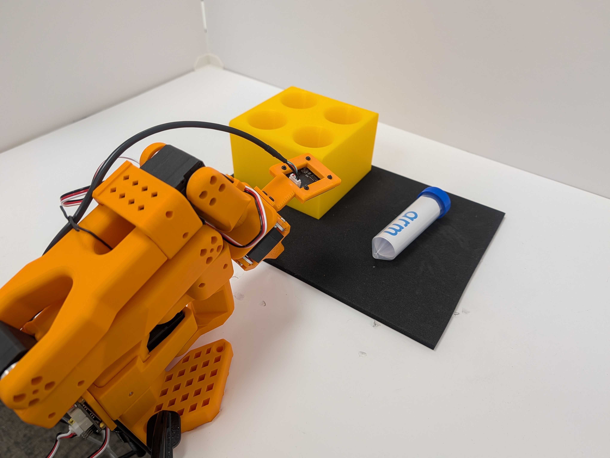
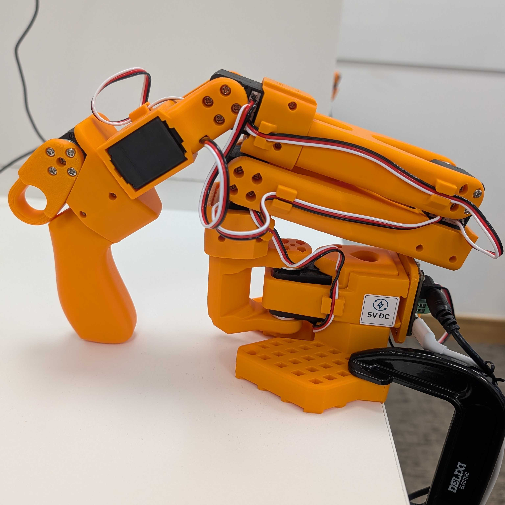
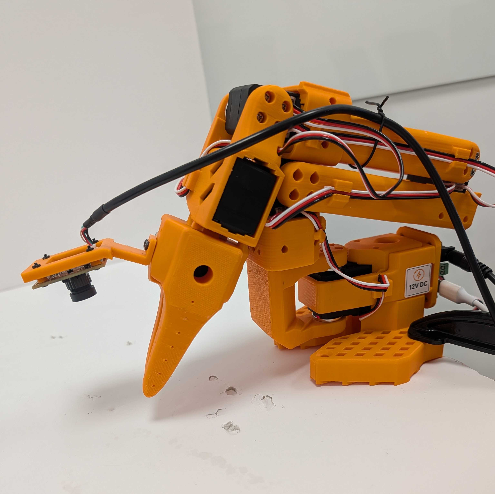

## What you'll build

You'll teach an SO-101 robot arm to pick up a vial and place it in a rack. First, you'll guide the robot through the task and record examples. You'll then adapt an AI model called SmolVLA with those examples and use it to control the robot. You'll run the software workflow on an Arm-based NVIDIA DGX Spark.

### SO-101 

The [SO-101 robot arm](https://huggingface.co/docs/lerobot/so101) is an open-source robotic arm designed for learning from demonstrations. This setup uses two arms with matching joints:

- You move the leader arm by hand to demonstrate the task.
- The powered follower arm mirrors the leader during data collection and later executes the learned behavior autonomously.

The leader has the operator handle used to demonstrate arm and gripper motion. The follower has the task gripper and wrist-mounted camera used for recording and autonomous control.

| SO-101 leader | SO-101 follower |
| --- | --- |
|  |  |

Each arm has motors for shoulder, elbow, wrist, and gripper motion. Calibration maps their physical ranges to compatible position values so a demonstration from the leader becomes a meaningful target for the follower.

The leader is needed only while you demonstrate and record the task. The final setup uses only the follower arm. The fine-tuned AI model reads the follower's cameras and joint state, then sends actions to the follower motors.

### LeRobot

[LeRobot](https://huggingface.co/docs/lerobot) is an open-source robotics framework from Hugging Face. It provides command-line tools and Python components for data collection, model training, and model evaluation.

- During data collection, it reads the cameras and follower joint state, receives target joint positions from the leader, and stores these observations and actions in a standard dataset.
- During training, it loads the same features, applies the model's preprocessing and postprocessing, and saves the fine-tuned model with its configuration.
- During evaluation, LeRobot connects the saved model to the follower and runs the control loop. It captures a new observation, asks the model for actions, sends those actions to the follower, and repeats.

### VLA models and SmolVLA

A useful way to understand a vision-language-action (VLA) model is as a progression from language models to models that can act in the physical world:

1. A large language model (LLM) receives text tokens and produces text tokens. It can follow written instructions, but it doesn't directly see the robot's environment.
2. A vision-language model (VLM) adds images to the text context. It can describe a scene or answer questions about it, but its normal output is still language.
3. A VLA adds robot state and an action-generation component. Instead of producing only text, it produces numerical actions that can control a robot.

A VLA receives one or more camera images, a natural-language task instruction, and the robot's current joint state. For the SO-101, the state includes the measured joint positions. The output is a continuous robot action containing targets for the shoulder, elbow, wrist, and gripper joints. The model repeatedly observes the updated scene and state, predicts the next actions, and forms a closed control loop with the robot.

[SmolVLA](https://huggingface.co/docs/lerobot/smolvla) is Hugging Face's lightweight foundation model for robot control. Its pretrained representations provide a starting point for understanding images and instructions, but you fine-tune it on your own demonstrations so it learns the robot geometry, camera viewpoints, and task behavior.

For this Learning Path, SmolVLA receives the gripper-camera image, workspace-camera image, pick-and-place instruction, and current SO-101 follower state. It outputs joint targets that LeRobot sends to the follower. 

## What you've learned and what's next

You now know how the SO-101, LeRobot, and SmolVLA fit into the workflow. 

Next, you'll create the LeRobot environment and verify that CUDA and all required command-line tools are available.
