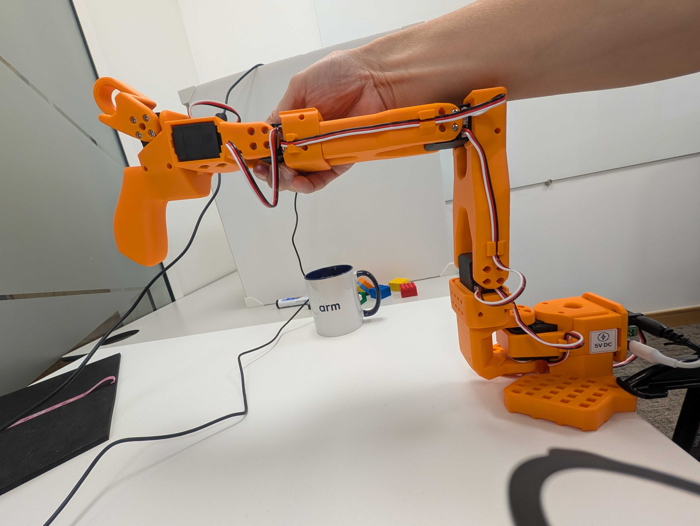
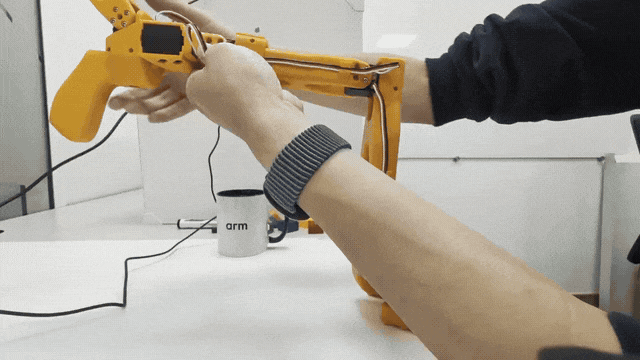
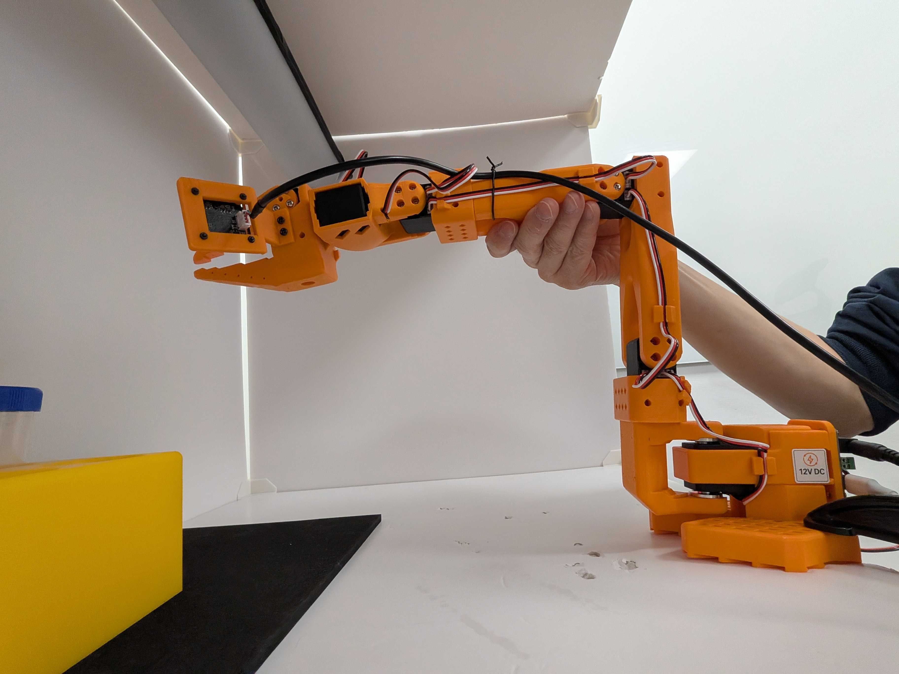
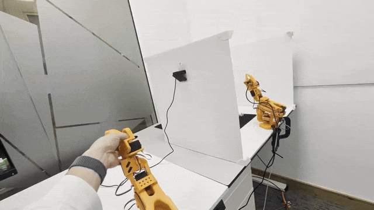

## Calibrate the leader and follower

Continue in the terminal where you set `ROBOT_PORT`, `LEADER_PORT`, `GRIPPER_CAMERA_ID`, and `WORKSPACE_CAMERA_ID`. If you opened a new terminal or reconnected a USB device, repeat discovery and export the current device paths before calibration.

Calibration maps each joint's encoder readings to its usable motion range so LeRobot can reproduce the leader's movements on the follower consistently. Start each arm with its joints near the middle of their usable ranges, then move each requested joint slowly through its safe range. Support the arm and stop before reaching a mechanical limit.

LeRobot 0.6.0 asks you to sweep shoulder pan, shoulder lift, elbow flex, wrist flex, and gripper. It assigns the complete encoder range to `wrist_roll`, so that joint isn't included in the recorded sweep.

Calibrate the leader first:

```bash
lerobot-calibrate \
  --teleop.type=so101_leader \
  --teleop.port="$LEADER_PORT" \
  --teleop.id=smolvla_leader
```

Place the leader in its middle-range pose before pressing Enter. Each joint should have room to move in both directions. The image shows the starting pose used in this setup.



After pressing Enter, support the leader and move each requested joint through its full safe range. The following animation is sped up to show the complete sequence. Perform the movements slowly on your own hardware.



Calibrate the follower with the same process:

```bash
lerobot-calibrate \
  --robot.type=so101_follower \
  --robot.port="$ROBOT_PORT" \
  --robot.id=smolvla_follower
```

Place the follower in the middle-range pose shown in the image, then press Enter and perform the same safe joint sweep used for the leader.



If LeRobot finds an existing calibration, follow the prompt to reuse it or press `c` to recalibrate. Here, `c` belongs to the calibration prompt; it isn't a dataset-recording control.

## Verify teleoperation

Teleoperation uses the leader arm to control the follower in real time.

Place both arms in similar stable poses and clear the follower workspace. Run a 60-second test:

```bash
lerobot-teleoperate \
  --robot.type=so101_follower \
  --robot.port="$ROBOT_PORT" \
  --robot.id=smolvla_follower \
  --robot.cameras="{gripper_cam: {type: opencv, index_or_path: $GRIPPER_CAMERA_ID, width: 640, height: 480, fps: 30}, workspace_cam: {type: opencv, index_or_path: $WORKSPACE_CAMERA_ID, width: 640, height: 480, fps: 30}}" \
  --teleop.type=so101_leader \
  --teleop.port="$LEADER_PORT" \
  --teleop.id=smolvla_leader \
  --fps=30 \
  --teleop_time_s=60 \
  --display_data=false
```

Move one joint at a time at first. Confirm that the follower mirrors each movement correctly and that its gripper opens and closes. Stop the test if the follower moves unexpectedly.

The animation shows the follower mirroring the leader’s arm pose and gripper movement.



## What you've accomplished

You calibrated both arms and confirmed that the follower mirrors the leader during teleoperation. Next, record the pick-and-place demonstrations.
