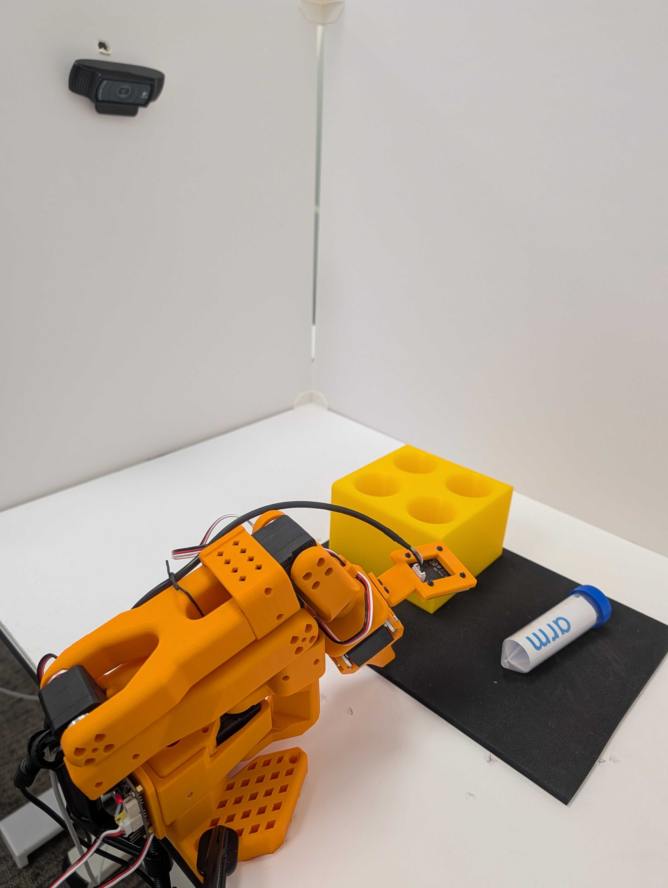
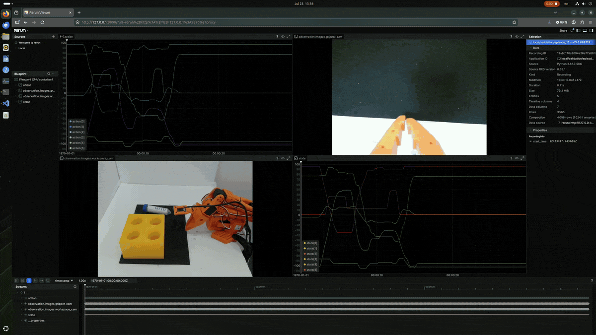

## Prepare the recording workspace

After calibrating and verifying teleoperation, record demonstrations that provide the camera images, robot state, and actions used to fine-tune SmolVLA. You'll then inspect the recorded episodes and optionally upload the validated dataset to Hugging Face.

Use the two-camera workspace that you prepared during hardware setup. Lay the vial on the black mat and place the rack beside it, within the follower's calibrated reach. The mat provides a consistent task area and visual contrast. Leave enough space between the vial and rack for the follower to grasp and move the vial without colliding with the rack.



## Define a consistent demonstration

Use the following task instruction for every episode:

```text
Pick up the vial and place it in the yellow rack
```

Start each episode with the vial lying on the pickup surface, the rack within the follower's safe reach, and both objects visible in the workspace camera.

Move the leader smoothly and grasp the vial. Place it into the rack, release it, and return to a stable pose.

Vary the vial and rack positions or orientations slightly between episodes, but stay inside the camera views and calibrated motion range.

Use the following acceptance rules:

- The gripper closes around the vial rather than pushing it.
- The vial finishes inside the intended rack hole and is released.
- The full task remains visible in both camera streams.
- No person, cable, or unrelated object enters the arm’s range of movement.
- Each accepted episode follows the same task order and lasts for the configured interval.

## Configure the recording session

Choose a repository identifier (ID) owned by your Hugging Face account, even when recording locally. Use the form `HF_USERNAME/DATASET_NAME` for `DATASET_REPO_ID`. Choose an empty local path for `LOCAL_DATASET_ROOT`.

Replace `your-hf-username` with your Hugging Face username, then export both values:

```bash
export DATASET_REPO_ID="your-hf-username/smolvla-vial-pick-place"
export LOCAL_DATASET_ROOT="$PWD/data/smolvla-vial-pick-place"

: "${DATASET_REPO_ID:?Set DATASET_REPO_ID before recording}"
: "${LOCAL_DATASET_ROOT:?Set LOCAL_DATASET_ROOT before recording}"
: "${ROBOT_CAMERAS:?Set ROBOT_CAMERAS to the working teleoperation configuration}"
```

The validation commands exit with an error if a required value is empty. `ROBOT_CAMERAS` retains the camera resolutions, frame rates, encodings, and backends that worked during teleoperation.

The following command records 50 episodes, each followed by a 15-second reset period:

```bash
test ! -e "$LOCAL_DATASET_ROOT" && \
lerobot-record \
  --robot.type=so101_follower \
  --robot.port="$ROBOT_PORT" \
  --robot.id=smolvla_follower \
  --robot.cameras="$ROBOT_CAMERAS" \
  --teleop.type=so101_leader \
  --teleop.port="$LEADER_PORT" \
  --teleop.id=smolvla_leader \
  --dataset.repo_id="$DATASET_REPO_ID" \
  --dataset.root="$LOCAL_DATASET_ROOT" \
  --dataset.single_task="Pick up the vial and place it in the yellow rack" \
  --dataset.num_episodes=50 \
  --dataset.episode_time_s=30 \
  --dataset.reset_time_s=15 \
  --dataset.fps=30 \
  --dataset.video=true \
  --dataset.streaming_encoding=false \
  --dataset.push_to_hub=false \
  --display_data=false \
  --play_sounds=true \
  --resume=false
```

{}
Keep these points in mind:
- Some users might need to adjust the `dataset.reset_time_s` value depending on how long it takes to reset the workspace for another run. 15 seconds might be too short a time to get everything reset and get back to the leader arm for the next episode recording.
- LeRobot provides keyboard controls to end an episode or reset period early, or to cancel the current episode. These controls can be useful when you need to discard a demonstration. In the tested LeRobot 0.6.0 setup, however, using them occasionally caused the recording process to stop with an error. Behavior might differ with other versions or systems. 

  To reduce the risk of an interrupted session, let the configured episode and reset timers expire whenever possible. If you use a keyboard control, confirm that the recorder remains active before starting the next episode.
{}

After the recorder exits, read the finalized summary:

```bash
python - <<'PY'
import json
import os
from pathlib import Path

info = json.loads((Path(os.environ.get("LOCAL_DATASET_ROOT")) / "meta/info.json").read_text())
print({
    "episodes": info["total_episodes"],
    "frames": info["total_frames"],
    "fps": info["fps"],
    "splits": info["splits"],
})

PY
```

For reference, the validated run produced:

```output
{'episodes': 50, 'frames': 44490, 'fps': 30, 'splits': {'train': '0:50'}}
```

This summary confirms that the recorder finalized the requested episodes and train split.

## Review an episode with Rerun

[Rerun](https://rerun.io/docs/getting-started/what-is-rerun) is a visualization toolkit for time-aligned multimodal data. You can use Rerun to scrub camera frames alongside robot state and action plots, making it easier to spot missing images, timing gaps, or unexpected motion.

The `lerobot-dataset-viz` command launches Rerun with the recorded camera, state, and action data:

```bash
lerobot-dataset-viz \
  --repo-id $DATASET_REPO_ID \
  --root $LOCAL_DATASET_ROOT \
  --episode-index 15 \
  --mode distant \
  --host 127.0.0.1 \
  --web-port 9090 \
  --grpc-port 9876 \
  --display-compressed-images
```

{}
The option `--display-compressed-images` is used for image datasets because uncompressed frames can exceed Rerun's distant-mode memory buffer and make early images appear blank. Press `Ctrl+C` after review.
{}

Open `http://127.0.0.1:9090` in the DGX Spark desktop browser while the `lerobot-dataset-viz` command is running, then complete these steps:
  - When the browser window opens, select **+** in the upper-left corner.
  - Select **Open from URL...**.
  - Enter `rerun+http://127.0.0.1:9876/proxy`.
  - Select **Open**.


{}
The browser on the DGX Spark must be used as the browser to view the UI. Typically, CORS errors will occur if a browser on a different or remote desktop is attempted instead of the browser on the DGX Spark.
{}

You should now see the following console including your USB camera images as well as data:



Press the **play button** in the lower left-hand portion of the console to play your animation. The animation shows the **Rerun** view while episode 15 is scrubbed. Both camera panes update with the task, and the action and state plots update as the arm moves.

Scrub from the first frame to the last. Check that the approach, grasp, lift, placement, release, and final pose before the reset period are visible. Reject a dataset with missing camera intervals, abrupt unexplained actions, unsafe motion, or inconsistent task order.

### Understand state and action

The visualizer plots `state` and `action` alongside the camera images:

- `state` contains calibrated joint positions measured from the follower.
- `action` contains target joint positions produced by the leader and commanded to the follower.

For the tested SO-101, vector indices map to joints as follows:

| Index | Joint |
|---|---|
| `[0]` | Shoulder pan |
| `[1]` | Shoulder lift |
| `[2]` | Elbow flex |
| `[3]` | Wrist flex |
| `[4]` | Wrist roll |
| `[5]` | Gripper |

LeRobot reads the follower state before sending the current action. The curves don't need to overlap exactly because one is a measured position and the other is a target at a slightly different point in the control loop. Motor response time, load, and mechanical compliance add further delay.

During fine-tuning, SmolVLA learns to predict actions from camera observations, task text, and robot state. The action is the behavior to reproduce. The state describes the pose from which the model acts.

## (Optional) Upload to Hugging Face

You don't need to upload when training on the same machine that stores the dataset. A Hub repository is useful when you want versioned sharing, the hosted dataset viewer, or access from a cloud GPU job. Uploading stores the dataset and doesn't provision GPU compute.

Use a repository ID under your own account. Choose a license that covers the demonstrations and video, and decide whether the repository should be public or private. 

Then, run the following script:

```bash
python - <<'PY'
import os
from pathlib import Path
from lerobot.datasets.lerobot_dataset import LeRobotDataset

dataset = LeRobotDataset(
    repo_id=os.environ.get("DATASET_REPO_ID"),
    root=Path(os.environ.get("LOCAL_DATASET_ROOT")),
)
dataset.push_to_hub(
    tags=["lerobot", "so101", "smolvla"],
    license=os.environ.get("DATASET_LICENSE"),
    private=False,
    push_videos=True,
)
PY
```

Set `private=True` if the data shouldn't be public. The `push_to_hub()` method creates the repository, uploads the dataset and videos, generates a dataset card, and tags the revision with the LeRobot version.

## What you've accomplished and what's next

You've now recorded and validated a pick-and-place dataset with synchronized camera, state, and action features. You can train directly from the local dataset or use the optional Hub upload for sharing and remote access. 

Next, you'll fine-tune SmolVLA from `LOCAL_DATASET_ROOT` on the DGX Spark GPU.
