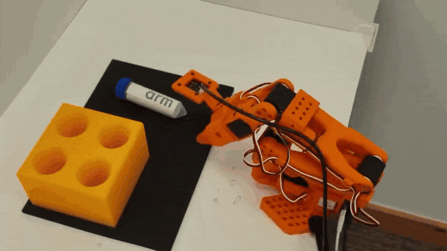

## Prepare the evaluation

You'll load the model checkpoint from earlier and use it to control the SO-101 follower for one pick-and-place attempt.

During evaluation, the leader arm isn't used. The model receives:

- Images from the gripper and workspace cameras
- The current joint positions of the follower
- The task instruction

Start by reconnecting the follower and both cameras.

Confirm that the following environment variables still identify the correct devices:

- `$ROBOT_PORT`
- `$GRIPPER_CAMERA_ID`
- `$WORKSPACE_CAMERA_ID`

USB device identifiers can change when a device is disconnected or the computer is restarted. If a device is no longer detected correctly, repeat the device-discovery steps from the hardware setup section.

After confirming the current camera IDs, rebuild `ROBOT_CAMERAS` with the exact resolutions, frame rates, `fourcc` encodings, and backends used during recording. If you used the default profiles, run:

```bash
export ROBOT_CAMERAS="{gripper_cam: {type: opencv, index_or_path: $GRIPPER_CAMERA_ID, width: 640, height: 480, fps: 30}, workspace_cam: {type: opencv, index_or_path: $WORKSPACE_CAMERA_ID, width: 640, height: 480, fps: 30}}"
: "${ROBOT_CAMERAS:?Set ROBOT_CAMERAS before evaluation}"
```

If you used the camera-specific replacement from the teleoperation section, repeat that export instead. Rebuilding the value incorporates the current device IDs while preserving the profiles used to collect the training images.

Keep the following settings consistent with data collection:

- Camera positions and mounting angles
- Task instruction
- Vial and rack layout used during data collection

Place the vial and rack within the range of positions represented in the training dataset. A fine-tuned model is less likely to succeed when the starting layout is significantly different from its demonstrations.

Set `MODEL_CHECKPOINT` to the checkpoint created during fine-tuning.

## Run the model

{}
The follower might begin moving as soon as model initialization finishes. Keep your hands and other objects outside the robot workspace, and keep the emergency stop within reach.
{}

In robotics, one complete execution of a trained model is called a rollout.

Run the following command:

```bash
lerobot-rollout \
  --strategy.type=base \
  --inference.type=rtc \
  --policy.path="$MODEL_CHECKPOINT" \
  --device=cuda \
  --robot.type=so101_follower \
  --robot.port="$ROBOT_PORT" \
  --robot.id=smolvla_follower \
  --robot.cameras="$ROBOT_CAMERAS" \
  --rename_map="{observation.images.gripper_cam: observation.images.camera1, observation.images.workspace_cam: observation.images.camera2}" \
  --task="Pick up the vial and place it in the yellow rack" \
  --fps=30 \
  --duration=30 \
  --display_data=false \
  --play_sounds=true \
  --return_to_initial_position=false
```

The command runs the model for up to 30 seconds. During this time, observe how the follower approaches the vial, attempts to grasp it, and moves it toward the rack.

The key options are:

- `--policy.path="$MODEL_CHECKPOINT"` loads the fine-tuned model checkpoint.
- `--robot.type=so101_follower` selects the SO-101 follower implementation.
- `--robot.id=smolvla_follower` selects the calibration associated with this robot identifier.
- `--robot.cameras="$ROBOT_CAMERAS"` reuses the camera profiles selected during teleoperation and recording.
- `--rename_map` maps the live camera feature names to the input names expected by the model. This mapping must match the mapping used during fine-tuning:
  - `gripper_cam` becomes `camera1`
  - `workspace_cam` becomes `camera2`
- `--task` provides the language instruction to the model. Use the same wording that was used when recording the dataset.
- `--inference.type=rtc` enables Real-Time Chunking (RTC). RTC allows the model to update its planned action sequence when new observations become available while the robot-control loop continues running.
- `--fps=30` sets the target robot-control frequency to 30 updates per second.
- `--duration=30` stops model control after 30 seconds.
- `--return_to_initial_position=false` prevents the follower from automatically moving back to its initial pose after the rollout.

When the command finishes, the follower remains in its final pose. Wait until all motion has stopped before approaching the robot or resetting the workspace.

## Observe the result

The animation shows an example rollout of the fine-tuned model.

Watch how the follower:

1. Moves toward the vial
2. Positions the gripper around it
3. Closes the gripper
4. Moves toward the rack
5. Releases the vial



A successful rollout should complete the requested task without human intervention. For this example, that means the follower grasps the vial, moves it to the rack, places it inside a rack hole, and releases it safely.

A rollout is unsuccessful if:

- The follower doesn't grasp the vial
- The vial is dropped
- The vial is released outside a rack hole
- The task isn't completed before the time limit
- You need to stop or assist the robot

A failed rollout doesn't necessarily indicate a problem with the command. It might indicate that the starting layout is outside the demonstrated range, the demonstrations were inconsistent, or the model needs additional training.

## What you've accomplished

You've now loaded a fine-tuned SmolVLA checkpoint and used it to control the SO-101 follower. You also observed the model's behavior during a physical pick-and-place attempt.

From here, you can use this workflow as a starting point for future robot-learning experiments.
