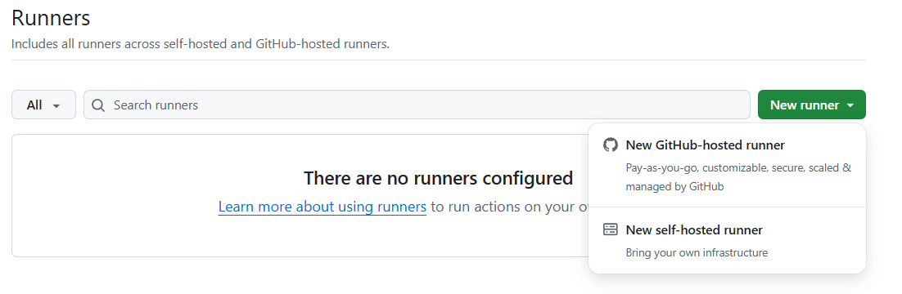
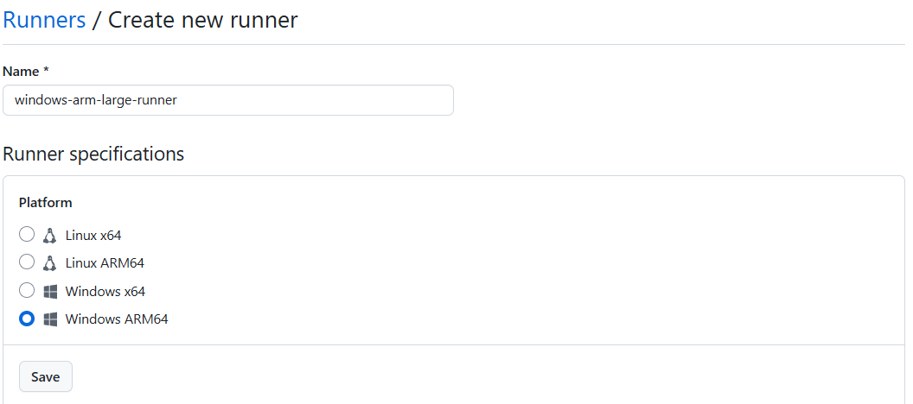
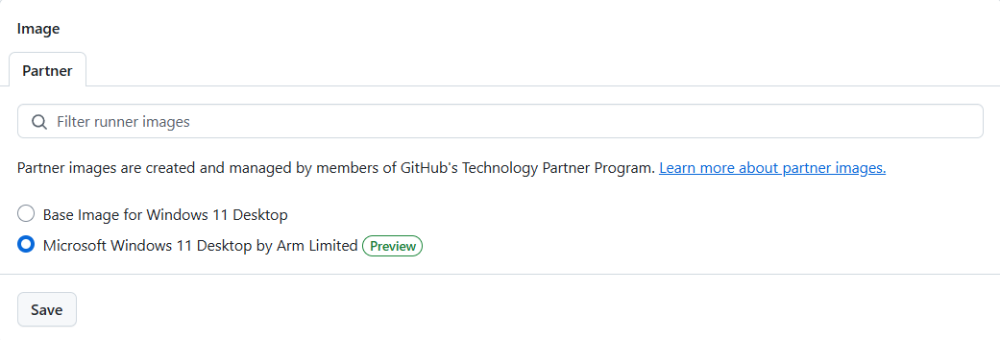
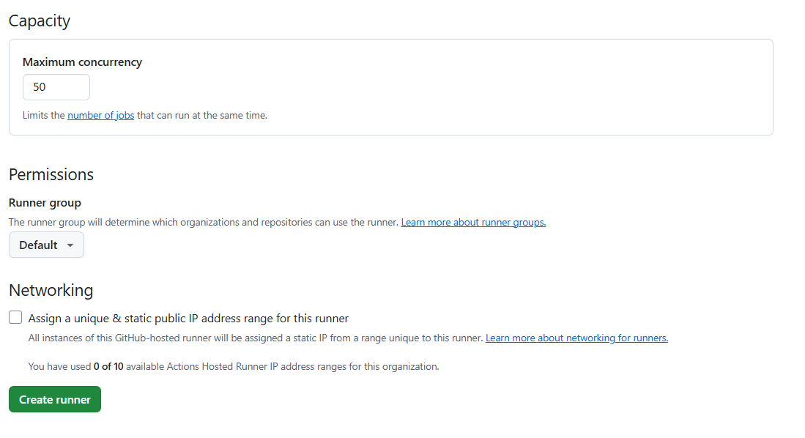
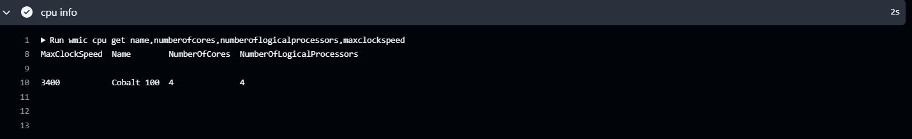

GitHub Arm-hosted runners for Windows are now available in public preview, providing a powerful and efficient way to build, test, and deploy your Windows applications on Arm without the need for virtualization. These runners come with a Windows 11 Desktop image, equipped with many tools to get started with your workflows. 

### What are GitHub Arm-hosted Runners?

Runners are the machines that execute jobs in a GitHub Actions workflow. An Arm-hosted runner is managed by GitHub and uses the Arm architecture, meaning you don't need to provide a server to run Actions workflows. GitHub provides the system and runs the Action workflows for you.

Arm-hosted runners are available for public repositories at no cost, subject to [standard usage limits](https://docs.github.com/en/actions/administering-github-actions/usage-limits-billing-and-administration#usage-limits). 

### How to use GitHub Arm-hosted Windows Runners?

To leverage the GitHub Windows Arm64 hosted runners, you need to use the following label in your public repository workflow runs:

```yaml
runs-on: windows-11-arm
```

{}
This label will not work in private repositories, the workflow will fail if you use it. 
{}


### What types of GitHub-hosted runners are available?

Two types of GitHub-hosted runners are available; standard runners and larger runners. Larger runners are differentiated from standard runners because you can control the amount of RAM, the number of CPUs, and configure the allocated disk space. You can also use the Windows 11 Desktop Arm Image with larger runners. To use this image on larger runners, you will need to create a new runner.

### How can I create an GitHub Arm-hosted Windows larger runner?

Arm-hosted runners are created at the organization level.

Navigate to your organization and select the `Settings` tab. On the left pane, select `Actions->Runners`.

On the `Runners` page, select the `New runner` drop-down on the top right, and then select `New GitHub-hosted runner`.



Specify a name for the runner, this is the `runs-on` field in your workflows so make the name clear for others who use it.

Choose Windows ARM64 for the platform and click `Save`.



Specify the operating system image for the runner, select `Microsoft Windows 11 Desktop by Arm Limited`, and click `Save`.



Select the size of the larger runner you need and click `Save`.


The `Capacity` section includes the maximum concurrency, which is the number of jobs to run at the same time.

You can also set the runner group for this runner. The runner group controls the settings for this runner. Pay attention to the runner group as you may need to return to the runner group settings if any configuration changes are needed.



Finally, click `Create runner`.

Your new Arm-hosted Windows larger runner is ready to use. Remember the runner name so you can use it in your workflows with the `runs-on` label. 

### How do I check the server hardware used by the Arm-hosted Windows Runners?

The Arm-hosted runners are powered by Microsoft Azure Cobalt 100 processors, based on the Arm Neoverse N2, with 4 vCPUs and Armv9-A features, including Scalable Vector Extension 2 (SVE2).

The output from running the `wmic` command on the Arm-hosted runner is below.




### How can I find the software installed on the Arm-hosted Windows Runners?

To find out more about the software installed on the Arm-hosted runners, visit the [GitHub Actions Partner Images repository](https://github.com/actions/partner-runner-images/). Check the [image documentation](https://github.com/actions/partner-runner-images/blob/main/images/arm-windows-11-image.md) for a list of software packages installed on the Windows 11 by Arm Limited image. You can also use this repository to report issues or request additional software.

