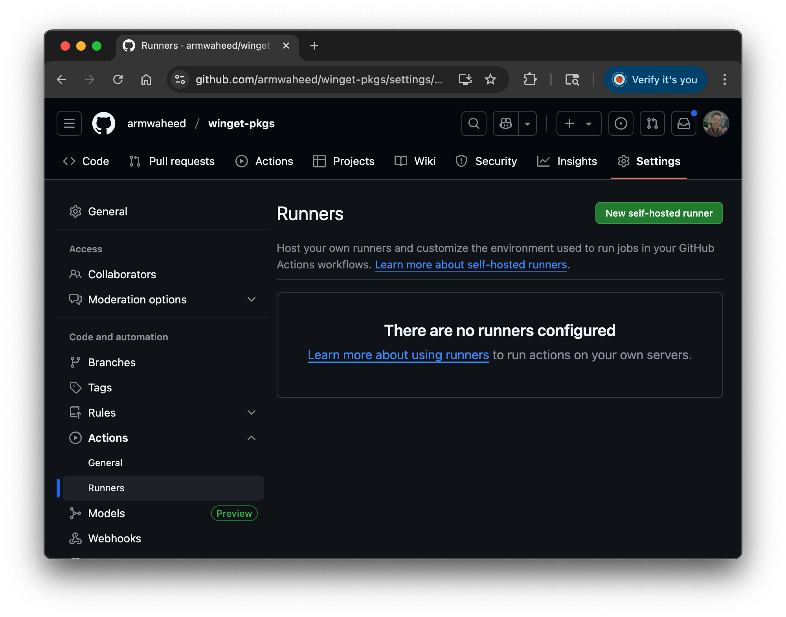
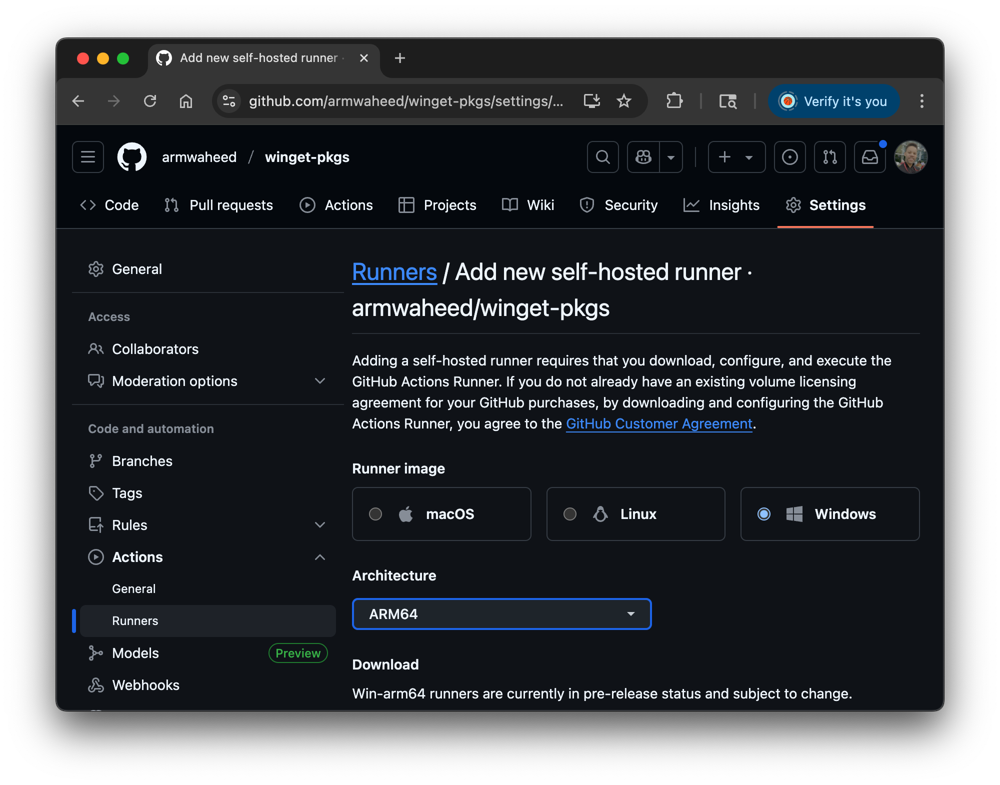
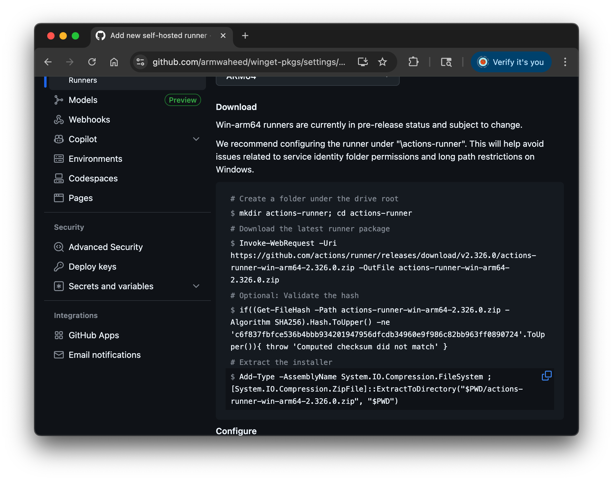

### Overview

GitHub now supports Arm self-hosted Windows runners, in Microsoft Azure. You can easily run workflows on an Azure Cobalt 100 virtual machine, with full control over your infrastructure. This Learning Path introduces GitHub Runners and how to self-host them.

### What are GitHub Self-hosted Runners?

Runners are the machines that execute jobs in a GitHub Actions workflow. An self-hosted runner is managed by you. This allows you to choose Arm architecture in your own cloud environment, to run GitHub Actions workflows. GitHub orchestrates the workflow jobs, while you run the Action workflows on your self-hosted virtual machine (VM) in the cloud.

GitHub self-hosted runners for Windows are now available in public preview, providing a powerful and efficient way to build, test, and deploy your Windows applications on Arm without the need for virtualization. These runners come with a Windows 11 Desktop image, equipped with many tools to get started with your workflows. 

Self-hosted runners are available for both private and public repositories at no cost, subject to [standard usage limits](https://docs.github.com/en/actions/administering-github-actions/usage-limits-billing-and-administration#usage-limits). 

### How Do I Use GitHub Self-hosted Windows Runners on Arm?

To leverage the GitHub Windows self-hosted runners on Arm64 VMs, you need to use the following label in your public repository workflow runs:

```yaml
runs-on: self-hosted
```

### How Do I Create a GitHub Self-hosted Runner?

Self-hosted runners are created at the organization or repository level. You will create a repository runner in this learning path.

Navigate to your respository and select the **Settings** tab. On the left pane, select **Actions->Runners**.

On the **Runners** page, push the **New self-hosted runner** button on the top right.



Choose Windows ARM64 for the platform and click **Save**.



Now follow the displayed instructions to **Download**, **Configure** and **Use your self-hosted runner** on your Microsoft Azure, Windows-on-Arm VM. [Use Windows PowerShell as an administrator](https://learn.microsoft.com/en-us/powershell/scripting/windows-powershell/starting-windows-powershell?view=powershell-7.6#run-with-administrative-privileges), to run the commands.

{}

For instructions on provisioning an Azure Windows-on-Arm VM please see the following learning path: [Deploy a Windows on Arm Cobalt 100 Virtual Machine on Azure](https://learn.arm.com/learning-paths/servers-and-cloud-computing/cobalt-windows/)

{}

