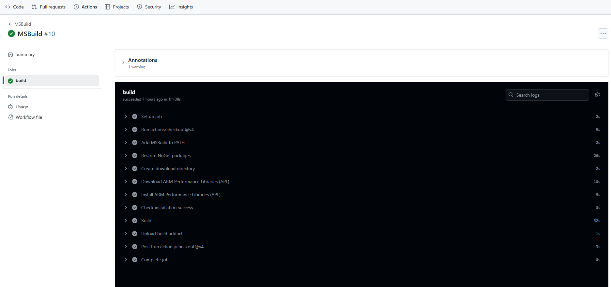

{}
In this section, you will learn how to automate the build process of a Windows application using GitHub Arm-hosted runners. You will use the application in the [Optimize Windows applications using Arm Performance Libraries Learning Path](/learning-paths/laptops-and-desktops/windows_armpl/).
{}

### About the Windows Application

This section provides a basic overview of the application. For detailed build instructions, see the [Optimize Windows applications using Arm Performance Libraries Learning Path](/learning-paths/laptops-and-desktops/windows_armpl/2-multithreading/).

The source code for the rotating 3D cube application, which demonstrates multiple programming approaches to performing rotation calculations, is available in this GitHub repository.

```console
https://github.com/arm/SpinTheCubeInGDI
```

The application implements a spinning cube and consists of four key components:
- **Shape Generation**: generates vertices for a sphere using a golden ratio-based algorithm.
- **Rotation Calculation**: uses a rotation matrix to rotate the 3D shape around the X, Y, and Z axes.
- **Drawing**: draws the transformed vertices of the shapes on the screen using a Windows API.
- **Performance Measurement**: measures and displays the number of transforms per second.

The code has two options to calculate the rotation:

1. **Multithreading**: distributes rotation calculations across multiple threads to improve performance.  
2. **Arm Performance Libraries**: uses Arm-optimized math functions to accelerate rotation calculations.

You will learn how to automate the build process for this application by using GitHub Actions with Arm-hosted Windows runners.

### Automate the Build Process

The [GitHub Actions workflow `msbuild.yml`](https://github.com/arm/SpinTheCubeInGDI/blob/main/.github/workflows/msbuild.yml) that automates the build process using MSBuild for Windows on Arm is included in the repository.

Below is an explanation of the steps in the workflow:


   **Trigger Events**: the workflow runs when there is a push or pull request event on the main branch.

   **Job Definition**: a single job named `build` is defined. It runs on the GitHub Arm-hosted Windows runner (`windows-11-arm`) as shown:

```console
jobs:
  build:
    runs-on: self-hosted
```
   **Checkout Repository**: uses the `actions/checkout@v4` action to fetch the code.

   **Add MSBuild to PATH**: adds MSBuild tools for the build process using `microsoft/setup-msbuild@v1.0.2`.

   **Restore Dependencies**: runs `nuget restore` to restore NuGet packages required by the solution.

   **Create Download Directory**: creates a directory to store downloaded files and verifies the Python version.

   **Download ARM Performance Libraries**: downloads the Windows installer for ARM Performance Libraries (APL) and verifies the downloaded files.

   **Install ARM Performance Libraries**: installs the downloaded ARM Performance Libraries using `msiexec.exe` with a quiet mode and logs the process.

   {}
   If `msiexec.exe /quiet` fails due to elevated privileges, you can download and install APL in a single step, using `winget`:
   ```shell
   winget install --accept-package-agreements --id Arm.ArmPerformanceLibraries --version 25.07
   ```
   {}

   **Check Installation Success**: verifies the success of the APL installation by checking the exit code and logs.

   **Build the Solution**: runs MSBuild to build the solution with the specified configuration (Debug) and platform (ARM64).

   **Upload Build Artifact**: uploads the built executable as an artifact using `actions/upload-artifact@v4`.

This workflow automates dependency management, environment setup, project compilation, and artifact storage - all using a GitHub Arm-hosted Windows runner.

### Fork the Repository and Run the Workflow

To run the workflow in your own GitHub account, start by forking the repository.

To fork the repository, go to the repository page on GitHub and click the **Fork** button in the top right corner. This will create a copy of the repository under your own GitHub account. 

You can then run the workflow in your forked repository by navigating to the **Actions** tab and selecting the MSBuild workflow, then clicking **Run workflow**.

You can view the **Actions** logs in the repository for each step. 


You have learned how to build a Windows application and upload the result as an artifact of your workflow using the GitHub Arm-hosted Windows runner.
