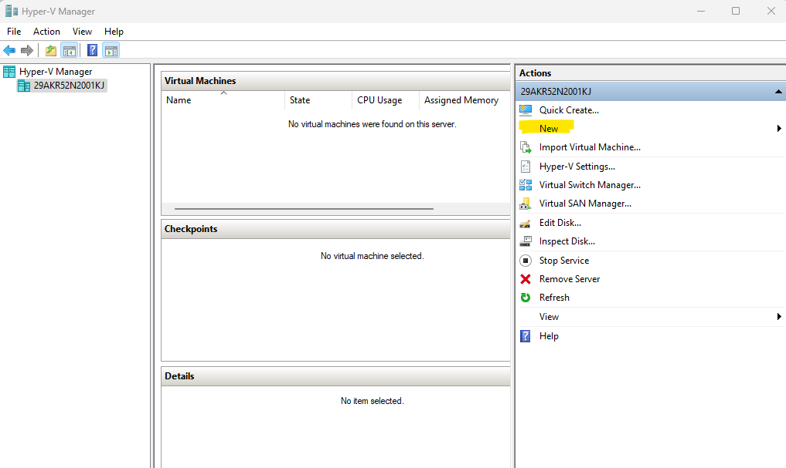
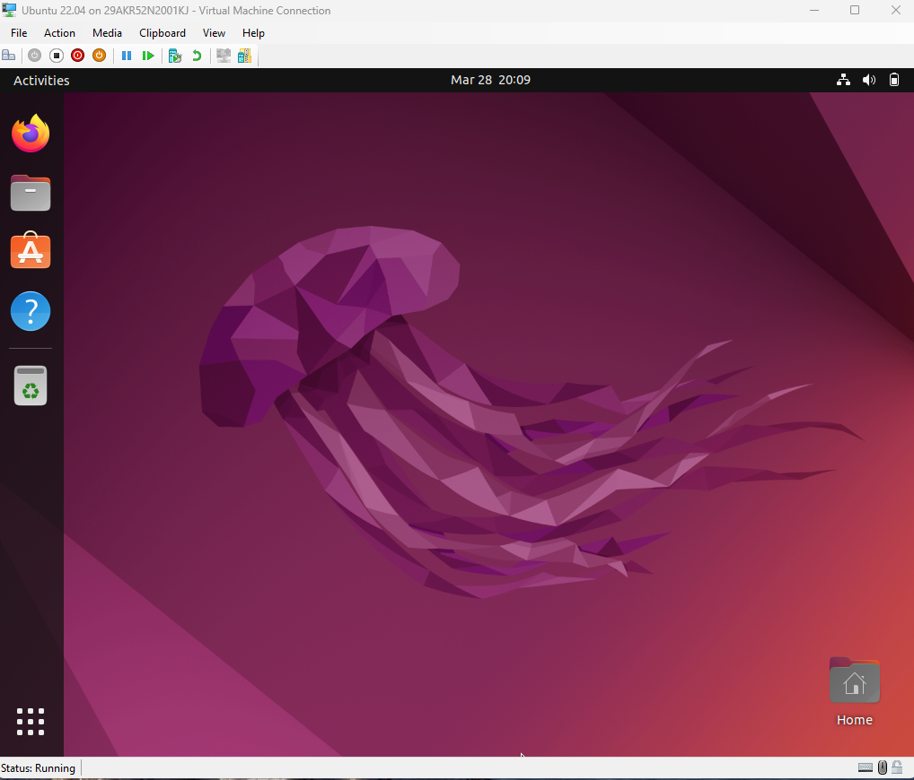
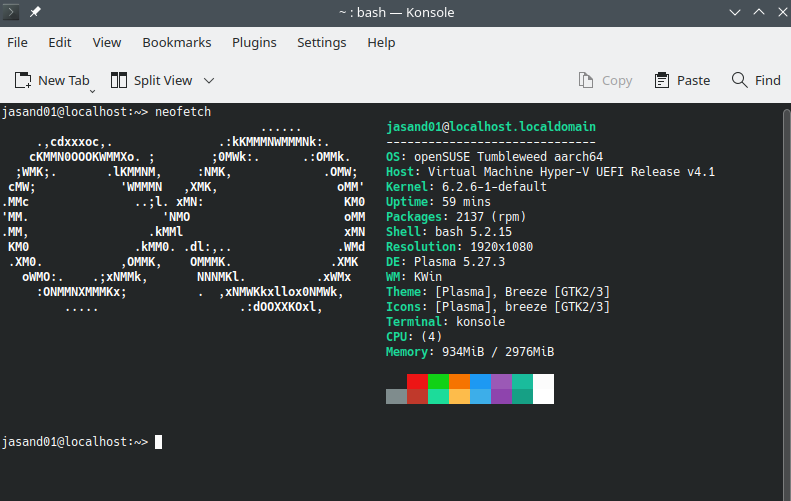

---
# User change
title: "Create a Linux virtual machine using Hyper-V"

weight: 2

layout: "learningpathall"
---

## Before you begin

You will need a Windows on Arm computer with [Hyper-V](/install-guides/hyper-v/) installed. 

You must have Windows 11 version 22H2 or newer to be able to run Linux virtual machines.

{}
Quick Create is a Hyper-V feature to create virtual machines with less setup. 
Do not use Quick Create with Windows on Arm devices.
{}

Ubuntu is used as an example Linux distribution. 

You can find information about other Linux distributions following the Ubuntu instructions. 

## Download an Ubuntu disk image

Download the [Ubuntu 24.04 ISO file](https://cdimage.ubuntu.com/noble/daily-live/current/noble-desktop-arm64.iso) for Arm.

Alternatively, you can download the `.iso` file from the Command Prompt or Windows PowerShell by running:

```console
curl https://cdimage.ubuntu.com/noble/daily-live/current/noble-desktop-arm64.iso --output noble-desktop-arm64.iso
```

## Install Ubuntu using Hyper-V 

### Create a new virtual machine

1. Open the Hyper-V Manager by searching for it in the Start Menu

2. Click on **New** in the Actions pane and select **Virtual Machine**



If you don't see **New** in the Actions pane click on your computer name on the left pane and it should appear. 

If you don't see your computer name under **Hyper-V Manager** on the left pane, click **Connect to Server...** in the Actions pane. Select **Local computer** and your computer should appear in the left pane. 

If you still don't see your computer in the left pane, use **Connect to Server...** in the Actions pane, select **Another computer**, and enter `127.0.0.1` and your computer should appear in the left pane. 

Proceed through the wizard answering questions and making choices.

3. Enter a name for your virtual machine and optionally change the location to store it

4. Select `Generation 2` for the virtual machine type

5. Specify the amount of memory you want to allocate to the virtual machine

Approximately half of the host machine memory is recommended.

6. Select `Default Switch` for the Networking Connection

7. Create a new virtual hard disk and specify the disk size

8. Select install the operating system from `Image file (.iso)`

Browse for the Ubuntu `.iso` file you downloaded. 

9. Finish the New Virtual Machine Wizard


### Configure the virtual machine settings

1. Right-click on the virtual machine and select "Settings".

2. Click on Security and uncheck `Enable Secure Boot` 

The virtual machine will not start correctly without disabling the secure boot. 

3. Click OK to save the settings

### Install Ubuntu

1. Start the virtual machine by double clicking on it and clicking `Start`

2. Wait for Ubuntu to reach the desktop

3. Double click the `Install Ubuntu` desktop icon

Configure Ubuntu and complete the installer. 

Your Linux virtual machine is now ready. 



## Resize display

You can resize the virtual machine display if it is too small. 

1. Use a text editor to open the file `/etc/default/grub`

Use `sudo` to open the file so you have permission to save the changes.

2. Modify the Linux command line to include the `video` parameter with the desired screen size

Find the line with the variable `GRUB_CMDLINE_LINUX_DEFAULT`

Add the video parameter as shown:

```console
GRUB_CMDLINE_LINUX_DEFAULT="quiet splash video=hyperv_fb:1920x1080"
```

3. Update the command line parameters

At a terminal prompt run:

```console
sudo update-grub
```

4. Install the extra drivers for virtual machines

```console
sudo apt install linux-image-extra-virtual -y
```

5. Restart the virtual machine

Your virtual machine now has a larger display size. 

## Other Linux distributions 

There are a number of other Linux distributions which can be used with Hyper-V and Windows on Arm. 

- [Debian Bookworm](https://www.debian.org/releases/bookworm/)
- [openSUSE Leap](https://get.opensuse.org/leap/15.4/)
- [openSUSE Tumbleweed](https://get.opensuse.org/tumbleweed/)
- [Fedora Workstation](https://getfedora.org/workstation/download/)

Look for the `aarch64` image and download the `.iso` file. 

You can follow the same procedure to boot from the `.iso` file and run the installer. 

Some distributions may resize the display automatically by right clicking on the desktop and looking for the display settings. 

Other distributions may require a modification to the kernel command line, similar to Ubuntu display resize information.

Here is openSUSE Tumbleweed:



Hyper-V virtual machines provide easy access to Arm Linux distributions using a Windows on Arm device. 
