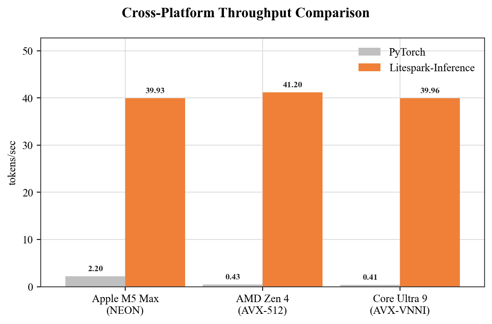
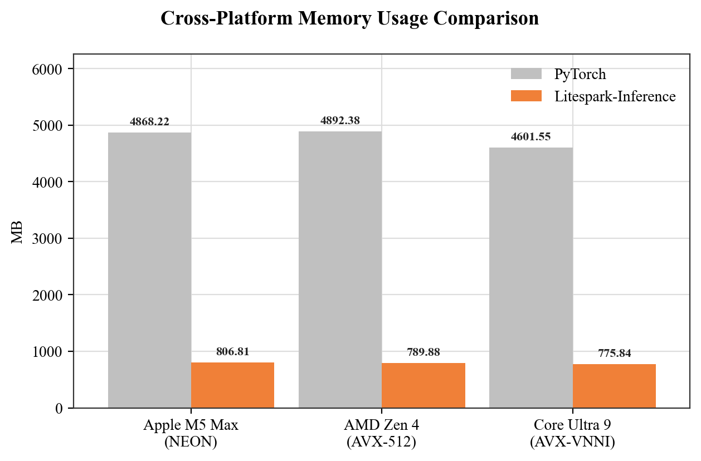

## The short version

Litespark-Inference is an open-source runtime that runs
ternary-weight language models - such as
[BitNet b1.58](https://arxiv.org/abs/2402.17764) - on the CPU you
already have.
No GPU. No CUDA wheel. No PyTorch installation. The dependency
footprint after `pip install` is `numpy`, `safetensors`, and
`tokenizers`.

It runs on:

| Platform | Kernel selected automatically |
|---|---|
| **Linux on x86_64** with AVX-512 (Intel Ice Lake+ / AMD Zen 4+) | AVX-512 + VNNI |
| **Linux on x86_64**, Intel Core Ultra (no AVX-512) | AVX-VNNI (256-bit) |
| **Linux on x86_64** without VNNI (AMD Zen 2-3, pre-Skylake-X Intel) | AVX2 + FMA fallback |
| **Linux on Arm (Graviton 2/3/4, Ampere, etc.)** | NEON + SDOT |
| **macOS on Apple silicon (M1/M2/M3/M4/M5)** | NEON + SDOT |

A single `pip install` reads your CPU's feature flags and compiles the
right C++ source for you. You don't pick the kernel; it picks itself.
The [Litespark-Inference install guide](/install-guides/litespark-inference/)
covers the install step for each platform.

## Why BitNet on the CPU

BitNet b1.58 stores each weight as a value in `{-1, 0, +1}` and packs
four weights into one byte. That means:

- The model file is around 6x smaller than the equivalent `bfloat16`
  model (around 497 MB packed versus around 4,600 MB unpacked).
- Every matmul reduces to `int8` activation x ternary weight - exactly
  what a CPU's SIMD dot-product instructions (SDOT on Arm, VNNI on
  x86) are designed for.

The net effect: a 2-billion-parameter model that fits in under 1 GB of
RAM and generates tokens at interactive speed on a normal laptop or
cloud CPU instance.

The charts below show Litespark-Inference against a PyTorch baseline
across several Arm and x86 CPUs. Token-generation throughput is roughly
an order of magnitude higher, and resident memory is around 6x smaller,
on every platform tested.

## What you'll do in this Learning Path

1. **Run BitNet-2B from the CLI in one line:**
   `litespark-inference generate "Why is BitNet fast on CPU?" --max-tokens 64`.

2. **Run the same model from a short Python script** using the
   high-level `BitNet.from_pretrained(...).generate(...)` API.

3. **Tune the embedding dtype** (`bf16` / `int8` / `int4`) to trade
   memory for quality.

4. **(Optional)** Run a head-to-head benchmark against `transformers`
   with `torch.bfloat16` on the same machine, with memory, TTFT,
   throughput, and energy-per-token numbers.

The next chapter runs BitNet-2B from the CLI and from Python.
