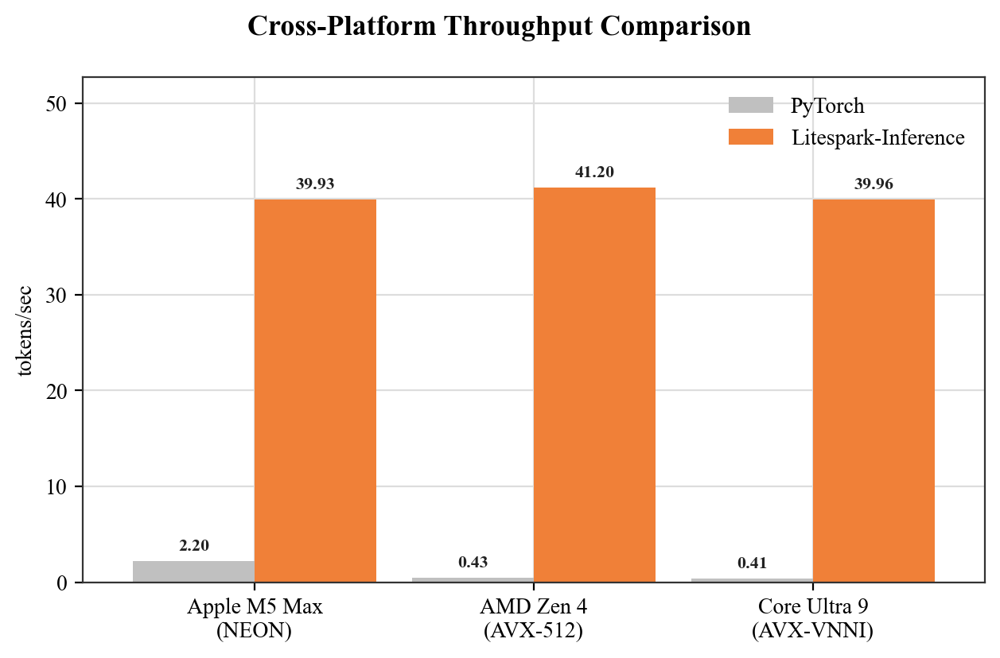
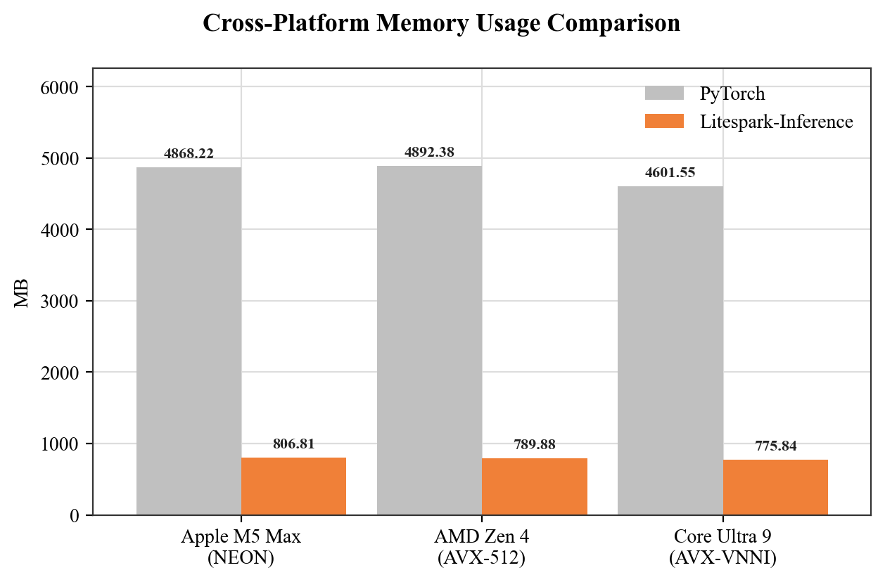

## Overview

Litespark-Inference is an open-source runtime designed to execute ternary-weight language models, such as [BitNet b1.58](https://arxiv.org/abs/2402.17764), directly on host CPUs. It performs inference without using a GPU or PyTorch at runtime. The PyTorch and Transformers packages are declared as dependencies for benchmarking and model-loading utilities, but the torchless inference path relies only on `numpy`, `safetensors`, and `tokenizers`.

It runs on:

| Platform | Kernel selected automatically |
|---|---|
| Linux on Arm Neoverse | NEON + SDOT |
| macOS on Apple Silicon | NEON + SDOT |
| Linux on x86_64 with AVX-512 | AVX-512 + VNNI |
| Linux on x86_64 with Intel Core Ultra | AVX-VNNI (256-bit) |
| Linux on x86_64 (no VNNI) | AVX2 + FMA fallback |

During `pip install`, the build process automatically detects your CPU's hardware feature flags and compiles the appropriate C++ kernel for your machine.

## How BitNet Accelerates CPU Inference

BitNet b1.58 stores each weight as a value in `{-1, 0, +1}` and packs
four weights into one byte. This provides two key benefits:

- Reduced Memory Footprint: The model file is around 6x smaller than the equivalent BF16 model (around 497 MB packed versus around 4,600 MB unpacked).
- SIMD Compute Efficiency: Every matrix multiplication reduces to INT8 activation × ternary weight, taking direct advantage of CPU SIMD dot-product instructions, such as `SDOT` on Arm Neon and `VNNI` on x86.

The net effect: a 2-billion-parameter model that fits in under 1 GB of
RAM and generates tokens at interactive speed on a normal laptop or
cloud CPU instance.

The charts below show Litespark-Inference against a PyTorch baseline
across several Arm and x86 CPUs. Token-generation throughput is roughly
an order of magnitude higher, and resident memory is around 6x smaller,
on every platform tested.

## What you've learned

In this section, you learned:
- How Litespark-Inference enables fast, lightweight CPU inference without GPU or PyTorch runtime dependencies.
- How ternary quantization (`BitNet b1.58`) compresses resident memory footprint and uses Arm Neon `SDOT` SIMD instructions.

## What you'll do in this Learning Path

1. Run BitNet-2B from the command line interface (CLI).
2. Execute model inference using Python and the `BitNet` API.
3. Compare embedding dtypes (BF16, INT8, and INT4) for memory and quality trade-offs.
4. (Optional) Benchmark Litespark-Inference performance against a PyTorch baseline.

The next section demonstrates how to run BitNet-2B from the CLI and from Python.
