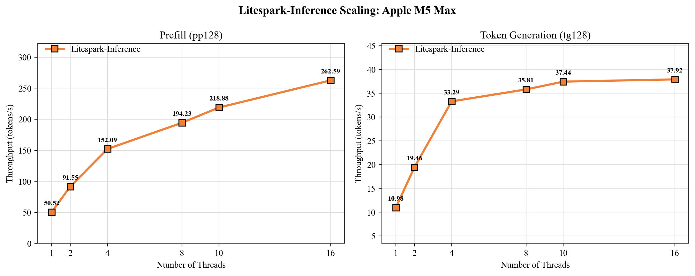
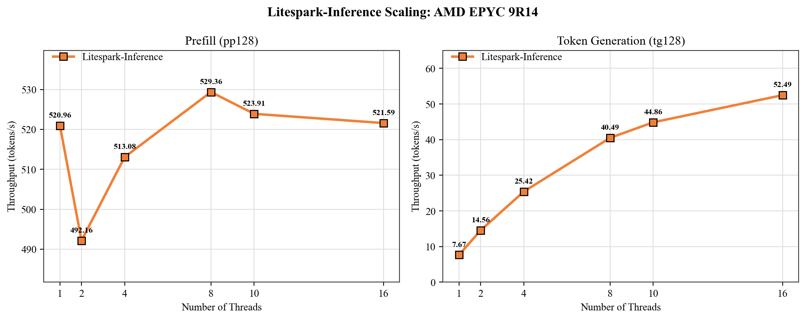
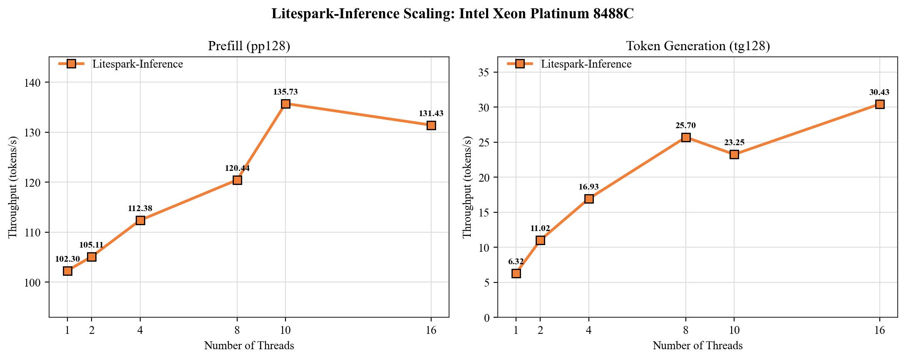

{}
This chapter is optional. Skip it if you just want to use the product.
It exists so you can quantify *how much* faster, smaller, and more
energy-efficient Litespark-Inference is on your machine versus the
Hugging Face and PyTorch baseline. The script also installs PyTorch as a
side effect (multi-GB download), which is worth knowing before you
start.
{}

Installing the package also gives you the `litespark-benchmark`
command, which runs both backends on the same prompt and prints a
side-by-side comparison table.

## One-shot benchmark

```bash
litespark-benchmark \
    --inference --pytorch \
    --no-matrix \
    --threads $(nproc) \
    --output results.json
```

About 1-2 minutes for the Litespark side, plus a longer pass for the
PyTorch baseline. Output ends with:

```output
======================================================================
COMPARISON: Litespark vs PyTorch
======================================================================

Metric                      PyTorch    Litespark  Improvement
----------------------------------------------------------
Memory (MB)                   4,602          773         5.9x
TTFT (ms)                   2,692.0        264.7        10.2x
Throughput (tok/s)             1.88        25.42        13.4x
```

The exact numbers depend on your CPU - the example above is from an
AMD Threadripper PRO 5965WX (Zen 3, 24 cores, no AVX-512). Apple
M-series and AWS Graviton 3/4 land in the same order of magnitude.

For the most accurate benchmark, run it when no other heavy processes
are running.

## Flag-by-flag breakdown

| Flag | Why |
|---|---|
| `--inference` | Run the BitNet inference benchmark (`pp128` + `tg128`). |
| `--pytorch` | Also run the Hugging Face/PyTorch baseline and print the comparison table. **Multi-GB PyTorch download on first run.** |
| `--no-matrix` | Skip the raw matrix-shape sweep, which can take an hour on a large CPU. |
| `--threads N` | Use N OMP threads. By default, the runtime uses the system default number of threads. Set this manually for an `N`-thread benchmark. |
| `--output results.json` | Saves the full result as JSON for further analysis or charting. |

## How throughput scales with threads

Sweeping `--threads` shows how prefill (`pp128`) and token generation
(`tg128`) scale as you add cores. Prefill is compute-bound and keeps
climbing with more threads; token generation is more memory-bound and
flattens out earlier. The charts below show the scaling on three
representative CPUs.







## (Optional) Energy measurement

If you want **joules per token** alongside the throughput numbers, add
`--power`:

```bash
litespark-benchmark \
    --inference --pytorch \
    --no-matrix \
    --threads $(nproc) \
    --power --power-cooldown 10 \
    --output results.json
```

On Linux, `--power` reads `/sys/class/powercap/intel-rapl/.../energy_uj`
(also works on AMD CPUs via the same kernel module). Those counters are
root-only by default, so the script auto-elevates with `sudo` - you will
see one password prompt at the start of the run. Once it has the
counters, everything else runs as the original user; the output JSON is
chowned back to you at the end. `--power-cooldown` sets the pause, in
seconds, before each measured power sample so the machine can settle
between runs.

The added rows in the comparison table:

```output
Energy (J)                 12096.21       952.11        12.7x
Energy/token (J)            94.5016       7.4383        12.7x
```

On Apple silicon, `--power` uses `powermetrics` for the energy reading.

### Where `--power` works

| Platform | Energy reading |
|---|---|
| Bare-metal Linux on Intel or AMD | Supported, via powercap / RAPL |
| Bare-metal Linux on Arm (Graviton metal, Ampere) | Depends on the platform - Graviton metal exposes it, most Arm boards do not |
| macOS Apple silicon | Supported, via `powermetrics` (script handles sudo automatically) |
| AWS EC2 non-metal instances | Not available - the hypervisor blocks MSR access; powercap zones are absent |
| WSL2 on Windows | Not available - same reason as EC2 (virtualized CPU) |

If `--power` reports `available: false`, your platform does not expose
the counters; the throughput numbers are still correct.

## Reading the JSON output

`results.json` contains the same fields shown in the table plus the
per-run timing distribution and the CPU's detected feature flags:

```json
{
  "system": {
    "cpu_model": "AMD Ryzen Threadripper PRO 5965WX 24-Cores",
    "architecture": "x86_64",
    "simd_features": {
      "avx512f": false,
      "avx512vnni": false,
      "avx_vnni": false,
      "neon": false
    }
  },
  "benchmarks": {
    "inference": { "kernel": "avx2-torchless", "threads": 24 },
    "pytorch_baseline": { "threads": 24 }
  }
}
```

The `simd_features` block tells you which kernel actually ran - useful
when comparing across machines.

## You're done

That is the full benchmarking flow. From here you can:

- Try different `--embed-dtype` values to see the memory/quality trade-off.
- Run on a different machine and compare - the JSON output makes
  side-by-side charts easy.
- File an issue at the
  [Litespark-Inference repo](https://github.com/Mindbeam-AI/Litespark-Inference)
  if your numbers look off or your platform is not detected correctly.
