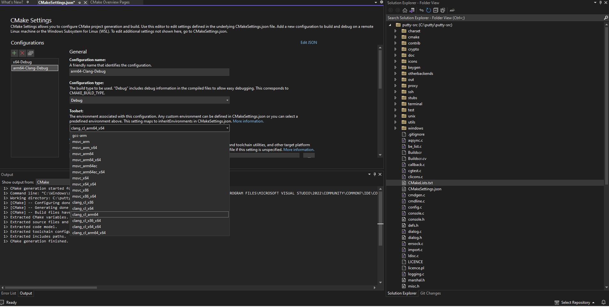

---
# User change
title: "Build a native windows application using LLVM for Windows on Arm"

weight: 2

layout: "learningpathall"
---

## Before you begin

Any Windows on Arm computer which has the required tools installed can be used for this Learning Path.

Follow the links to install the required tools. 

* [Visual Studio 2022 or higher](/install-guides/vs-woa). 
* [Install LLVM support in Visual Studio](/install-guides/vs-woa/#install-llvm-support-in-visual-studio).
* [Strawberry Perl](https://strawberryperl.com/) 

{}
There is currently no Arm version of Strawberry Perl. Install the 32-bit x86 version.
{}

## Compile PuTTY natively on Windows on Arm with Clang

You can use Clang to build a CMake application for Windows on Arm. The example application is PuTTY, an open-source SSH and telnet client.

To compile PuTTY on a Windows on Arm device, follow the steps outlined below:

1. Open `Windows PowerShell` on your Windows on Arm computer.

Run the next two steps at the PowerShell command prompt. 

2. Create a directory to use for the build and go to the directory:

```console
mkdir C:\putty
cd C:\putty
```

3. Download the PuTTY source archive into your build directory and unzip it:

```console
wget https://the.earth.li/~sgtatham/putty/latest/putty-src.zip  -o putty-src.zip
Expand-Archive putty-src.zip
```

4. Open the source code folder in Visual Studio

Start Microsoft Visual Studio. 

Select the `Open a Local folder` option. 

Browse and select the putty source directory `C:\putty\putty-src` which contains the `CmakeLists.txt` file.

 

The `Solution Explorer` pane will appear on the right side of Visual Studio and will display the folder structure and files in the putty source directory.

{}
Don't be alarmed when Visual Studio appears to start building. 
PuTTY uses the CMake build system and Visual Studio starts generating the CMake cache when the project is opened. 
{}

Wait for Visual Studio to complete processing for the default configuration, which is `x64-Debug`. 

5. Change the configuration to Arm

When Visual Studio processing is complete, you can change the configuration to build for Arm64 instead.

To change the configuration, right click on the `CMakeLists.txt` file in the `Solution Explorer` pane. 

Select `CMake settings for putty`. 

This opens up the `CMake Settings` dialog. 

You can now add a new configuration to build PuTTY for Arm. This configuration uses the LLVM toolchain installed by the Visual Studio Installer. 


6. Add a new configuration

In `CMake Settings`, click on `+` sign to `Add a New Configuration` and select `arm64-Clang-Debug`. 


7. Change the toolset

With the `arm64-Clang-Debug` configuration selected, change the `Toolset` from the drop-down menu to `clang_cl_arm64`. 



8. Generate the CMake configuration

Scroll down and find `CMake variables and Cache` and click on `Save and generate CMakeCache to load variables`. 

This will change the configuration on the top of Visual Studio to `arm64-Clang-Debug`

On the top toolbar open the drop down and click `arm64-Clang-Debug`. Then select `Project -> Configure Cache`. This will trigger Visual Studio to generate the `CMakeCache.txt` file for your new `arm64-Clang-Debug` configuration.

In the output window, you will see messages similar to:

```output
1> CMake generation started for configuration: 'arm64-Clang-Debug'.
1> Environment settings:
1>     CXXFLAGS=--target=arm64-pc-windows-msvc -fdiagnostics-absolute-paths
1>     CFLAGS=--target=arm64-pc-windows-msvc -fdiagnostics-absolute-paths
1> Command line: "C:\Windows\system32\cmd.exe" /c "%SYSTEMROOT%\System32\chcp.com 65001 >NUL && "C:\PROGRAM FILES\MICROSOFT VISUAL STUDIO\2022\COMMUNITY\COMMON7\IDE\COMMONEXTENSIONS\MICROSOFT\CMAKE\CMake\bin\cmake.exe"  -G "Ninja"  -DCMAKE_BUILD_TYPE:STRING="Debug" -DCMAKE_INSTALL_PREFIX:PATH="C:\putty\putty-src\out\install\arm64-Clang-Debug" -DCMAKE_C_COMPILER:FILEPATH="C:/PROGRAM FILES/MICROSOFT VISUAL STUDIO/2022/COMMUNITY/VC/Tools/Llvm/bin/clang-cl.exe"  -DCMAKE_MAKE_PROGRAM="C:\PROGRAM FILES\MICROSOFT VISUAL STUDIO\2022\COMMUNITY\COMMON7\IDE\COMMONEXTENSIONS\MICROSOFT\CMAKE\Ninja\ninja.exe" "C:\putty\putty-src" 2>&1"
1> Working directory: C:\putty\putty-src\out\build\arm64-Clang-Debug
1> [CMake] -- The C compiler identification is Clang 15.0.1 with MSVC-like command-line
1> [CMake] -- Detecting C compiler ABI info
1> [CMake] -- Detecting C compiler ABI info - done
```
From these messages, you can see that the Compiler being used to build the PuTTY application is Clang 15.0.1. 

This is the version of the LLVM toolchain installed with Visual Studio.

9. Modify the `windows.cmake` file

In `Solutions Explorer` browse to the `cmake`-> `platforms` directory and open the `windows.cmake` file. 

Search for `/C1252` in this file and replace with `-c1252`

After the change, it should look like:

```output
  set(CMAKE_RC_FLAGS "${CMAKE_RC_FLAGS} /nologo -c1252")
```

{}
The cmake helper tool `cmcldeps.exe` has an issue understanding the entire command-line syntax with "/" used to to pass a command-line option. You can use "-" instead to pass the command line option.
{}

10. Build the application

Select `Build->Build-All`

When the build process completes, there will be a new executable `putty.exe` in your configuration build folder `C:\putty\putty-src\out\build\arm64-Clang-Debug` 

This is the PuTTY application that you natively compiled on your Windows on Arm machine with the LLVM toolchain. 

Double-click it to run and check that it works on your Windows on Arm device. 

If you right click on the PuTTY application and select `Properties`, on the `Compatibility` tab you will see the `Windows on Arm` emulation settings are disabled. This shows the application was natively built for Windows on Arm.


## Change to a different version of LLVM

If you would like to build with a different version of LLVM, you will need to make a change in the CMake settings. 

At the time of writing, the latest version with Windows on Arm support is LLVM 18.1.8. 

Ensure you have downloaded and installed [LLVM 18.1.8](/install-guides/llvm-woa)

On `CMake Settings` page in Visual Studio, select the `Show advanced variables`checkbox under `CMake variables and cache`.

Change the value of `CMAKE_C_COMPILER` to point to the location where you have installed LLVM 18.1.8. 

For example: `C:\Program Files\LLVM\bin\clang-cl.exe`. Click on the `Save to JSON` checkbox next to this field and `Save`.


Saving this change will automatically trigger the CMake cache variables to be re-generated and loaded. 

You should see output similar to what is shown below:

```output
1> [CMake] -- The C compiler identification is Clang 18.1.8 with MSVC-like command-line
1> [CMake] -- Detecting C compiler ABI info
1> [CMake] -- Detecting C compiler ABI info - done
```

The Clang version is now 18.1.8.
