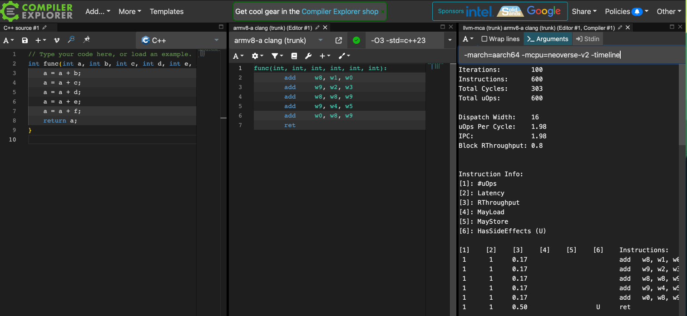

### What is Compiler Explorer?
Compiler Explorer is an interactive online compiler that lets you edit code in C/C++, Java, Python and many other programming languages. It then allows you to see what the code looks like after being compiled in real time. It supports multiple compilers and has many tools available, including llvm-mca.

### Running MCA in Compiler Explorer
To access Compiler Explorer, open a browser and go to https://godbolt.org. This leads you to a page that looks as in Figure 1 below:


On the left side of the page is the source code. In Figure 1 it is set to C++, you can click on the programming language to select a different language for the source code. Now copy this code and use it as C++ source:
```
int func(int a, int b, int c, int d, int e, int f) {
    a = a + b;
    a = a + c;
    a = a + d;
    a = a + e;
    a = a + f;
    return a;
}
```

On the right side of the page is the disassembly output from the compiler. You can change the compiler by clicking on it and selecting a different one. You can try this now and select `armv8-a clang(trunk)` as the compiler. Then add some compiler flags by typing `-O3` in the `Compiler options` box. You can view the full set of options passed to the compiler by clicking on the green tick next to the compiler. You can now add llvm-mca from the `Add tool` dropdown button, as shown in Figure 2 below:


To add more flags to `llvm-mca`, click on the `Arguments` button and type them in. Specify the CPU name to `llvm-mca` by using the `-mcpu` flag. To find what CPUs are supported you can check the [clang documentation](https://clang.llvm.org/docs/CommandGuide/clang.html#cmdoption-print-supported-cpus). You can try this now and add `-mcpu=neoverse-v2`, as well as any other flags you choose to pass to `llvm-mca`. On the right side of the page is the output from running `llvm-mca` on the disassembly of the source code, as shown in Figure 3 below:


You are now able to run `llvm-mca` using Compiler Explorer.