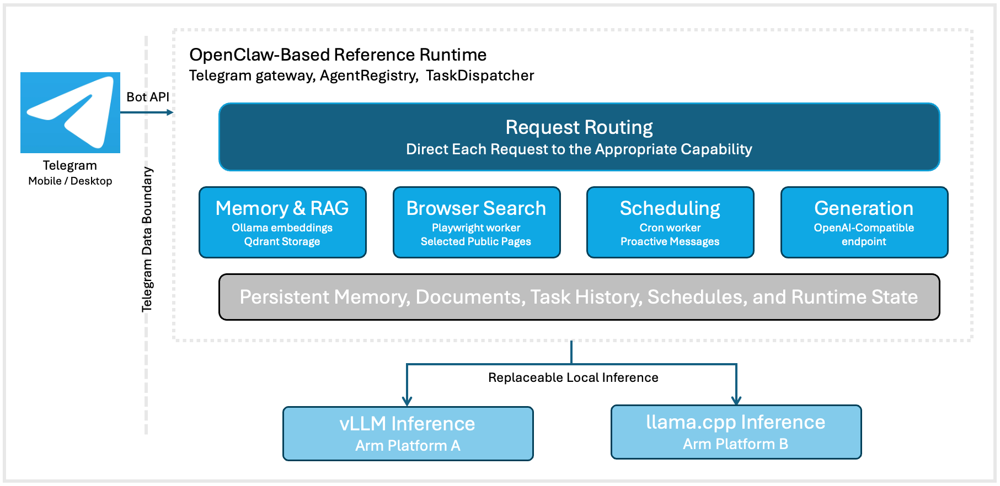

## Transition from inference to an assistant

Running a local LLM gives you private text generation, but not a complete assistant. You still need an interface for questions, saved information, document searches, and reminders.

In this Learning Path, you'll deploy [OpenClaw Arm Continuum](https://github.com/odincodeshen/openclaw-arm-continuum) and use it from Telegram. You'll save a household note, query a local document, search the web, and schedule a notification. Inference, embeddings, documents, vector memory, and task state remain on hardware that you control.

Telegram is the messaging interface. The runtime can support another platform through a gateway that translates its messages and events.

OpenClaw provides the foundation for the assistant. The reference runtime connects it to Telegram, local generation through vLLM or `llama.cpp`, Ollama embeddings, Qdrant memory, browser search, and scheduled tasks. It routes each request to the relevant local service or tool.

## Understand the data boundary

Local-first doesn't mean that every byte stays offline. Telegram and web search use external services, while the core AI data remains under your control.

| Data or operation | Location | External interaction |
|---|---|---|
| LLM inference | DGX Spark or CPU-only Arm host | Model weights are downloaded during setup |
| Embeddings | Local Ollama service | Model weights are downloaded during setup |
| Vector memory and RAG | Local Qdrant service | None during normal retrieval |
| Uploaded documents | Local runtime workspace | Telegram transports the original upload |
| Cron state and task history | Local workspace and Gateway state | Telegram transports push messages |
| External data lookup | Local skill | Public data service selected by the skill |
| Browser search | Local Playwright worker | Search engine and selected public pages |

The runtime doesn't use a public cloud LLM API. Telegram transports bot messages, and browser searches send requests to external websites.

{}
Don't enter real personal, household, or organizational information. Instead, use synthetic or public data. If the host already contains personal runtime data, set environment variables by following the instructions in [Configure and start the OpenClaw runtime on DGX Spark](/learning-paths/laptops-and-desktops/openclaw_continuum/3_dgx_runtime_deploy/).
{}

## Trace the application request path

The architecture shows how Telegram requests reach local services and persistent data:



The reference runtime can also start a configured workflow automatically, without requiring a new Telegram message from the user:

```text
Cron schedule
    -> Reference runtime cron worker
    -> Local skill and local LLM
    -> Telegram push notification
```

Slash commands follow fixed routes. For example, `/search` always selects browser search, while a plain-language weather question selects the weather skill.

{}
The runtime uses a text-first architecture, fixed skill routes, and one local LLM endpoint. This Learning Path doesn't cover multi-model routing, multi-agent handoffs, or hardware benchmarking.
{}

## Understand the shared API contract across Arm platforms

The same workflow uses an inference engine suited to each platform:

| Platform | Inference engine |
|---|---|
| NVIDIA DGX Spark | vLLM server |
| Radxa Orion O6 | `llama.cpp` server |

Both expose an OpenAI-compatible chat-completions API, so only the configured endpoint and model name change.

## What you've learned and what's next

You now understand the runtime components, data boundary, and shared inference API.

Next, you'll prepare the NVIDIA DGX Spark and configure Ollama and Qdrant.
