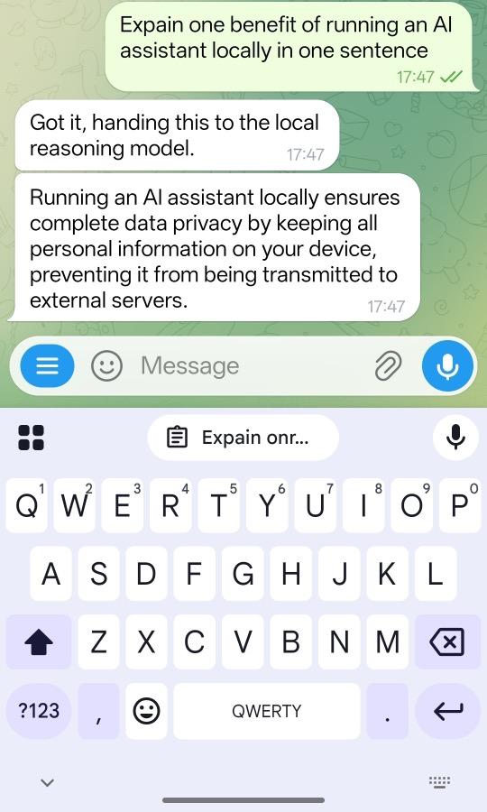

## Prepare the DGX Spark Host Environment

This section assumes Docker Engine, the Docker Compose plugin, the NVIDIA driver, and NVIDIA Container Toolkit are installed on DGX Spark. Cloning the project later in this Learning Path downloads the reference runtime source and configuration, but it does not install Ollama or Qdrant. Prepare these host services before you start the project containers.

Confirm that the Arm CPU and NVIDIA GPU are visible:

```bash
uname -m
nvidia-smi
```

The expected CPU architecture is:

```output
aarch64
```

{}
This Learning Path uses Docker Engine and Docker Compose to run its services. If Docker is not installed on your DGX Spark, follow the [Install Docker Engine](https://learn.arm.com/install-guides/docker/docker-engine/) guide before continuing.
{}

Confirm Docker GPU access:

```bash
docker run --rm --gpus all ubuntu nvidia-smi
```

You do not need to install the vLLM Python package or start a vLLM server directly on the DGX Spark host. The project's `compose.yaml` pulls a container image that already includes vLLM and starts the local inference server for you. The NVIDIA driver and NVIDIA Container Toolkit are still required so that this container can access the GPU.

## Configure Ollama for Local Embeddings

Unlike vLLM, Ollama is not included as a service in the project's `compose.yaml`. Install and run Ollama separately on the DGX Spark host before starting the reference runtime.

Install Ollama using the [official Linux installer](https://docs.ollama.com/linux):

```bash
curl -fsSL https://ollama.com/install.sh | sh
```

The project containers connect to Ollama through the Docker host gateway. Create a systemd override that configures Ollama to listen on the host interfaces:

```bash
sudo install -d -m 0755 /etc/systemd/system/ollama.service.d
printf '%s\n' '[Service]' 'Environment="OLLAMA_HOST=0.0.0.0:11434"' | \
  sudo tee /etc/systemd/system/ollama.service.d/override.conf
```

Confirm the override file:

```bash
sudo systemctl cat ollama
```

The output should include the override:

```output
# /etc/systemd/system/ollama.service.d/override.conf
[Service]
Environment="OLLAMA_HOST=0.0.0.0:11434"
```

Reload systemd and restart Ollama:

```bash
sudo systemctl daemon-reload
sudo systemctl enable --now ollama
sudo systemctl restart ollama
```

Pull the embedding model used by this Learning Path:

```bash
ollama pull nomic-embed-text
```

Confirm that Ollama lists the model:

```bash
curl http://127.0.0.1:11434/api/tags
```

The response should list `nomic-embed-text:latest` with the `embedding` capability:

```output
{
  "models": [
    {
      "name": "nomic-embed-text:latest",
      "model": "nomic-embed-text:latest",
      "modified_at": "2026-07-15T16:58:41.999102452+01:00",
      "size": 274302450,
      "digest": "0a109f422b47e3a30ba2b10eca18548e944e8a23073ee3f3e947efcf3c45e59f",
      "details": {
        "parent_model": "",
        "format": "gguf",
        "family": "nomic-bert",
        "families": ["nomic-bert"],
        "parameter_size": "137M",
        "quantization_level": "F16",
        "context_length": 2048,
        "embedding_length": 768
      },
      "capabilities": ["embedding"]
    }
  ]
}
```

The modification time, size, and digest can differ with the installed model version.

## Start Qdrant for persistent vector storage

Create a Docker volume so that vector data remains available when the Qdrant container is replaced:

```bash
docker volume create openclaw-qdrant-data
```

Start Qdrant on the host using the [official container image](https://qdrant.tech/documentation/quick-start/):

```bash
docker run -d \
  --name openclaw-qdrant \
  --restart unless-stopped \
  -p 6333:6333 \
  -p 6334:6334 \
  -v openclaw-qdrant-data:/qdrant/storage \
  qdrant/qdrant
```

The `docker run` command creates the container and is needed only the first time. If `openclaw-qdrant` already exists but is stopped, start it instead:

```bash
docker start openclaw-qdrant
```

Confirm that the Qdrant API responds:

```bash
curl http://127.0.0.1:6333/collections
```

Before the reference runtime creates its collections, the response is similar to:

```output
{
  "result": {
    "collections": []
  },
  "status": "ok",
  "time": 0.000064224
}
```

The response time can differ. The empty collection list is expected at this stage; the runtime creates the tutorial collections when you save or ingest content.

{}
Ollama and Qdrant must be reachable from the project containers, but they should not be exposed to an untrusted network. Use the DGX Spark firewall or another host-level access control to restrict ports `11434`, `6333`, and `6334` to the local host and its Docker networks.
{}

## Clone the Reference Repository

Clone the repository and check out the release used by this Learning Path:

```bash
git clone https://github.com/odincodeshen/openclaw-arm-continuum.git
cd openclaw-arm-continuum
git checkout v1.2
```

The checked-out tag fixes the source used by this Learning Path even when development continues on `main`. Container images and model artifacts that do not have an explicit version are resolved when you download them and can change independently of the source tag.

## Configure Private Environment Variables

Copy the DGX Spark environment template:

```bash
cp .env.example .env
```

Generate a Gateway token:

```bash
openssl rand -hex 32
```

If you do not already have a Telegram bot, follow the official [Telegram Bot tutorial](https://core.telegram.org/bots/tutorial) to create one before continuing.

Edit `.env` and set the four private values:

```text
OPENCLAW_TELEGRAM_BOT_TOKEN=<your-telegram-bot-token>
OPENCLAW_TELEGRAM_ALLOWED_CHAT_IDS=<your-telegram-chat-id>
OPENCLAW_CRON_CHAT_IDS=<your-telegram-chat-id>
OPENCLAW_GATEWAY_TOKEN=<generated-random-token>
```

{}
Do not share your Telegram bot token or chat ID with anyone, and do not include them in screenshots, logs, or public repositories.
{}

Only allowlisted chat IDs can send commands to this runtime.

The main tutorial flow uses the default personal collections:

```text
personal_tracker_memory
personal_knowledge_base
```

You do not need to add collection settings to `.env` for this default path. Use only the synthetic data provided in the exercises.

{}
If this host already contains personal runtime data, or if you are preparing a public demonstration, add the following optional settings to `.env` to isolate the tutorial data:

```text
OPENCLAW_TRACKER_COLLECTION=demo_tracker_memory
OPENCLAW_KNOWLEDGE_COLLECTION=demo_knowledge_base
OPENCLAW_RUNTIME_LABEL=DGX Spark Demo
```

If you choose this option, replace the `personal_*` collection names in later verification commands with the corresponding `demo_*` names.
{}

The DGX model used in this Learning Path is text-first. Disable experimental vision routing:

```text
OPENCLAW_VISION_ENABLED=false
```

{}
Never commit `.env`. It contains the Telegram bot token and Gateway authentication token. The repository ignores this file, but you should still verify `git status` before publishing changes.
{}

## Initialize and Start the Runtime Stack

The Gateway runs as user ID `1000` inside its container and needs write access to its persistent state directory. Prepare the directory before starting the stack:

```bash
mkdir -p gateway-data/state
sudo chown -R 1000:1000 gateway-data
sudo chmod -R u+rwX gateway-data
```

Start the complete DGX Spark stack:

```bash
docker compose --env-file .env -f compose.yaml up -d
```

The first start can take several minutes while Docker images and model weights are downloaded and vLLM loads and compiles the model. A running container does not yet mean that its API is ready.

Verify Service Status and API Readiness:

```bash
docker compose --env-file .env -f compose.yaml ps -a
docker logs --tail 80 openclaw-vllm
docker logs --tail 80 openclaw-gateway
docker logs --tail 80 openclaw-telegram
docker logs --tail 80 openclaw-cron
```

Follow the vLLM log during the first startup:

```bash
docker logs -f openclaw-vllm
```

Wait until the log includes `Application startup complete`. Model download and compilation messages before this point are expected. Press `Ctrl+C` to stop following the log; this does not stop the container.

Confirm that the model API is ready:

```bash
curl http://127.0.0.1:8000/v1/models
```

Verify that a project container can reach both host services through the Docker host gateway:

```bash
docker exec openclaw-telegram python -c "import urllib.request; print(urllib.request.urlopen('http://host.docker.internal:11434/api/tags').status)"
docker exec openclaw-telegram python -c "import urllib.request; print(urllib.request.urlopen('http://host.docker.internal:6333/collections').status)"
```

Both commands should print HTTP status `200`.

Confirm the local Gateway dashboard endpoint:

```bash
curl -I http://127.0.0.1:18789/
```

An HTTP `200` response confirms that the Gateway dashboard is reachable.

## Run the first Telegram test

Open your bot in Telegram and send:

```text
/help
```

The bot should return the OpenClaw command card. Next, send a short general message:

```text
Explain one benefit of running an AI assistant locally in one sentence.
```

Watch the Telegram and vLLM logs while the request is processed:



```bash
docker logs --tail 10 openclaw-telegram
```

The output should look similar to:

```output
2026-07-17T15:38:47+00:00 [telegram] chat_id=<your-telegram-chat-id> text_chars=69
2026-07-17T15:38:47+00:00 [runtime] start chat_id=<your-telegram-chat-id> active=1
2026-07-17T15:38:51+00:00 [runtime] done chat_id=<your-telegram-chat-id> task_id=<task-id> agent=chat_agent duration_ms=4153 answer_chars=180
```

```bash
docker logs --tail 10 openclaw-vllm
```

The recent log should include a successful local completion request similar to:

```output
(APIServer pid=1) INFO:     172.18.0.7:48686 - "POST /v1/chat/completions HTTP/1.1" 200 OK
```

The request appearing in the local logs confirms the runtime path. The model's text alone is not evidence that inference was local.

## Execute Test Suites

Run the repository tests from the host:

```bash
OPENCLAW_OLLAMA_BASE_URL=http://127.0.0.1:11434 \
OPENCLAW_QDRANT_BASE_URL=http://127.0.0.1:6333 \
PYTHONPATH=app python3 -m unittest discover -s tests
```

The output should look similar to:

```output
............................................................................................................
----------------------------------------------------------------------
Ran 119 tests in 3.213s

OK
```

These tests validate command routing, task dispatch, cron parsing, ingestion helpers, and failure handling. They are software behavior tests, not hardware benchmarks.

## What you've learned and what's next

You have deployed the personal reference runtime on NVIDIA DGX Spark, connected it to your Telegram bot, verified the local vLLM endpoint, and checked the runtime tests.

Next, you will use the deployment as a local-first household assistant and confirm that memory is stored in local Qdrant collections.
