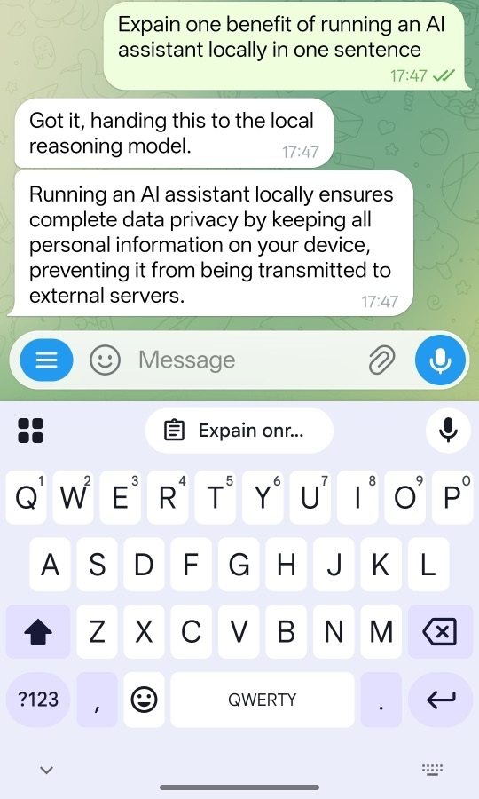

## Configure the Telegram bot environment variables

With the host and local services ready, configure the Telegram bot.

You need a Telegram account, a bot token, and the numeric chat ID for the account that will use the bot. Create a Telegram account if you don't already have one. You can use the Telegram desktop, mobile, or web client for the following steps.

To create a bot and obtain its token:

1. Open Telegram and start a chat with BotFather.
2. Send the following command:

    ```text
    /newbot
    ```

3. Follow BotFather's prompts to name the bot and choose a username.
4. Copy the HTTP API token that BotFather returns. You'll add it to the `.env` file later.

For more information about creating and managing bots, see the official [Telegram Bot tutorial](https://core.telegram.org/bots/tutorial).

Next, obtain the chat ID for your Telegram account:

1. Open a chat with the bot that you created and send a test message, such as `Hello`. The message creates an update that the Telegram Bot API can return.
2. Open a terminal on your local machine and query the updates. Replace `<your-telegram-bot-token>` with the HTTP API token from BotFather:

    ```bash
    curl "https://api.telegram.org/bot<your-telegram-bot-token>/getUpdates"
    ```

    The output is similar to:

    ```output
    {
      "ok": true,
      "result": [
        {
          "update_id": (...),
          "message": {
            (...)
          },
          "chat": {
            (...)
          },
          "date": (...),
          "text": "Hello"
        }
      ]
    }
    ```

    Copy the `message.chat.id` value. You'll use this value for `<your-telegram-chat-id>` in the `.env` file. If the `result` array is empty, send another message to the bot and run the command again.

Copy the DGX Spark environment template:

```bash
cp .env.example .env
```

Keep `.env` in the `openclaw-arm-continuum` repository root, alongside `.env.example`. The deployment command reads it from this location.


Then, generate a Gateway token:

```bash
openssl rand -hex 32
```


Edit `.env` and set the four private values:

```text
OPENCLAW_TELEGRAM_BOT_TOKEN=<your-telegram-bot-token>
OPENCLAW_TELEGRAM_ALLOWED_CHAT_IDS=<your-telegram-chat-id>
OPENCLAW_CRON_CHAT_IDS=<your-telegram-chat-id>
OPENCLAW_GATEWAY_TOKEN=<generated-gateway-token>
```

Set `OPENCLAW_CRON_TIMEZONE` to your local [IANA timezone](https://en.wikipedia.org/wiki/List_of_tz_database_time_zones). For example, use `Europe/London`, `America/New_York`, or `Asia/Singapore`:

```text
OPENCLAW_CRON_TIMEZONE=<your-IANA-timezone>
```

Scheduled jobs use UTC when this setting is omitted.

You'll name the location explicitly when asking weather-related questions, so you don't need to configure `OPENCLAW_DEFAULT_WEATHER_LOCATION`.

{}
Don't share your Telegram bot token or chat ID with anyone, and don't include them in screenshots, logs, or public repositories.
{}

Only allowlisted chat IDs can send commands to this runtime.

The main tutorial flow uses the default personal collections:

```text
personal_tracker_memory
personal_knowledge_base
```

You don't need to add collection settings to `.env` for this default path. Use only the synthetic data provided in the exercises.

{}
If this host already contains personal runtime data, or if you're preparing a public demonstration, add the following optional settings to `.env` to isolate the tutorial data:

```text
OPENCLAW_TRACKER_COLLECTION=demo_tracker_memory
OPENCLAW_KNOWLEDGE_COLLECTION=demo_knowledge_base
OPENCLAW_RUNTIME_LABEL=DGX Spark Demo
```

If you choose this option, replace the `personal_*` collection names in later verification commands with the corresponding `demo_*` names.
{}

The DGX model that you'll use is text-first. Disable experimental vision routing:

```text
OPENCLAW_VISION_ENABLED=false
```


## Initialize and start the runtime stack

The Gateway runs as user ID `1000` inside its container and needs write access to its persistent state directory. Prepare the directory before starting the stack:

```bash
mkdir -p gateway-data/state
sudo chown -R 1000:1000 gateway-data
sudo chmod -R u+rwX gateway-data
```

Start the complete DGX Spark stack:

```bash
docker compose --env-file .env -f compose.yaml up -d
```

The first start takes longer than subsequent starts because vLLM downloads the approximately 30 GiB Qwen model before loading it. The download time depends on your network connection and can make the initial startup longer. Subsequent starts use the cached model. A running container doesn't mean that its API is ready.

Check service status and API readiness:

```bash
docker compose --env-file .env -f compose.yaml ps -a
docker logs --tail 80 openclaw-vllm
docker logs --tail 80 openclaw-gateway
docker logs --tail 80 openclaw-telegram
docker logs --tail 80 openclaw-cron
```

Follow the vLLM log during the first startup:

```bash
docker logs -f openclaw-vllm
```

Wait for `Application startup complete`. Press `Ctrl+C` to leave the log view without stopping the container.

Confirm that the model API is ready:

```bash
curl http://127.0.0.1:8000/v1/models
```

Verify that a project container can reach both host services through the Docker host gateway:

```bash
docker exec openclaw-telegram python -c "import urllib.request; print(urllib.request.urlopen('http://host.docker.internal:11434/api/tags').status)"
docker exec openclaw-telegram python -c "import urllib.request; print(urllib.request.urlopen('http://host.docker.internal:6333/collections').status)"
```

Both commands should print HTTP status `200`.

Confirm the local Gateway dashboard endpoint:

```bash
curl -I http://127.0.0.1:18789/
```

An HTTP `200` response confirms that the Gateway dashboard is reachable.

## Run the first Telegram test

Creating the bot with BotFather registers its name and username in Telegram. The `openclaw-telegram` container uses the token in `.env` to connect the Telegram bot to the local Gateway and AI services on DGX Spark.

Find the bot in Telegram by searching for the username that you chose in BotFather. You can also replace `<your-bot-username>` in `https://t.me/<your-bot-username>` with that username and open the URL. Select **Start** to open a chat. The bot doesn't start a chat with you or automatically appear in your chat list.

Messages use the following path:

```text
Telegram client -> Telegram Bot API -> openclaw-telegram container on DGX Spark
    -> local Gateway and AI services -> openclaw-telegram container -> Telegram client
```

After the containers are running and you've started the Telegram chat, send:

```text
/help
```

The bot should return the OpenClaw command card. Next, send a short general message:

```text
Explain one benefit of running an AI assistant locally in one sentence.
```



Watch the Telegram logs while the request is processed:

```bash
docker logs --tail 10 openclaw-telegram
```

The output is similar to:

```output
2026-07-17T15:38:47+00:00 [telegram] chat_id=<your-telegram-chat-id> text_chars=69
2026-07-17T15:38:47+00:00 [runtime] start chat_id=<your-telegram-chat-id> active=1
2026-07-17T15:38:51+00:00 [runtime] done chat_id=<your-telegram-chat-id> task_id=<task-id> agent=chat_agent duration_ms=4153 answer_chars=180
```

Watch the Telegram logs while the request is processed:

```bash
docker logs --tail 10 openclaw-vllm
```

The recent log should include a successful local completion request similar to:

```output
(APIServer pid=1) INFO:     172.18.0.7:48686 - "POST /v1/chat/completions HTTP/1.1" 200 OK
```

The request appearing in the local logs confirms the runtime path. The model's text alone isn't evidence that inference was local.

## Execute test suites

Run the repository tests from the host:

```bash
OPENCLAW_OLLAMA_BASE_URL=http://127.0.0.1:11434 \
OPENCLAW_QDRANT_BASE_URL=http://127.0.0.1:6333 \
PYTHONPATH=app python3 -m unittest discover -s tests
```

The final lines are similar to:

```output
Ran 121 tests in 4.256s
OK (skipped=5)
```

The count and time can change. `OK` confirms that the software behavior tests passed. These aren't hardware benchmarks.

## What you've accomplished and what's next

You've now deployed the personal reference runtime on NVIDIA DGX Spark, connected it to your Telegram bot, verified the local vLLM endpoint, and checked the runtime tests.

Next, you'll use the deployment as a local-first household assistant and confirm that memory is stored in local Qdrant collections.
