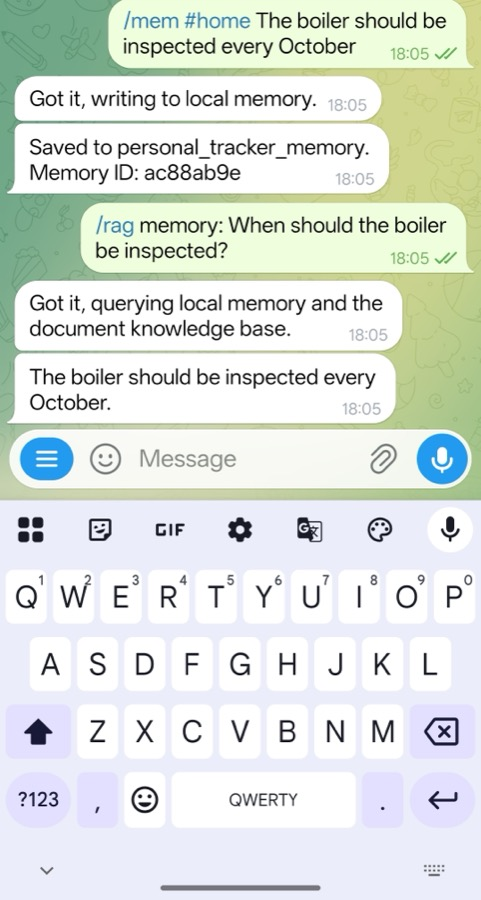

## Use a household assistant scenario

The project provides a customizable runtime for use cases that need private, local-first AI processing. You can adapt its skills, data sources, workflows, and schedules to match your own requirements. To make these capabilities concrete, this chapter uses a shared household assistant as an example rather than prescribing a fixed application. You will save synthetic maintenance information and retrieve it later without sending the memory to a public cloud LLM. You can apply the same architecture to other scenarios that need locally controlled inference, memory, and retrieval.

Telegram transports the original messages between you and the runtime. After the messages reach your host, Ollama, Qdrant, and the local LLM process the memory workflow without using a public cloud LLM API.

This tutorial treats household data as shared. It does not implement separate access control for each family member.

## Save a household memory

Send this command to the Telegram bot:

```text
/mem #home The boiler should be inspected every October.
```

OpenClaw performs the following operations:

```text
Telegram / Mem command
    -> Memory skill
    -> Ollama embedding
    -> Qdrant collection: personal_tracker_memory
```

Wait for the confirmation, then retrieve the memory:

```text
/rag memory: When should the boiler be inspected?
```

The response should mention October.




The retrieval request follows this local path:

```text
Telegram question
    -> Ollama query embedding
    -> Qdrant similarity search
    -> Retrieved context
    -> Local vLLM response
    -> Telegram answer
```

## Verify the local collection

Confirm that the personal memory collection exists:

```bash
curl http://127.0.0.1:6333/collections/personal_tracker_memory
```

The output is similar to:

```output
{
  "result": {
    "status": "green",
    "optimizer_status": "ok",
    "indexed_vectors_count": 0,
    "points_count": 102,
    "segments_count": 8,
    "config": {
      "params": {
        "vectors": {
          "size": 768,
          "distance": "Cosine"
        },
        "shard_number": 1,
        "replication_factor": 1,
        "write_consistency_factor": 1,
        "on_disk_payload": true
      },
      "hnsw_config": {
        "m": 16,
        "ef_construct": 100,
        "full_scan_threshold": 10000,
        "max_indexing_threads": 0,
        "on_disk": false
      },
      "optimizer_config": {
        "deleted_threshold": 0.2,
        "vacuum_min_vector_number": 1000,
        "default_segment_number": 0,
        "max_segment_size": null,
        "memmap_threshold": null,
        "indexing_threshold": 10000,
        "flush_interval_sec": 5,
        "max_optimization_threads": null,
        "prevent_unoptimized": null
      },
      "wal_config": {
        "wal_capacity_mb": 32,
        "wal_segments_ahead": 0,
        "wal_retain_closed": 1
      },
      "quantization_config": null
    },
    "payload_schema": {},
    "update_queue": {
      "length": 0
    }
  },
  "status": "ok",
  "time": 0.000305601
}
```

The point count, segment count, and response time depend on the existing data and Qdrant state. A `green` collection with `optimizer_status` set to `ok` confirms that the collection is healthy. The vector size of `768` matches the `nomic-embed-text` embedding configuration.

The collection metadata does not prove that the boiler reminder was stored. Query the point payload directly to verify the synthetic record:

```bash
curl -sS -X POST \
  http://127.0.0.1:6333/collections/personal_tracker_memory/points/scroll \
  -H 'Content-Type: application/json' \
  -d '{
    "filter": {
      "must": [
        {
          "key": "text",
          "match": {
            "value": "#home The boiler should be inspected every October."
          }
        }
      ]
    },
    "limit": 5,
    "with_payload": true,
    "with_vector": false
  }'
```

Look for the synthetic boiler memory in the returned payload. This second check verifies the stored content rather than only the health and configuration of the collection. The filter is necessary because a personal collection can already contain other records, so scrolling only the first few points might not return the new reminder.

This check is important. It verifies the storage location from the data layer instead of trusting the assistant to describe its own architecture.

## Inspect the active agents and task history

Send the following command to the Telegram bot:

```text
/agents
```

The response lists the thin agents registered by the v1.2 runtime, including memory, RAG, browser search, weather, and chat routes.

To inspect recent tasks, send this command to the Telegram bot:

```text
/tasks last 5
```

Task history records which agent handled the request, its status, and runtime duration. In v1.2, the dispatcher selects skills and agents while using one configured LLM endpoint. Dynamic routing between multiple models is a possible direction for future development.

## Ask for external weather data

Send a weather question in plain language:

```text
Cambridge weather tomorrow
```

OpenClaw routes the request to the weather skill. Do not add `/search` to this question. An explicit `/search` command selects the general browser worker instead of the dedicated weather route.

This request crosses the local data boundary because the skill contacts the public [wttr.in](https://wttr.in/) weather service. The local model API is still not replaced by a cloud LLM API.

## Check your work

Your household assistant should now:

1. Save and retrieve the synthetic boiler reminder from Telegram.
2. Store the reminder in `personal_tracker_memory`.
3. Show the selected agent in `/agents` and `/tasks last 5`.
4. Return weather data through the external weather skill.

## What you've accomplished and what's next

You saved and retrieved a synthetic household memory, verified it in Qdrant, and inspected both local and external request paths. Next, you will add document RAG, browser search, and a proactive cron reminder.
