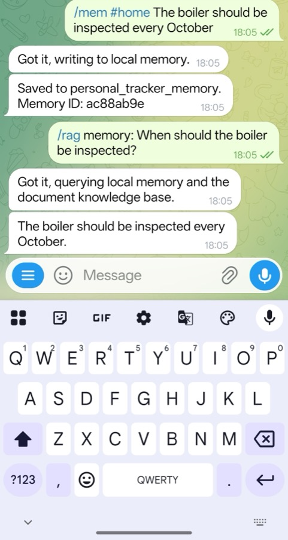

## Define the Household Test Scenario

In this section, you will create a shared household assistant to test local memory. You will save and retrieve a synthetic maintenance reminder without sending it to a public cloud LLM.

Telegram transports the messages. Ollama, Qdrant, and the local LLM process them on your host.

This tutorial treats household data as shared. It does not implement separate access control for each family member.

## Store and Query Local Memory

Send this command to the Telegram bot:

```text
/mem #home The boiler should be inspected every October.
```

The runtime stores the reminder through this path:

```text
Telegram / Mem command
    -> Memory skill
    -> Ollama embedding
    -> Qdrant collection: personal_tracker_memory
```

Wait for the confirmation, then retrieve the memory:

```text
/rag memory: When should the boiler be inspected?
```

The response should mention October.




The retrieval request follows this local path:

```text
Telegram question
    -> Ollama query embedding
    -> Qdrant similarity search
    -> Retrieved context
    -> Local vLLM response
    -> Telegram answer
```

## Verify Qdrant Vector Collections

Confirm that the personal memory collection exists:

```bash
curl http://127.0.0.1:6333/collections/personal_tracker_memory
```

The relevant fields are similar to:

```output
{
  "result": {
    "status": "green",
    "optimizer_status": "ok",
    "points_count": 102,
    "config": {
      "params": {
        "vectors": {
          "size": 768,
          "distance": "Cosine"
        },
        "on_disk_payload": true
      }
    }
  },
  "status": "ok"
}
```

The point count depends on existing data. A `green` status with `optimizer_status` set to `ok` confirms collection health. The vector size of `768` matches `nomic-embed-text`.

The collection metadata does not prove that the boiler reminder was stored. Query the point payload directly to verify the synthetic record:

```bash
curl -sS -X POST \
  http://127.0.0.1:6333/collections/personal_tracker_memory/points/scroll \
  -H 'Content-Type: application/json' \
  -d '{
    "filter": {
      "must": [
        {
          "key": "text",
          "match": {
            "value": "#home The boiler should be inspected every October."
          }
        }
      ]
    },
    "limit": 5,
    "with_payload": true,
    "with_vector": false
  }'
```

Look for the boiler reminder in the returned payload. The filter finds it even when the personal collection contains other records. This verifies the stored data directly instead of relying on the assistant's response.

## Inspect Active Agents and Task Execution

Send the following command to the Telegram bot:

```text
/agents
```

The response lists the thin agents registered by the reference runtime, including memory, RAG, browser search, weather, and chat routes.

To inspect recent tasks, send this command to the Telegram bot:

```text
/tasks last 5
```

Task history shows which agent handled the request, its status, and its runtime. All routes use the configured LLM endpoint.

## Test External Skill Integration

Send a weather question in plain language:

```text
Cambridge weather tomorrow
```

The runtime sends this question to the weather skill. Do not add `/search`, which selects the general browser worker instead.

This request contacts the public [wttr.in](https://wttr.in/) weather service, but generation still uses the local model.

## Check your work

Your household assistant should now:

1. Save and retrieve the synthetic boiler reminder from Telegram.
2. Store the reminder in `personal_tracker_memory`.
3. Show the selected agent in `/agents` and `/tasks last 5`.
4. Return weather data through the external weather skill.

## What you've learned and what's next

You saved and retrieved a synthetic household memory, verified it in Qdrant, and inspected both local and external request paths. Next, you will add document RAG, browser search, and a proactive cron reminder.
