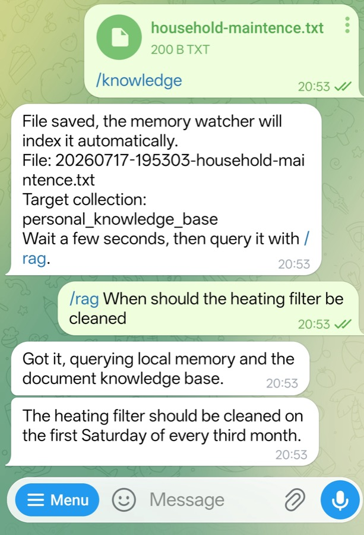
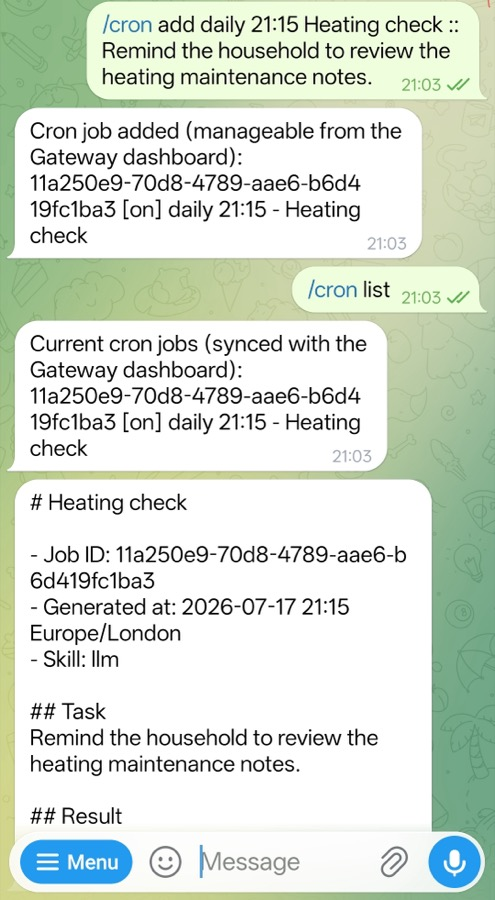

## Create a synthetic household document

Create a small text file on the device where you use Telegram. The source file can be in any directory that your Telegram client can access. Use the following synthetic tutorial content:

```text
Household heating maintenance notes

Inspect the boiler every October.
Clean the heating filter on the first Saturday of every third month.
Keep the service reference number with the maintenance record.
```

Save the file as `household-maintenance.txt`. In Telegram, upload the file to your bot with this caption:

```text
/knowledge
```

The document follows this path:

```text
File on the Telegram client device
    -> Telegram bot upload
    -> DGX Spark workspace/inbox/knowledge/telegram
    -> Memory watcher and Ollama embeddings
    -> Qdrant collection: personal_knowledge_base
```

Telegram transports the uploaded file to the bot. OpenClaw then downloads it to `openclaw-arm-continuum/workspace/inbox/knowledge/telegram/` on DGX Spark. The memory watcher indexes the local copy and writes its chunks to `personal_knowledge_base`.

{}
In this Learning Path, supported Telegram uploads are indexed after they are saved. The review-first upload workflow is planned but is not part of this release.
{}

The bot reports the stored filename with a timestamp prefix, similar to `20260717-180500-household-maintenance.txt`. Copy the filename from the response.

Indexing runs asynchronously. Wait a few seconds, then confirm that the memory watcher processed the file:

```bash
docker logs --tail 30 openclaw-memory-watcher
```

In Telegram, ask a question using the returned filename. Replace `<returned-file-name>` with the filename reported by the bot:

```text
/rag <returned-file-name> When should the heating filter be cleaned?
```

The filename is optional for general RAG queries. Without a filename, the OpenClaw Arm Continuum runtime used in this Learning Path performs semantic search across its configured memory and knowledge collections. Including the returned filename adds document-specific chunks to the retrieved context and helps scope the answer to this upload. This Learning Path uses the filename so that existing records in the personal collections do not affect the validation result.

The following example shows a general RAG query without the filename:



The answer should mention the first Saturday of every third month.

The answer verifies retrieval through the application. To verify the stored document directly in Qdrant, filter the collection by the returned filename:

```bash
curl -sS -X POST \
  http://127.0.0.1:6333/collections/personal_knowledge_base/points/scroll \
  -H 'Content-Type: application/json' \
  -d '{
    "filter": {
      "must": [
        {
          "key": "file_name",
          "match": {
            "value": "<returned-file-name>"
          }
        }
      ]
    },
    "limit": 5,
    "with_payload": true,
    "with_vector": false
  }'
```

The returned payload should contain chunks from `household-maintenance.txt`. This confirms that the uploaded file is stored and indexed locally rather than relying only on the assistant's answer.

## Create a proactive reminder

Choose a time a few minutes in the future using the runtime timezone configured by `OPENCLAW_CRON_TIMEZONE`. Send this command to the Telegram bot to create a daily tutorial reminder:

```text
/cron add daily 21:15 Heating check :: Remind the household to review the heating maintenance notes.
```

Replace `21:15` with your test time. Then list the job in Telegram:

```text
/cron list
```

The bot returns a job ID, and `/cron list` shows the schedule as `[on]`. At the configured time, the bot starts a new Heating check message for the scheduled task.



The job runs only inside the configured due-time window. Creating the job must not execute it immediately.

After the configured time, verify that the cron worker delivered the scheduled job:

```bash
docker logs --tail 30 openclaw-cron
```

Look for a line containing `[cron] dynamic job sent`, the job ID, and the path to the locally saved cron report.

To test without waiting, copy the job ID from `/cron list` and send:

```text
/cron run <job-id>
```

The result should be delivered as a Telegram push message.

## Inspect cron from the Gateway dashboard

The Gateway dashboard listens on localhost. If you are working directly on the DGX Spark desktop, open:

```text
http://127.0.0.1:18789/
```

If DGX Spark is remote, create an SSH tunnel from your laptop:

```bash
ssh -L 18789:127.0.0.1:18789 <user>@<dgx-spark-host>
```

Then open `http://127.0.0.1:18789/` locally and enter the `OPENCLAW_GATEWAY_TOKEN` stored in the private `.env` file.

Confirm that the dashboard and Telegram show the same cron job and run history.

{}
Keep the Gateway and its admin RPC endpoint behind localhost, an SSH tunnel, or a trusted private network. Do not expose the dashboard directly to the public internet.
{}

## Check your work

You have now validated two runtime paths:

| User goal | OpenClaw path |
|---|---|
| Answer from a household document | Telegram -> RAG skill -> Qdrant -> local LLM |
| Send a proactive reminder | Cron -> OpenClaw skill -> Telegram push |

The LLM is one replaceable part of the application. The local memory, tools, schedules, and interaction paths remain available around it.

## What you've accomplished and what's next

You validated document RAG and a proactive reminder for the household assistant. Next, you will move the same workflows to a CPU-only Armv9 system.
