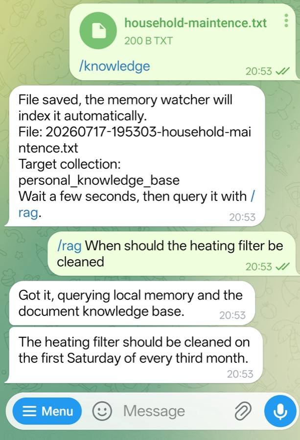
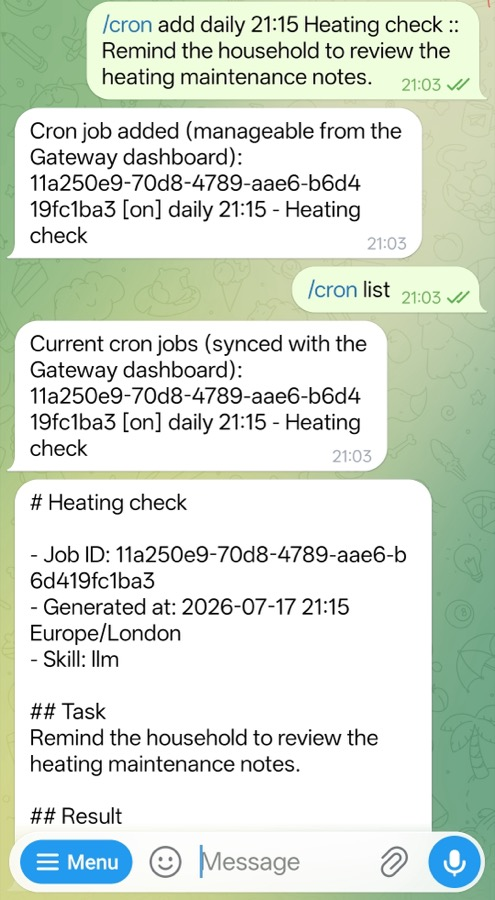

## Ingest and Query Document RAG

Create a small text file on the device where you use Telegram.

{}
Telegram uploads files from the device running the client, not from DGX Spark unless Telegram runs there. Common locations are `Downloads`, `Documents`, or `Desktop` on a computer and `Downloads` in the Files app on a phone or tablet.
{}


Use the following synthetic tutorial content:

```text
Household heating maintenance notes

Inspect the boiler every October.
Clean the heating filter on the first Saturday of every third month.
Keep the service reference number with the maintenance record.
```

Save the file as `household-maintenance.txt`, then upload it to your bot with this caption:

```text
/knowledge
```

The document follows this path:

```text
File on the Telegram client device
    -> Telegram bot upload
    -> DGX Spark workspace/inbox/knowledge/telegram
    -> Memory watcher and Ollama embeddings
    -> Qdrant collection: personal_knowledge_base
```

The `/knowledge` caption explicitly routes the file to document indexing. The runtime stores it under `workspace/inbox/knowledge/telegram/`, creates embeddings, and writes the chunks to `personal_knowledge_base`.

The bot reports the stored filename with a timestamp prefix, similar to `20260717-180500-household-maintenance.txt`. Copy the filename from the response.

Indexing runs in the background. Wait a few seconds, then check the memory watcher:

```bash
docker logs --tail 30 openclaw-memory-watcher
```

In Telegram, ask a question using the returned filename. Replace `<returned-file-name>` with the filename reported by the bot:

```text
/rag <returned-file-name> When should the heating filter be cleaned?
```

The filename limits retrieval to this upload, so existing records do not affect the result. A general `/rag` query without a filename searches all configured memory and knowledge collections. The screenshot shows this general query, but use the filename-specific command for this test.



The answer should mention the first Saturday of every third month.

To verify the stored document directly in Qdrant, filter the collection by the returned filename:

```bash
curl -sS -X POST \
  http://127.0.0.1:6333/collections/personal_knowledge_base/points/scroll \
  -H 'Content-Type: application/json' \
  -d '{
    "filter": {
      "must": [
        {
          "key": "file_name",
          "match": {
            "value": "<returned-file-name>"
          }
        }
      ]
    },
    "limit": 5,
    "with_payload": true,
    "with_vector": false
  }'
```

The payload should contain chunks from `household-maintenance.txt`, confirming that Qdrant stored and indexed the upload.

## Execute Deterministic Web Search

Use the browser agent for current public information. Send this command to the bot:

```text
/search Arm Learning Paths local AI development
```

The explicit `/search` prefix selects the browser-search route deterministically:

```text
Telegram /search command
    -> Browser-search agent
    -> Local Playwright worker
    -> Public search engine and selected pages
    -> Local vLLM summary
    -> Telegram answer
```

The query and page requests leave the local network. Playwright saves the retrieved content under `workspace/inbox/tracker/web/`, and local vLLM generates the answer.

Confirm that the browser worker handled the request:

```bash
docker logs --tail 20 openclaw-browser-scraper
```

Look for a successful `POST /scrape` request. The Telegram response should cite the retrieved sources and include the path to the saved web Markdown file.

Finally, send this command in Telegram:

```text
/tasks last 5
```

Confirm that the search task reports `browser_search_agent`.

## Schedule Proactive Cron Tasks

Choose a time a few minutes in the future, using `OPENCLAW_CRON_TIMEZONE`. Create a daily reminder:

```text
/cron add daily 21:15 Heating check :: Remind the household to review the heating maintenance notes.
```

Replace `21:15` with your test time. Then list the job in Telegram:

```text
/cron list
```

The bot returns a job ID, and `/cron list` shows the schedule as `[on]`.



Creating the job does not run it immediately. At the configured time, the bot sends the Heating check message.

After the configured time, verify that the cron worker delivered the scheduled job:

```bash
docker logs --tail 30 openclaw-cron
```

Look for a line containing `[cron] dynamic job sent`, the job ID, and the path to the locally saved cron report.

To test without waiting, copy the job ID from `/cron list` and send:

```text
/cron run <job-id>
```

The result should be delivered as a Telegram push message.

## Inspect Cron From the Gateway Dashboard

The Gateway dashboard listens on localhost. If you are working directly on the DGX Spark desktop, open:

```text
http://127.0.0.1:18789/
```

If DGX Spark is remote, create an SSH tunnel from your laptop:

```bash
ssh -L 18789:127.0.0.1:18789 <user>@<dgx-spark-host>
```

Replace `<user>` with your DGX Spark user name and `<dgx-spark-host>` with its host name or IP address.

Then open `http://127.0.0.1:18789/` locally and enter the `OPENCLAW_GATEWAY_TOKEN` stored in the private `.env` file.

Confirm that the dashboard and Telegram show the same cron job and run history.

{}
Keep the Gateway and its admin RPC endpoint behind localhost, an SSH tunnel, or a trusted private network. Do not expose the dashboard directly to the public internet.
{}

## Check your work

You have now validated three runtime paths. Document questions use the RAG skill, Qdrant, and the local LLM. Current public queries use the browser-search agent and Playwright. Proactive reminders run through the cron worker and arrive as Telegram messages.

The LLM is one replaceable part of the application. The local memory, tools, schedules, and interaction paths remain available around it.

## What you've learned and what's next

You validated document RAG, explicit browser search, and a proactive reminder for the household assistant. Next, you will move the same workflows to a CPU-only Armv9 system.
