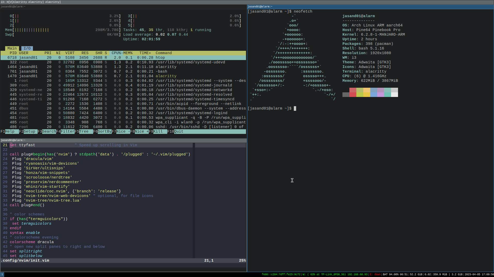

This section is optional, but demonstrates a possible developer setup on the Pinebook Pro with the i3 window manager and Neovim. 

Neovim is lightweight and keeps the best parts of vim and improves it. Neovim has Lua extensibility while still supporting Vimscript. It's able to go beyond what is possible with vim, and the majority of vim plugins work as expected. 

If you have been curious about Neovim but never used it, this is a good way to try.

## How do I configure Neovim for enhanced functionality?

When opening Neovim for the first time it will look almost exactly like vim, but it is more customizable.  

Here are some configuration and customization examples demonstrating what is possible. 

* https://github.com/NvChad/NvChad
* https://github.com/jdhao/nvim-config
* https://github.com/CosmicNvim/CosmicNvim
* https://github.com/ecosse3/nvim
* https://neovim.io/screenshots/

## How do I install and set up Neovim?

In addition to Neovim, you should install Python and Node so that plugins to work correctly. Without these you may see errors each time Neovim is opened.

{}
Neovim is launched with the `nvim` command.
{}

### How do I install Neovim?

1. Install Neovim

```console
sudo pacman -Sy neovim
```

2. Install the vim-plug plugin manager

```console
sh -c 'curl -fLo "${XDG_DATA_HOME:-$HOME/.local/share}"/nvim/site/autoload/plug.vim --create-dirs \
       https://raw.githubusercontent.com/junegunn/vim-plug/master/plug.vim'
```

3. Install the Node version manager

```console
curl -o- https://raw.githubusercontent.com/nvm-sh/nvm/v0.39.2/install.sh | bash
```

The install.sh will modify your shell `.bashrc` to add `nvm` to your path.

Reread the updated `.bashrc` file to complete the install.

```console
. ~/.bashrc
```

4. Use the Node Version Manager to install the latest long term support version of Node. 

```console
nvm install --lts
```

5.  Install the current release of Python and Pip

```console
sudo pacman -Sy python python-pip
```

6. Install the vim pip dependencies

```console
pip3 install pynvim
```

### How do I configure and customize Neovim?

Use `nvim` to create the configuration file `init.vim`

1. Create a new directory for the `init.vim` configuration file

```console
mkdir -p ~/.config/nvim
```

2. Open the configuration file `init.vim` using Neovim

```console
nvim ~/.config/nvim/init.vim
```

3. Add the configuration information to the file. 

Copy the text below and paste it into the `init.vim` file. 

```console
set nocompatible            " disable compatibility to old-time vi
set showmatch               " show matching 
set ignorecase              " case insensitive 
set mouse=v                 " middle-click paste with 
set hlsearch                " highlight search 
set incsearch               " incremental search
set tabstop=4               " number of columns occupied by a tab 
set softtabstop=4           " see multiple spaces as tabstops so <BS> does the right thing
set expandtab               " converts tabs to white space
set shiftwidth=4            " width for autoindents
set autoindent              " indent a new line the same amount as the line just typed
set number                  " add line numbers
set wildmode=longest,list   " get bash-like tab completions
set cc=80                  " set an 80 column border for good coding style
filetype plugin indent on   "allow auto-indenting depending on file type
syntax on                   " syntax highlighting
set mouse=a                 " enable mouse click
set clipboard=unnamedplus   " using system clipboard
filetype plugin on
set cursorline              " highlight current cursorline
set ttyfast                 " Speed up scrolling in Vim

call plug#begin(has('nvim') ? stdpath('data') . '/plugged' : '~/.vim/plugged')
 Plug 'dracula/vim'
 Plug 'ryanoasis/vim-devicons'
 Plug 'SirVer/ultisnips'
 Plug 'honza/vim-snippets'
 Plug 'scrooloose/nerdtree'
 Plug 'preservim/nerdcommenter'
 Plug 'mhinz/vim-startify'
 Plug 'neoclide/coc.nvim', {'branch': 'release'}
 Plug 'nvim-tree/nvim-web-devicons' " optional, for file icons
 Plug 'nvim-tree/nvim-tree.lua'
call plug#end()

" color schemes
if (has("termguicolors"))
 set termguicolors
endif
syntax enable
" colorscheme evening
colorscheme dracula
" open new split panes to right and below
set splitright
set splitbelow

" move line or visually selected block - alt+j/k
inoremap <A-j> <Esc>:m .+1<CR>==gi
inoremap <A-k> <Esc>:m .-2<CR>==gi
vnoremap <A-j> :m '>+1<CR>gv=gv
vnoremap <A-k> :m '<-2<CR>gv=gv" move split panes to left/bottom/top/right
nnoremap <A-h> <C-W>H
nnoremap <A-j> <C-W>J
nnoremap <A-k> <C-W>K
nnoremap <A-l> <C-W>L" move between panes to left/bottom/top/right
nnoremap <C-h> <C-w>h
nnoremap <C-j> <C-w>j
nnoremap <C-k> <C-w>k
nnoremap <C-l> <C-w>l

" Press i to enter insert mode, and ii to exit insert mode.
:inoremap ii <Esc>
:inoremap jk <Esc>
:inoremap kj <Esc>
:vnoremap jk <Esc>
:vnoremap kj <Esc>

" open file in a text by placing text and gf
nnoremap gf :vert winc f<cr>" copies filepath to clipboard by pressing yf
:nnoremap <silent> yf :let @+=expand('%:p')<CR>
" copies pwd to clipboard: command yd
:nnoremap <silent> yd :let @+=expand('%:p:h')<CR>" Vim jump to the last position when reopening a file
if has("autocmd")
  au BufReadPost * if line("'\"") > 0 && line("'\"") <= line("$")
    \| exe "normal! g'\"" | endif
endif

lua <<EOF
-- disable netrw at the very start of your init.lua (strongly advised)
vim.g.loaded_netrw = 1
vim.g.loaded_netrwPlugin = 1

-- set termguicolors to enable highlight groups
vim.opt.termguicolors = true

-- OR setup with some options
require("nvim-tree").setup({
  sort_by = "case_sensitive",
  view = {
    adaptive_size = true,
    mappings = {
      list = {
        { key = "u", action = "dir_up" },
      },
    },
  },
  renderer = {
    group_empty = true,
  },
  filters = {
    dotfiles = true,
  },
})
EOF
```

Feel free to tweak any settings to your preferences. These were adapted from [Neovim configuration for beginners](https://medium.com/geekculture/neovim-configuration-for-beginners-part-two-fb3834da91b8)

4. Run the following command inside Neovim to install the plugins

```console
:PlugInstall
```

The plugins listed between the call plug#begin and call plug#end are installed.

5. Try the nvim-tree plugin

Open nvim-tree in `nvim` using:

```console
:NvimTreeOpen
```

Close nvim-tree in `nvim` using:

```console
:NVimTreeClose
```

More nvim-tree commands and settings are available in the [GitHub documentation](https://github.com/nvim-tree/nvim-tree.lua/blob/master/doc/nvim-tree-lua.txt)

For the symbols in the tree view to display correctly you will need to download and install a patched font. 
A good place to start is [Nerd Fonts](https://github.com/ryanoasis/nerd-fonts).

Neovim is a great option for the Pinebook Pro running the i3 window manager. 


