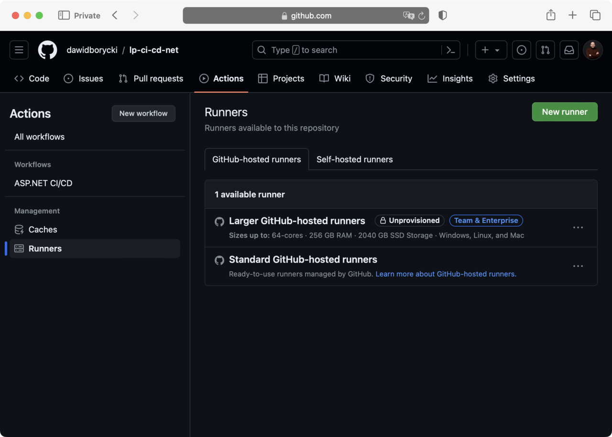
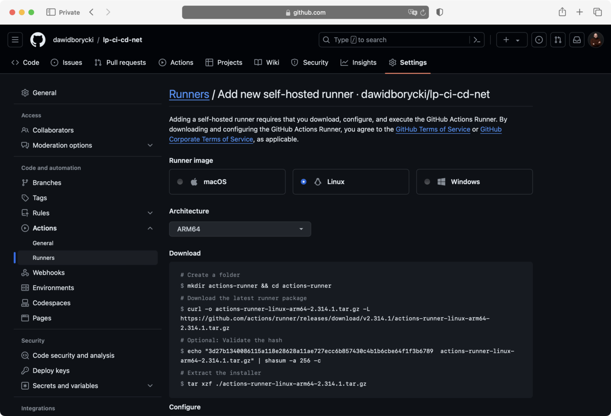
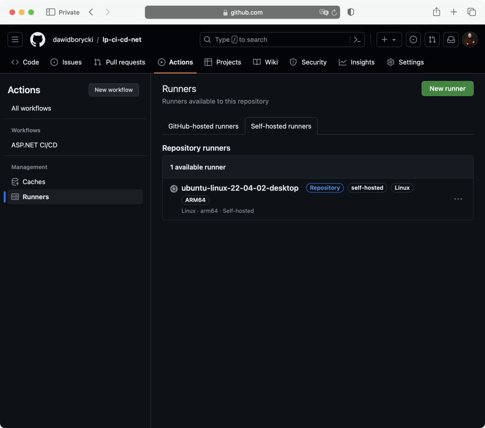

---
# User change
title: "Create the Self-Hosted Runner in GitHub"

weight: 7

layout: "learningpathall"
---


## Create the Self-Hosted Runner in GitHub
Go to the Actions tab, and under Management, click on Runners. If you do not see the Actions tab, navigate to Settings > Actions and select Allow all actions and reusable workflows. This will display the following window: 



Then, click on the 'New runner' button, followed by 'New self-hosted runner'. In the 'Add new self-hosted runner' section, proceed as follows:
* Select Linux for the operating system.
* Choose ARM64 for the architecture



Next, execute the following instructions on your machine:

```console
mkdir actions-runner && cd actions-runner

curl -o actions-runner-linux-arm64-2.314.1.tar.gz -L https://github.com/actions/runner/releases/download/v2.314.1/actions-runner-linux-arm64-2.314.1.tar.gz

echo "3d27b1340086115a118e28628a11ae727ecc6b857430c4b1b6cbe64f1f3b6789  actions-runner-linux-arm64-2.314.1.tar.gz" | shasum -a 256 -c

tar xzf ./actions-runner-linux-arm64-2.314.1.tar.gz
```

You should see output similar to the following:

```output
  % Total    % Received % Xferd  Average Speed   Time    Time     Time  Current
                                 Dload  Upload   Total   Spent    Left  Speed
  0     0    0     0    0     0      0      0 --:--:-- --:--:-- --:--:--     0
100  107M  100  107M    0     0  7989k      0  0:00:13  0:00:13 --:--:-- 8474k
actions-runner-linux-arm64-2.314.1.tar.gz: OK
```

Then, configure the VM with the following command:
```
./config.sh --url https://github.com/dawidborycki/lp-ci-cd-net --token <TYPE_YOUR_TOKEN>
```

During the command's execution, you will be prompted to provide the runner group, the name of the runner, and the work folder name. You can accept the defaults by pressing Enter at each step. The output will resemble:

```console
--------------------------------------------------------------------------------
|        ____ _ _   _   _       _          _        _   _                      |
|       / ___(_) |_| | | |_   _| |__      / \   ___| |_(_) ___  _ __  ___      |
|      | |  _| | __| |_| | | | | '_ \    / _ \ / __| __| |/ _ \| '_ \/ __|     |
|      | |_| | | |_|  _  | |_| | |_) |  / ___ \ (__| |_| | (_) | | | \__ \     |
|       \____|_|\__|_| |_|\__,_|_.__/  /_/   \_\___|\__|_|\___/|_| |_|___/     |
|                                                                              |
|                       Self-hosted runner registration                        |
|                                                                              |
--------------------------------------------------------------------------------

# Authentication


√ Connected to GitHub

# Runner Registration

Enter the name of the runner group to add this runner to: [press Enter for Default] 

Enter the name of runner: [press Enter for ubuntu-linux-22-04-02-desktop] 

This runner will have the following labels: 'self-hosted', 'Linux', 'ARM64' 
Enter any additional labels (ex. label-1,label-2): [press Enter to skip] 

√ Runner successfully added
√ Runner connection is good

# Runner settings

Enter name of work folder: [press Enter for _work] 

√ Settings Saved.
```

Finally, start the runner by executing:

```console
./run.sh
```

The output will indicate a successful connection and readiness to receive jobs
```output
√ Connected to GitHub

Current runner version: '2.314.1'
2024-03-25 16:21:59Z: Listening for Jobs
```

The runner will now be visible in the GitHub actions:



You have successfully prepared all the tools needed to run the CI/CD pipeline on the self-hosted runner. In the next step, you will test it.