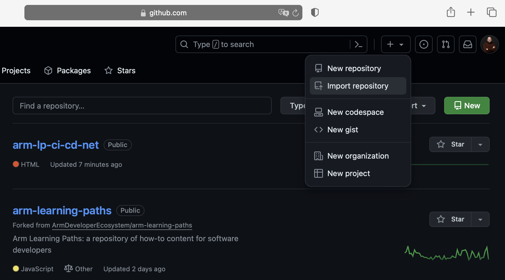
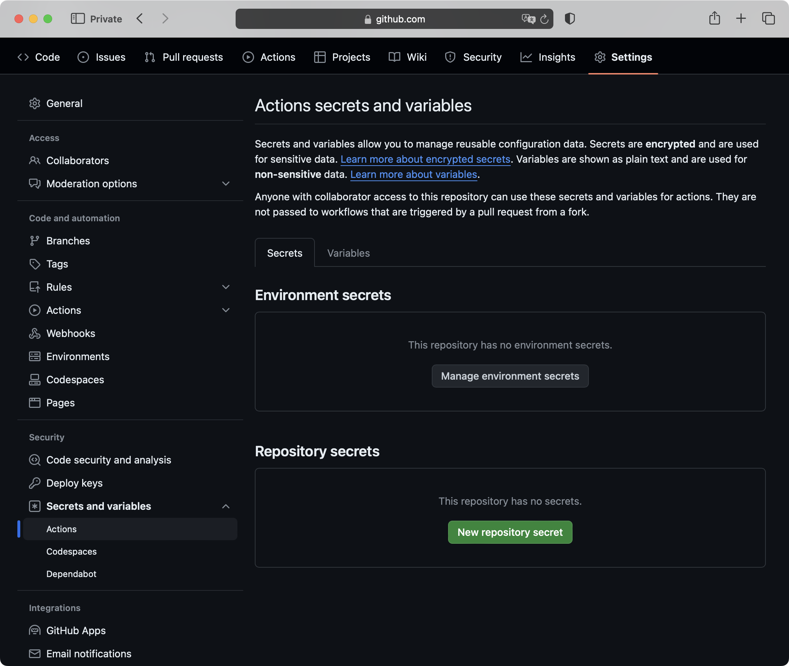
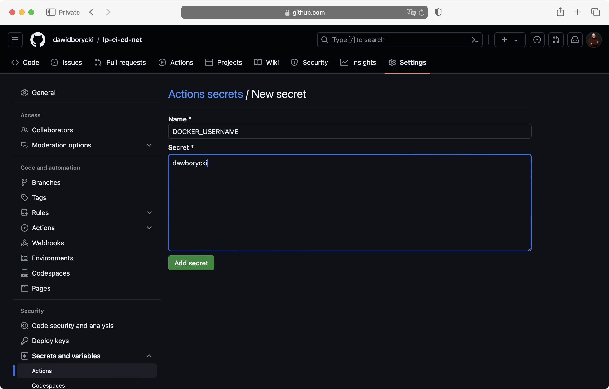
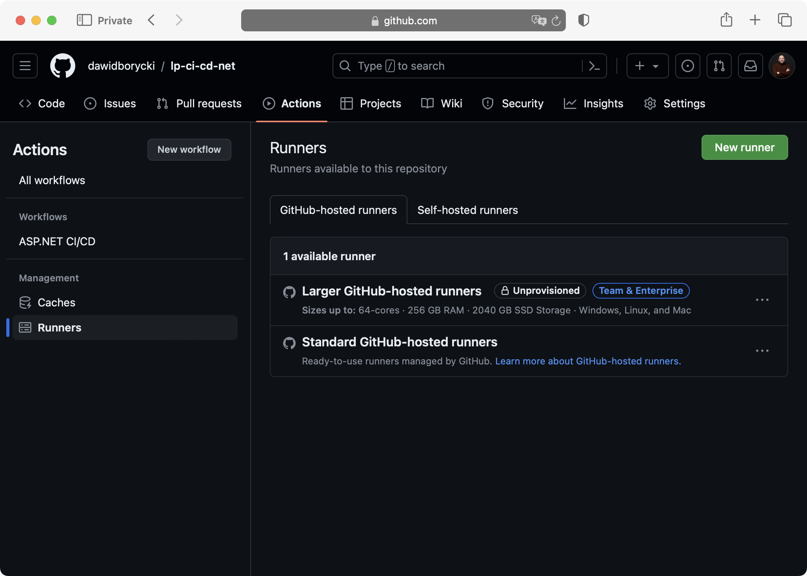
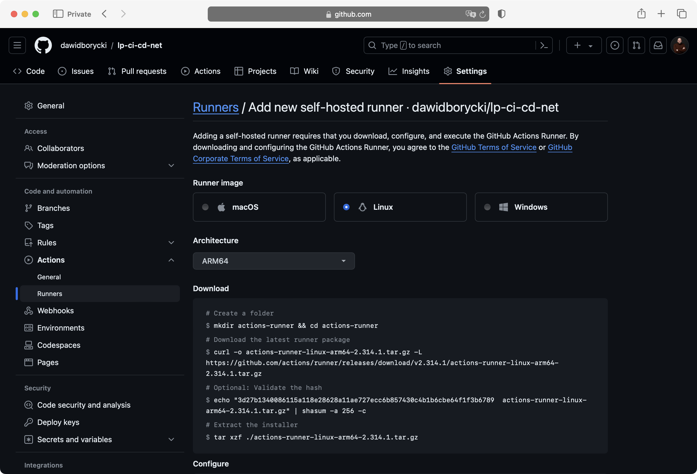
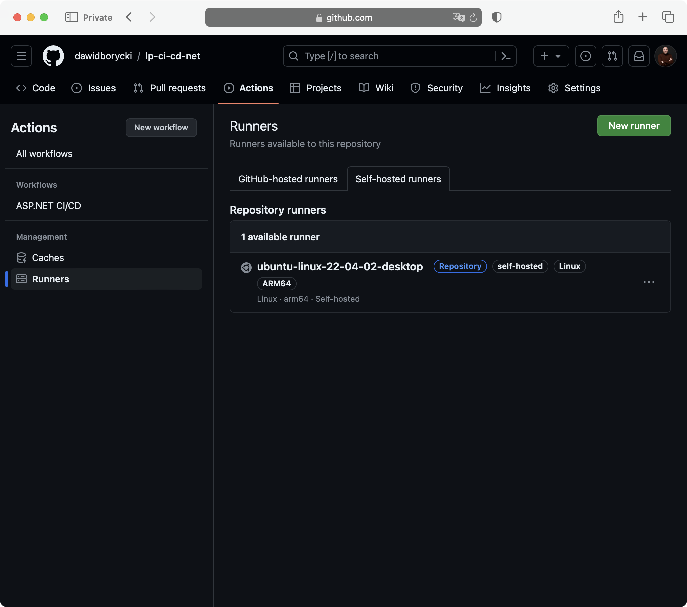

---
# User change
title: "Use Self-Hosted Arm64-Based Runners in GitHub Actions"

weight: 2

layout: "learningpathall"
---

## Introduction
GitHub Actions is a continuous integration and continuous deployment (CI/CD) platform that enables developers to automate their workflow directly within their GitHub repository. It facilitates the creation of workflows for building, testing, and deploying code based on various events, such as a push to a repository or a pull request. This automation streamlines the process of integrating changes and deploying them to production, fostering a more efficient and consistent development cycle.

A powerful feature of GitHub Actions is its support for self-hosted runners. Unlike the default runners hosted by GitHub, self-hosted runners allow developers to execute their CI/CD pipelines on their own hardware. This capability is particularly vital when custom hardware configurations are necessary. For example, developers can use Arm64-based runners to build software specifically for Arm64 architectures, ensuring compatibility and optimizing performance for software intended to run on devices and servers powered by Arm64 processors.

Utilizing self-hosted runners with GitHub Actions offers flexibility and control, enabling teams to tailor the CI/CD process to meet their specific hardware and network requirements. Advantages include the use of custom hardware configurations not available in the hosted environment, the ability to run jobs in a private network environment, and reduced build and deployment times by leveraging high-performance or specialized hardware. Integrating self-hosted runners into their development workflow allows teams to align their development, testing, and deployment processes more closely with their operational environment, thereby enhancing the efficiency and reliability of their software delivery pipeline.

In this learning path, you will discover how to configure and use an Arm64 runner that will build a .NET application for Arm64. Additionally, the CI/CD pipeline we will create is designed to generate an Arm64 Docker image of the application and then push the image to a Docker Hub repository.

Before completing this learning path you can complete the Hello World [example](learning-paths/laptops-and-desktops/windows_cicd_github/), which provides a basic "hello world" scenario. You will be able to extend that knowledge here with a comprehensive set of operations critical for real-world application deployment:
1. Environment Setup: It includes detailed steps on preparing the self-hosted runner with necessary tools like the required .NET SDK and Docker, which are essential for building real applications, not just running simple scripts.
2. Complex Workflow Configuration: this learning path demonstrates how to use GitHub Actions to manage complex workflows involving multiple jobs and steps, along with job dependencies, which are crucial for sophisticated CI/CD pipelines.
3. Building and Deployment: this learning path shows how to build an ASP.NET application, create a Docker image of the application, and then push this image to a Docker repository on DockerHub.
4. Security Practices: we’ve incorporated best practices for security by using GitHub secrets to securely store and retrieve credentials necessary for DockerHub, ensuring sensitive information is handled securely.

## Before you start
To complete this learning path, you will need the following:
1. A DockerHub account. You can set up a free account [here](https://hub.docker.com/signup)
2. A GitHub account. You can sign up [here](https://github.com/signup)
3. An Arm64-powered machine, either virtual or physical. For this learning path, we will be using an Arm64-powered VM with Ubuntu 22.04.

## Setting up the DockerHub repository
First, create a repository on DockerHub by following these steps:
1. Log in to DockerHub, then click on Repositories at the top.
2. Under Repositories, click the Create repository button:


3. In the Create repository window, set the repository name to sampleapp and change the repository visibility to Private. 


4. Click the Create button. This will create the repository and redirect you back to the repositories list. Note the Docker push command. It should look like: docker push <YOUR_ACCOUNT_NAME>/sampleapp:tagname


Now you will need to generate the access token to enable the workflow to authenticate to DockerHub. To create the access token: 
1. Click on your username in the top-right corner of the Docker Hub site.
2. From the dropdown menu, select My Account, and then click the Security tab on the left:


3. Click the New Access Token button. This opens the New Access Token window, in which:
* Type ci-cd for the token name
* Select Read,Write,Delete permissions and then click the Generate button
4. A Copy Access Token window appears.  Ensure you copy and safely store the generated access token.. 

## Prepare GitHub repository 
Now, you will prepare your GitHub repository as follows:

1. Go to GitHub and log in with your account credentials.
2. In the top right corner, click the + dropdown and select Import repository



3. In the Import your project to GitHub section:
* Paste the following link https://github.com/dawidborycki/arm-lp-ci-cd-net.git into the 'Your old repository's clone URL' field.
* Set the repository name, for example, lp-ci-cd-net.
* Click the Begin import button.

After the import is complete, you will create two secrets that will store your Docker username and token. Proceed as follows
1. Go to your repository settings, and on the left, scroll down to Secrets and variables, then click Actions:


2. Under Actions secrets and variables, click the New repository secret button. This opens the New secret window, where you should configure the secret as follows:
* Name: DOCKER_USERNAME
* Value: <TYPE_YOUR_USERNAME>
* Click the Add secret button



3. Similarly, create another secret:
* Name: DOCKER_PASSWORD
* Value: <PASTE_YOUR_TOKEN>

## Prepare the Runner
When using self-hosted runners, you are responsible for patching the operating system and installing all the software required to build the application. In this learning path, we use the .NET SDK and Docker. Therefore, you need to install these components.

For Ubuntu 22.04, the Docker installation process is as follows:

1. Open the Terminal and type the following commands:
```console
# Add Docker's official GPG key:
sudo apt-get update
sudo apt-get install ca-certificates curl gnupg lsb-release
sudo mkdir -p /etc/apt/keyrings
sudo curl -fsSL https://download.docker.com/linux/ubuntu/gpg -o /etc/apt/keyrings/docker.gpg
sudo chmod a+r /etc/apt/keyrings/docker.gpg

# Add the repository to Apt sources:
echo \
  "deb [arch=$(dpkg --print-architecture) signed-by=/etc/apt/keyrings/docker.gpg] https://download.docker.com/linux/ubuntu \
  $(lsb_release -cs) stable" | \
  sudo tee /etc/apt/sources.list.d/docker.list > /dev/null
sudo apt-get update

sudo apt-get install docker-ce docker-ce-cli containerd.io docker-buildx-plugin docker-compose-plugin
```
2. Create the docker group and add your user to it:
```console 
sudo groupadd docker
sudo usermod -aG docker $USER
```
3. Restart the machine, then verify that Docker is working by running the following command in the Terminal:
```console
docker run hello-world
```

To install the .NET SDK:
1. Open the terminal and enter: 
```console
wget https://dot.net/v1/dotnet-install.sh -O dotnet-install.sh
chmod +x ./dotnet-install.sh
./dotnet-install.sh --version latest
```
2. This will generate output similar to the following:
```output
dotnet-install: Attempting to download using aka.ms link https://dotnetcli.azureedge.net/dotnet/Sdk/8.0.203/dotnet-sdk-8.0.203-linux-arm64.tar.gz
dotnet-install: Remote file https://dotnetcli.azureedge.net/dotnet/Sdk/8.0.203/dotnet-sdk-8.0.203-linux-arm64.tar.gz size is 221512731 bytes.
dotnet-install: Extracting zip from https://dotnetcli.azureedge.net/dotnet/Sdk/8.0.203/dotnet-sdk-8.0.203-linux-arm64.tar.gz
dotnet-install: Downloaded file size is 221512731 bytes.
dotnet-install: The remote and local file sizes are equal.
dotnet-install: Installed version is 8.0.203
dotnet-install: Adding to current process PATH: `/home/parallels/.dotnet`. Note: This change will be visible only when sourcing script.
dotnet-install: Note that the script does not resolve dependencies during installation.
dotnet-install: To check the list of dependencies, go to https://learn.microsoft.com/dotnet/core/install, select your operating system and check the "Dependencies" section.
dotnet-install: Installation finished successfully.
```
3. Configure the environment variables for the .NET SDK to ensure the dotnet command is in your PATH:
Configure environment variables:
```console
echo 'export DOTNET_ROOT=$HOME/.dotnet' >> ~/.profile
echo 'export PATH=$PATH:$DOTNET_ROOT:$DOTNET_ROOT/tools' >> ~/.profile
source ~/.profile
```

The VM is ready, and you can associate it with GitHub.

## Create the Self-Hosted Runner in GitHub
Go to the Actions tab, and under Management, click on Runners. If you do not see the Actions tab, navigate to Settings > Actions and select Allow all actions and reusable workflows. This will display the following window: 



Then, click on the 'New runner' button, followed by 'New self-hosted runner'. In the 'Add new self-hosted runner' section, proceed as follows:
* Select Linux for the operating system.
* Choose ARM64 for the architecture



Next, execute the following instructions on your machine:

```console
mkdir actions-runner && cd actions-runner

curl -o actions-runner-linux-arm64-2.314.1.tar.gz -L https://github.com/actions/runner/releases/download/v2.314.1/actions-runner-linux-arm64-2.314.1.tar.gz

echo "3d27b1340086115a118e28628a11ae727ecc6b857430c4b1b6cbe64f1f3b6789  actions-runner-linux-arm64-2.314.1.tar.gz" | shasum -a 256 -c

tar xzf ./actions-runner-linux-arm64-2.314.1.tar.gz
```

You should see output similar to the following:

```output
  % Total    % Received % Xferd  Average Speed   Time    Time     Time  Current
                                 Dload  Upload   Total   Spent    Left  Speed
  0     0    0     0    0     0      0      0 --:--:-- --:--:-- --:--:--     0
100  107M  100  107M    0     0  7989k      0  0:00:13  0:00:13 --:--:-- 8474k
actions-runner-linux-arm64-2.314.1.tar.gz: OK
```

Then, configure the VM with the following command:
```
./config.sh --url https://github.com/dawidborycki/lp-ci-cd-net --token <TYPE_YOUR_TOKEN>
```

During the command's execution, you will be prompted to provide the runner group, the name of the runner, and the work folder name. You can accept the defaults by pressing Enter at each step. The output will resemble:

```console
--------------------------------------------------------------------------------
|        ____ _ _   _   _       _          _        _   _                      |
|       / ___(_) |_| | | |_   _| |__      / \   ___| |_(_) ___  _ __  ___      |
|      | |  _| | __| |_| | | | | '_ \    / _ \ / __| __| |/ _ \| '_ \/ __|     |
|      | |_| | | |_|  _  | |_| | |_) |  / ___ \ (__| |_| | (_) | | | \__ \     |
|       \____|_|\__|_| |_|\__,_|_.__/  /_/   \_\___|\__|_|\___/|_| |_|___/     |
|                                                                              |
|                       Self-hosted runner registration                        |
|                                                                              |
--------------------------------------------------------------------------------

# Authentication


√ Connected to GitHub

# Runner Registration

Enter the name of the runner group to add this runner to: [press Enter for Default] 

Enter the name of runner: [press Enter for ubuntu-linux-22-04-02-desktop] 

This runner will have the following labels: 'self-hosted', 'Linux', 'ARM64' 
Enter any additional labels (ex. label-1,label-2): [press Enter to skip] 

√ Runner successfully added
√ Runner connection is good

# Runner settings

Enter name of work folder: [press Enter for _work] 

√ Settings Saved.
```

Finally, start the runner by executing:

```console
./run.sh
```

The output will indicate a successful connection and readiness to receive jobs
```output
√ Connected to GitHub

Current runner version: '2.314.1'
2024-03-25 16:21:59Z: Listening for Jobs
```

The runner will now be visible in the GitHub actions:



You have successfully prepared all the tools needed to run the CI/CD pipeline on the self-hosted runner. In the next step, you will test it.