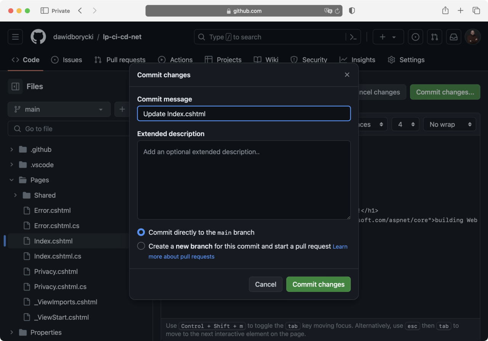
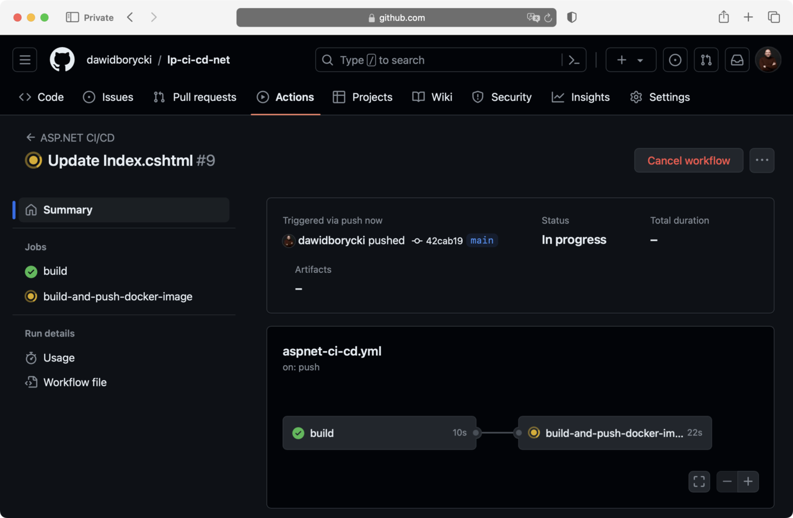

---
# User change
title: "Running CI/CD pipeline"

weight: 8

layout: "learningpathall"
---

## Objective
In this section, you run the CI/CD pipeline and verify that it deploys the Docker image to the Docker Hub repository

## CI/CD pipeline
The CI/CD pipeline is declared under the .github/workflows/asp-net-ci.cd.yml file. This YAML configuration defines a CI/CD pipeline for an ASP.NET project using GitHub Actions. It specifies actions to be triggered on push or pull request events to the main branch. This is indicated at the top of the YAML declaration:
```XML
on:
  push:
    branches: [ main ]
  pull_request:
    branches: [ main ]
```

The pipeline consists of two jobs: build and build-and-push-docker-image. Both jobs run on a self-hosted runner. Specifically, the build job is declared as follows:

```XML
jobs:
  build:
    runs-on: self-hosted

    steps:
    - uses: actions/checkout@v3

    - name: Setup .NET
      uses: actions/setup-dotnet@v1      
   
    - name: Build
      run: dotnet build -c Release
```

This job has three steps, which include:
1. Checking out the code using actions/checkout@v3.
2. Setting up .NET using actions/setup-dotnet@v1.
3. Building the project in Release configuration using the dotnet build -c Release command

Then, the YAML declares the build-and-push-docker-image job:
```XML
build-and-push-docker-image:
  needs: build
  runs-on: self-hosted
    
  steps:
  - uses: actions/checkout@v3
        
  - name: Set up Docker Buildx
    uses: docker/setup-buildx-action@v1
    
  - name: Login to DockerHub
    uses: docker/login-action@v1
    with:
      username: ${{ secrets.DOCKER_USERNAME }}
      password: ${{ secrets.DOCKER_PASSWORD }}
    
  - name: Build and push
    uses: docker/build-push-action@v2
    with:
      context: .
      file: ./Dockerfile
      push: true
      tags: ${{ secrets.DOCKER_USERNAME }}/sampleapp:latest
      platforms: linux/arm64
    
  - name: Logout of DockerHub
    run: docker logout
``` 

This job depends on the successful completion of the build job. This means that the build-and-push-docker-image runs after the build job. Again, the job uses self-hosted runner, and has the following steps:
 
1.Checking out the code again.

2. Setting up Docker Buildx using docker/setup-buildx-action@v1.

3. Logging in to DockerHub with credentials stored in GitHub secrets (DOCKER_USERNAME and DOCKER_PASSWORD).

4. Building and pushing the Docker image to DockerHub using docker/build-push-action@v2. The image is tagged as latest under the user's DockerHub account and is built for the linux/arm64 platform.

5. Logging out of DockerHub.

This pipeline automates the process of building the .NET application and packaging it into a Docker image, which is then pushed to DockerHub. It leverages GitHub secrets for secure authentication to DockerHub.

## Running the pipeline

To run the above pipeline, you need to make modifications to the source code and commit these changes to the main branch. Follow the steps below to proceed:

1. Navigate to your GitHub repository, and open the Pages/index.cshtml file in edit mode by clicking the pencil icon in the top right corner.

2. Modify line 8 of this file to change the header text. Replace the existing line with the following code
```HTML
<h1 class="display-4">Hello, Arm Developers!</h1>
```

This change updates the page's main header to greet Arm developers specifically.


3. Below the file editor, find and click the Commit changes button. This action opens the Commit changes window.

4. In the Commit changes window, you have the option to add a commit message describing your changes. After reviewing your message, click Commit changes to finalize the update:



Committing these changes to the main branch will automatically trigger the CI/CD pipeline. You can monitor the progress of this pipeline under the Actions tab of your GitHub repository:



Upon completion of the second job, which builds and pushes the Docker image, you can find the updated Docker image in your Docker Hub repository. The new image will be tagged as latest and will reflect the changes made to the index.cshtml file:


This process demonstrates how code changes in your repository can seamlessly integrate with GitHub Actions to automate the build and deployment of your application, including updating Docker images in Docker Hub.


