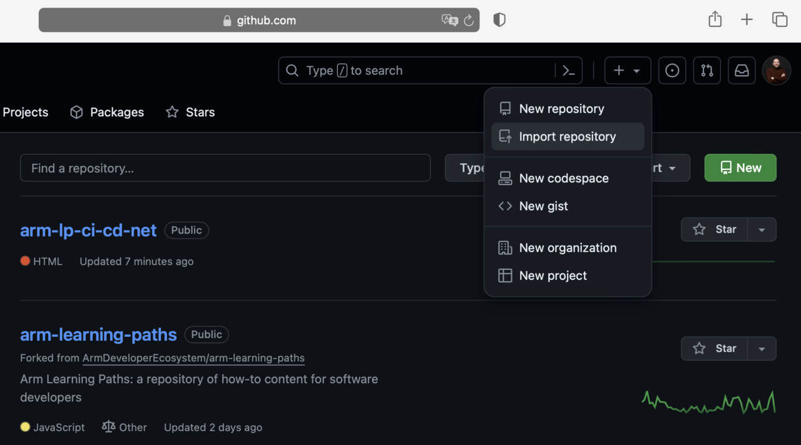
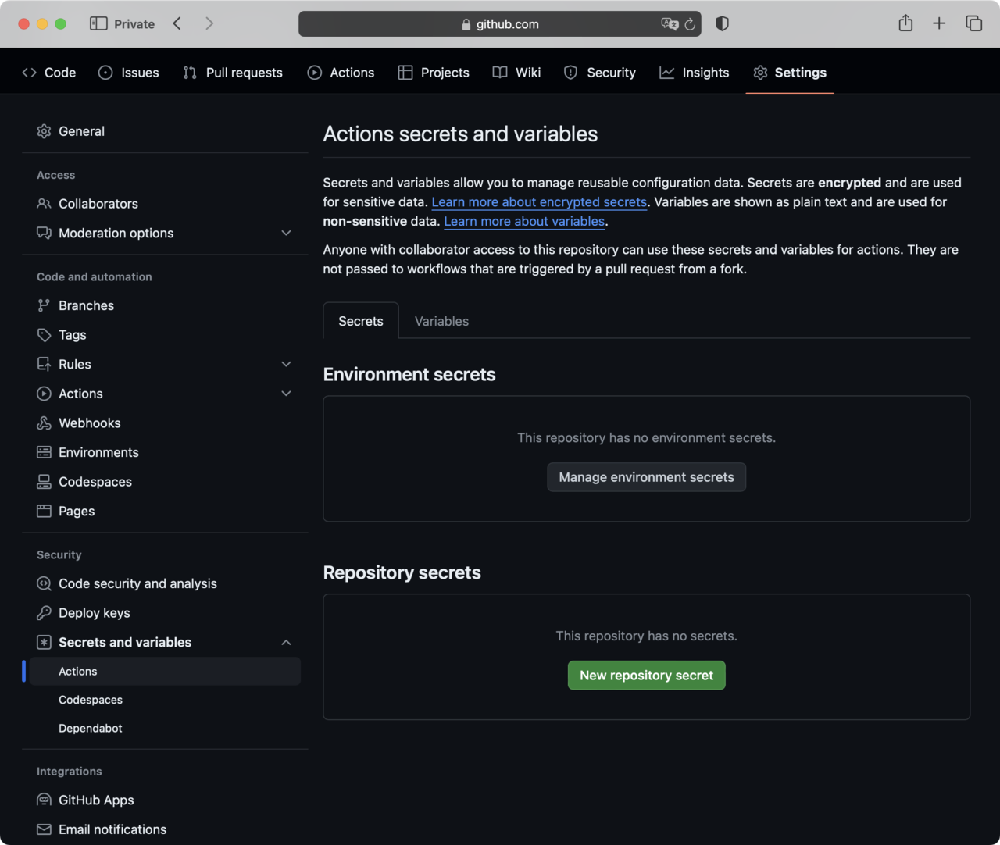
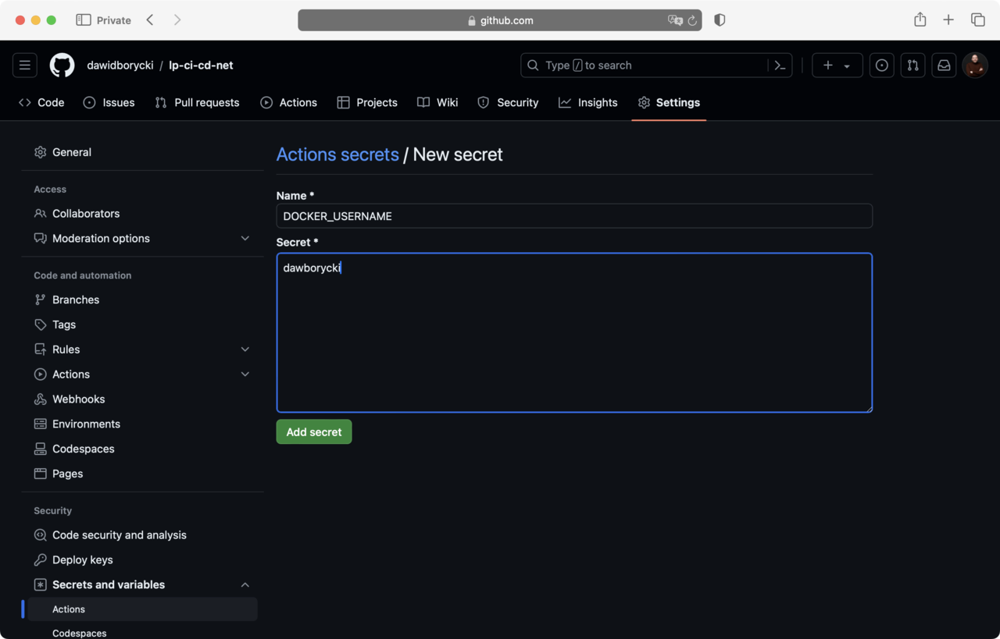

---
# User change
title: "Prepare GitHub Repository"

weight: 5

layout: "learningpathall"
---

## Prepare GitHub repository 
Now, you will prepare your GitHub repository as follows:

1. Go to GitHub and log in with your account credentials.
2. In the top right corner, click the + dropdown and select Import repository.

3. In the Import your project to GitHub section:
* Paste the following link https://github.com/dawidborycki/arm-lp-ci-cd-net.git into the 'Your old repository's clone URL' field.
* Set the repository name, for example, lp-ci-cd-net.
* Click the Begin import button.

After the import is complete, you will create two secrets that will store your Docker username and token. Proceed as follows
1. Go to your repository settings, and on the left, scroll down to Secrets and variables, then click Actions:

2. Under Actions secrets and variables, click the New repository secret button. This opens the New secret window, where you should configure the secret as follows:
* Name: DOCKER_USERNAME
* Value: <TYPE_YOUR_USERNAME>
* Click the Add secret button

3. Similarly, create another secret:
* Name: DOCKER_PASSWORD
* Value: <PASTE_YOUR_TOKEN>