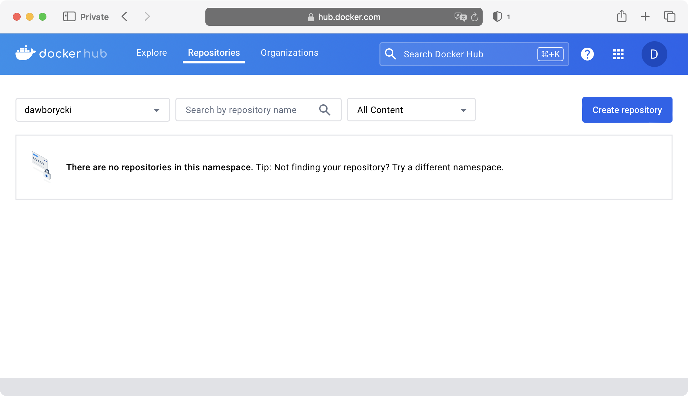
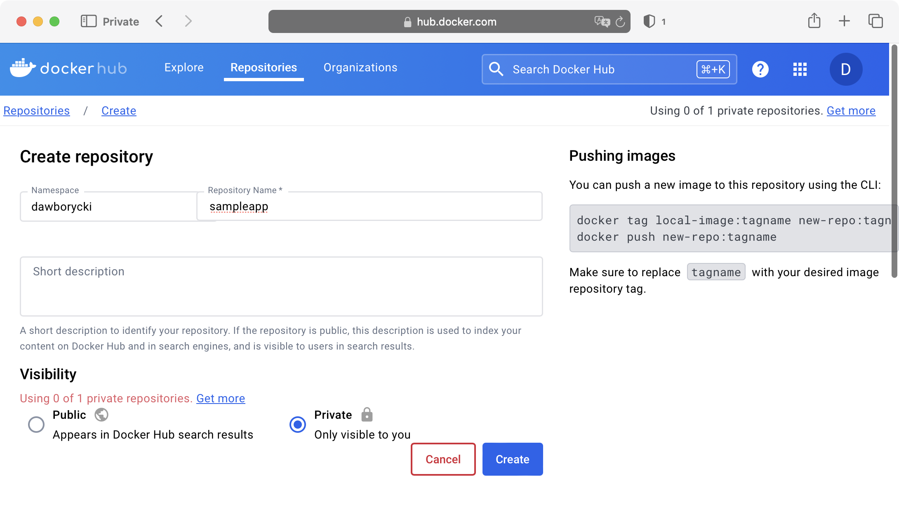
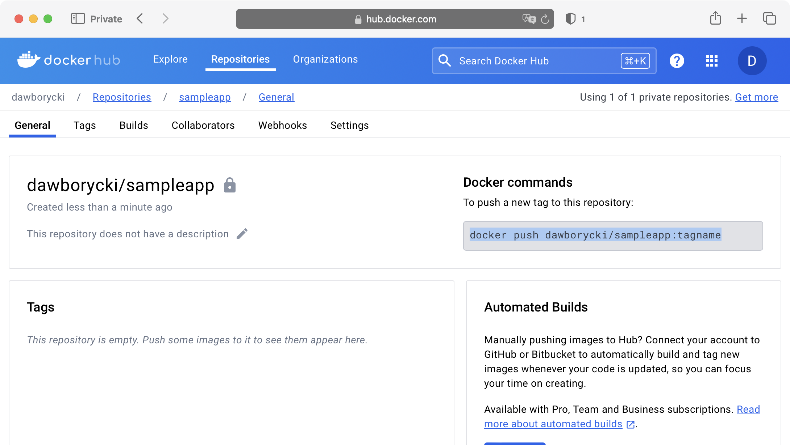
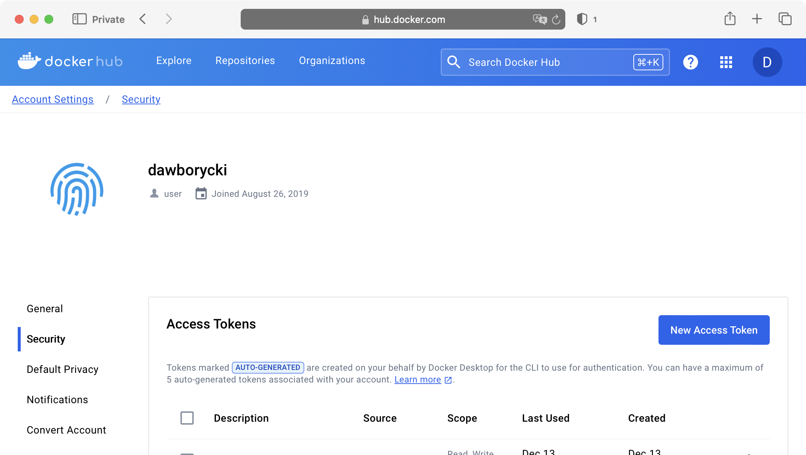

---
# User change
title: "Setting up the DockerHub Repository"

weight: 4

layout: "learningpathall"
---
## Setting up the DockerHub repository
First, create a repository on DockerHub by following these steps:
1. Log in to DockerHub, then click on *Repositories* at the top.
2. Under *Repositories*, click the *Create repository* button:

3. In the *Create repository* window, set the repository name to sampleapp and change the repository visibility to *Private*. 

4. Click the *Create* button. This will create the repository and redirect you back to the repositories list. Note the Docker push command. It should look like: docker push <YOUR_ACCOUNT_NAME>/sampleapp:tagname

Now you will need to generate the access token to enable the workflow to authenticate to DockerHub. To create the access token: 
1. Click on your username in the top-right corner of the Docker Hub site.
2. From the dropdown menu, select My Account, and then click the Security tab on the left:

3. Click the New Access Token button. This opens the New Access Token window, in which:
* Type ci-cd for the token name.
* Select Read, Write, Delete permissions and then click the Generate button.
4. A Copy Access Token window appears.  Ensure you copy and safely store the generated access token. 

