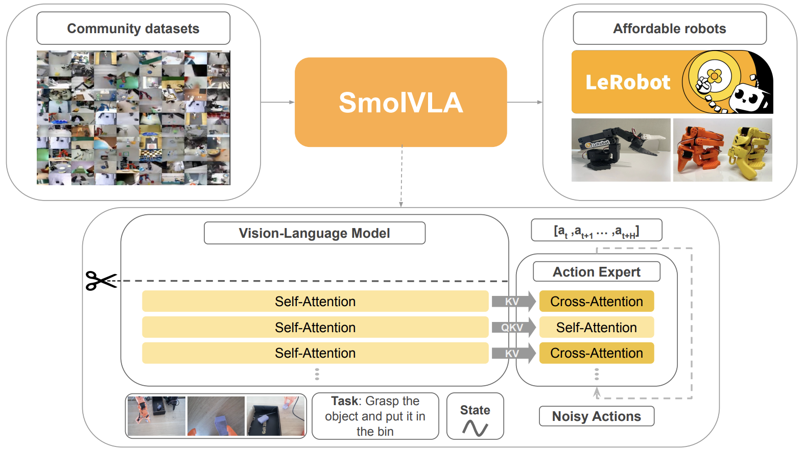

## Review the SmolVLA architecture
[SmolVLA](https://arxiv.org/pdf/2506.01844) is a lightweight vision-language-action model with around 450 million parameters. \
It takes camera images, a language instruction, and the robot state as inputs, and outputs a sequence of robot actions.



{}
The embedded Vision-Language model processes and concatenates the inputs into a multimodal sequence of context tokens known as the **prefix**, which is passed to the action expert.
{}

LeRobot's provided SmolVLA checkpoint is configured with:
- 3 camera image inputs.
- 48-language-token instruction padding.
- 10 iterations of flow matching in the action expert.

After denoising, the action expert outputs a clean robot action chunk of shape `[1, 50, 32]`. The provided checkpoint only uses 6 real action dimensions, so padding is removed, leaving a `[1, 50, 6]` tensor. This represents a 50-step action trajectory for each action dimension.

## Learn the ExecuTorch workflow
ExecuTorch provides a common platform for edge AI inference deployment.

On a high level, you first export your PyTorch model to a hardware-unspecific ExecuTorch intermediate representation (IR). \
Next, you use a suitable backend to "lower" your model to an optimized state for your target hardware. We will use the [XNNPACK backend](https://github.com/google/XNNPACK), which enables highly-optimized inference on Arm CPUs.

The model stages in the ExecuTorch conversion pipeline are:
```output
PyTorch model (SmolVLA)
      │
      │  torch.export.export(...)
      v
ExportedProgram
      │
      │  to_edge(...)
      v
ExecuTorch Edge IR
      │
      │  partition with XnnpackPartitioner
      │  lower supported subgraphs to XNNPACK
      v
Edge program with XNNPACK delegate calls
      │
      │  to_executorch()
      v
Serialized ExecuTorch program (.pte)
      │
      │  loaded by native ExecuTorch runtime
      v
ExecuTorch runtime
      │
      ├─ XNNPACK delegate kernels
      │
      └─ portable CPU fallback ops
      v
Arm CPU
```

#### Partitioning and lowering
After `torch.export`, the model is represented as a graph of ATen operations.

The XNNPACK partitioner inspects this graph and groups the operations that
XNNPACK can execute. These supported regions are replaced with delegate calls
that will be handled by the XNNPACK backend at runtime.

During backend lowering, XNNPACK-supported subgraphs are converted into delegate data and replaced in the Edge graph with **XNNPACK delegate calls**. Operations that XNNPACK cannot execute remain in the Edge graph, provided that the ExecuTorch runtime has suitable **fallback kernels** for them.

Where possible, higher-level operations may also be **decomposed** into simpler
ATen operations that can be backend-delegated. If an operation is supported by neither the backend nor fallback, you can manually implement a decomposition into backend/fallback-supported ops.

Finally, `to_executorch()` applies runtime-specific transformations, including memory planning, and produces the ExecuTorch program that is serialized as a `.pte` file.

### Split architecture
We will separately apply exportation and lowering three times: once for each of the **vision encoder**, **prefix forward pass**, and **denoising step**.

There are multiple reasons why this decoupling is beneficial compared to a whole-model export:
- The pinned ExecuTorch exports the whole denoising for-loop by copying the single-step graph 10 times in the export. This prolongs lowering and introduces unnecessary memory overhead. Instead, we run one exported iteration 10 times.
- We will utilise different numbers of CPU cores to independently optimize the `vision`, `prefix` and `denoise` latencies.
- The latency overhead introduced by wiring the I/O of the three components is negligible, and far outweighed by the above optimization.
- It is a standard [LeRobot SmolVLA](https://huggingface.co/lerobot/smolvla_base) development split because it provides immediate access to denoising without needing to re-run the vision and prefix stages, which are more costly than one denoising step.


## What you've learned and what's next
You now have an understanding of the SmolVLA architecture, and a mental image of the model's progression through the ExecuTorch pipeline.

Next, you will set up your environment and obtain necessary resources for your own conversion.
