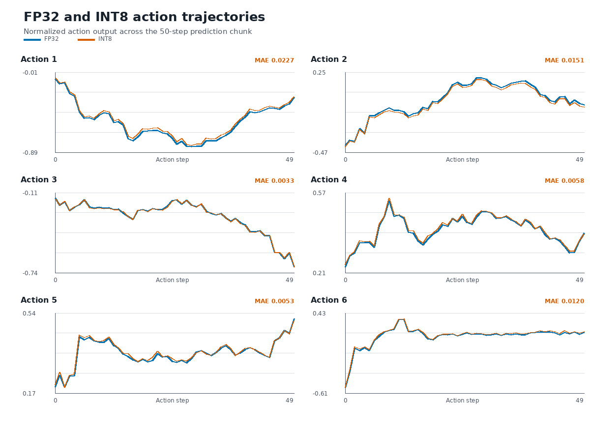

## Quantize and export the INT8 model
You have seen each stage of the pipeline. Using it, you'll now export an INT8 quantization of the model using TorchAO.

First, change the artifact output directory:
```bash
export SMOLVLA_ARTIFACTS_DIR=$PWD/artifacts/int8
```

Now, use the prepared `pipeline.sh` script to run through the whole pipeline with INT8 quantization:
```bash
./scripts/pipeline.sh \
    --variant int8 \
    --input-suite "$SMOLVLA_INPUT_SUITE" \
    --output-dir artifacts/int8
```
{}
The `--variant int8` option applies dynamic per-channel INT8 quantization to eligible linear operations in `vision_encoder` and `denoise_step`: weights use per-channel INT8 quantization, while activations are quantized dynamically at runtime. `prefix_forward` remains FP32 to preserve accuracy.

Quantization occurs immediately after loading the model, before splitting and exporting.

Different SmolVLA configurations can benefit from different quantizations. In particular, fine-tuned models can use static INT8, where real robot task data influences the quantization.
{}

## Compare the FP32 and INT8 executions

### Inspect the CPU layout and usage
We can explicitly provide CPU cores to the native runner rather than rely on non-deterministic allocation in the two executions for the FP32 and INT8 models. This ensures consistent performance and a fair comparison. It also lets us optimize the different components' executions. Inspect your CPU core layout with:
```bash
lscpu -e=CPU,ONLINE,MAXMHZ,MODELNAME
```

For example, the layout on an NVIDIA DGX Spark:
```output
CPU ONLINE    MAXMHZ MODELNAME
  0    yes 2808.0000 Cortex-A725
  1    yes 2808.0000 Cortex-A725
  2    yes 2808.0000 Cortex-A725
  3    yes 2808.0000 Cortex-A725
  4    yes 2808.0000 Cortex-A725
  5    yes 3900.0000 Cortex-X925
  6    yes 3900.0000 Cortex-X925
  7    yes 3900.0000 Cortex-X925
  8    yes 3900.0000 Cortex-X925
  9    yes 3900.0000 Cortex-X925
 10    yes 2808.0000 Cortex-A725
 11    yes 2808.0000 Cortex-A725
 12    yes 2808.0000 Cortex-A725
 13    yes 2808.0000 Cortex-A725
 14    yes 2808.0000 Cortex-A725
 15    yes 3900.0000 Cortex-X925
 16    yes 3900.0000 Cortex-X925
 17    yes 3900.0000 Cortex-X925
 18    yes 3900.0000 Cortex-X925
 19    yes 3900.0000 Cortex-X925
```

You'll be provided with the *option* to allocate a group of cores to `vision` and a group of cores to both `prefix` and `denoise`, which you can experiment with. Decide on a group of CPU cores that is favourable for execution. The recommended configuration is eight to ten cores for `vision` and five to eight cores for the other components.

In the above case, cores `5-9` and `15-19` are faster Cortex-X cores, and will be provided as examples in the section below.

Additionally, if your machine has resource-intensive processes running, this will affect inference latency. You might want to consider this. Inspect the live CPU load with:
```bash
top
```

### Run benchmarks
Modify and run this command to do a small benchmark of the FP32 model, and then re-run it with `--artifacts-dir artifacts/int8` for the INT8 model:

```bash
python scripts/benchmark.py \
    --artifacts-dir artifacts/fp32 \
    --warmup-runs 3 \
    --benchmark-runs 10 \
    --cpu-threads 5 \
    --cpu-affinity 15-19 \
    --vision-cpu-threads 8 \
    --vision-cpu-affinity 5-9,15-19
```
{}
Change any arguments. In particular:
- `cpu-affinity` specifies the cores allocated for the process.
- `cpu-threads` specifies the ExecuTorch/XNNPACK thread pool size.\
Recommended: match the number of cores used in your `cpu-affinity`.
- `vision-*` options allow you to specify separate worker thread and core allocations to the vision encoder.

Exclude the vision options to run the vision encoder with the base thread pool and CPU affinity. \
Exclude all `[...]cpu-affinity` and `[...]cpu-threads` options to use unregulated core allocations.
{}

### Compare benchmark results
Compare the latency and output accuracy to the PyTorch reference, and visualise the six action-dimension output values:
```bash
python scripts/compare.py \
    --fp32 artifacts/fp32 \
    --int8 artifacts/int8
```

Example output from running on a DGX spark:
```output
variant  median_ms  PTE_MB  cosine      MAE       SQNR_dB
FP32       1443.36  1611.7  0.999995944  0.000982  49.34
INT8        720.74  1022.9  0.999376578  0.010765  28.86
INT8 speedup: 2.00x
```



## What you've accomplished

You've converted a SmolVLA model to ExecuTorch with an INT8 quantization, run FP32 and INT8 models using identical inputs on an Arm CPU, and compared their output error and native runtime latency.

From here, you can integrate the ExecuTorch model into a robotics pipeline, experiment with more quantizations and SmolVLA configurations, or optimize for other Arm CPU layouts.
