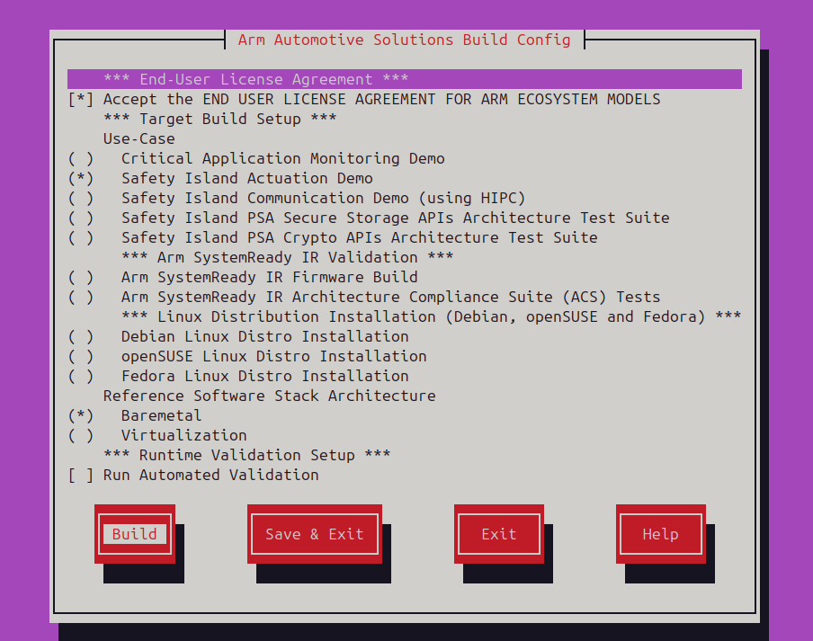

---
# User change
title: "Build the Arm Automotive Solutions Software Reference Stack"

weight: 5

layout: "learningpathall"
---
## Build the automotive software stack

The Thelio Astra makes it possible to build the complete software stack on an Arm-based local machine, instead of using alternative setups such as an Arm-based cloud instance, or a non-Arm desktop computer.

You can build the Using the Arm Automotive Solutions Software Reference Stack from the command line of the Ubuntu 20.04 Multipass virtual machine. 

Create a new directory, and clone the repository:

```console
mkdir -p ~/arm-auto-solutions
cd ~/arm-auto-solutions
git clone https://git.gitlab.arm.com/automotive-and-industrial/arm-auto-solutions/sw-ref-stack.git --branch v1.1
```

Open the configuration menu:

```console
kas menu sw-ref-stack/Kconfig
```

Use the space bar and the arrow keys to select the three components shown in the screen capture below:
- Accept the END USER LICENSE AGREEMENT.
- Safety Island Actuation Demo.
- Baremetal. 



{}
To build and run, you must accept the EULA. 
{}

Use tab to navigate to the `Build` button and press enter to start the build.

The build will take some time, depending on the number of CPUs in your virtual machine.

