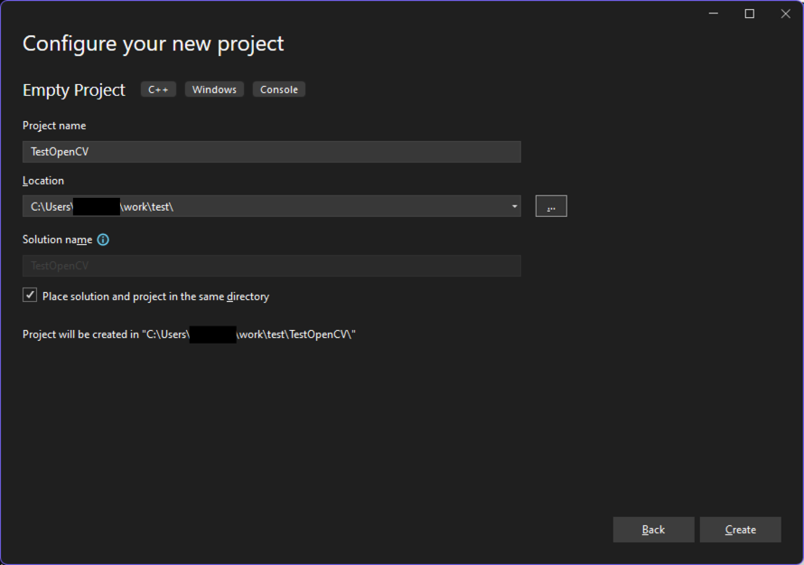
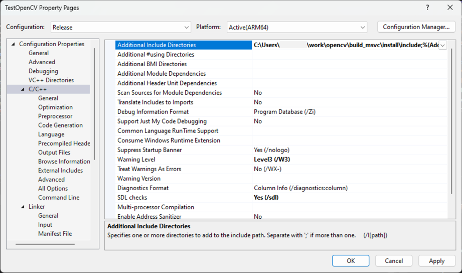
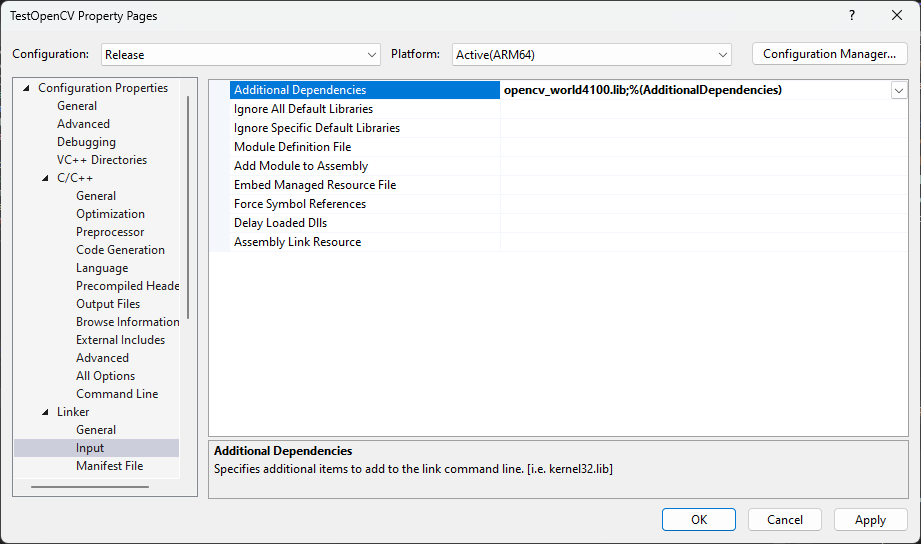
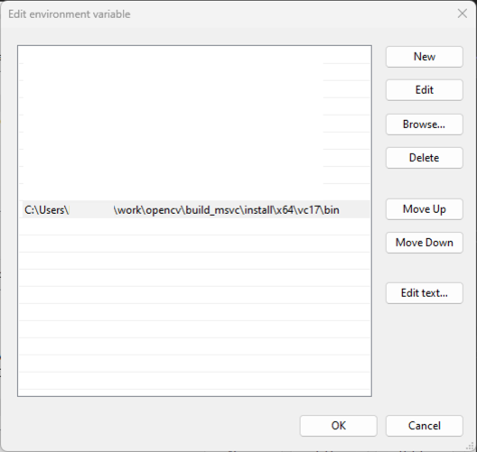

## How do I build OpenCV with MSVC?

Follow these steps to build OpenCV and a test application using the library with the MSVC compiler.

### Clone the OpenCV repository

Open up a Windows PowerShell and checkout the source tree:

```bash
git clone https://github.com/opencv/opencv
cd opencv
git checkout tags/4.10.0
```

{}
You might be able to use a later version, but these steps have been tested with version 4.10.0.
{}

### Pre-build configuration

You can use CMake from the command line. 

First, run the following command to run the pre-build configuration: 

```bash
mkdir build_msvc
cd build_msvc

cmake `
-S .. `
-B . `
-G "Visual Studio 17 2022" `
-DCMAKE_BUILD_TYPE=Release `
-DBUILD_opencv_world=ON `
-DWITH_ITT=OFF `
-DWITH_OPENCL=OFF `
-DWITH_OPENCLAMDBLAS=OFF `
-DWITH_OPENCLAMDFFT=OFF `
-DWITH_OPENCL_D3D11_NV=OFF `
-DWITH_DIRECTML=OFF `
-DWITH_DIRECTX=OFF `
-DWITH_ADE=OFF `
-DWITH_CAROTENE=OFF
```

The given options in the code above specify the following:
- The source code is located one level above the current directory.
- The build will be performed in the current directory.
- The Visual Studio 2022 MSVC compiler will be used as the compiler.
- The compiled library is generated as a single file that includes all of OpenCV's functionality.
- Unnecessary options have been disabled, assuming processing on Arm CPUs.

&nbsp;

If the configuration is successful, a message similar to the following should be displayed at the end of the execution:

```output
-- General configuration for OpenCV 4.10.0 =====================================
--   Version control:               4.10.0
--
--   Platform:
--     Timestamp:                   2024-11-08T08:50:24Z
--     Host:                        Windows 10.0.22631 ARM64
--     CMake:                       3.28.1
--     CMake generator:             Visual Studio 17 2022
--     CMake build tool:            C:/Program Files/Microsoft Visual Studio/2022/Professional/MSBuild/Current/Bin/arm64/MSBuild.exe
--     MSVC:                        1941
--     Configuration:               Debug Release
--
--   CPU/HW features:
--     Baseline:                    NEON
--       requested:                 NEON FP16
--     Dispatched code generation:  NEON_DOTPROD NEON_FP16
--       requested:                 NEON_FP16 NEON_BF16 NEON_DOTPROD
--       NEON_DOTPROD (1 files):    + NEON_DOTPROD
--       NEON_FP16 (2 files):       + NEON_FP16
--
--   C/C++:
--     Built as dynamic libs?:      YES
--     C++ standard:                11
--     C++ Compiler:                C:/Program Files/Microsoft Visual Studio/2022/Professional/VC/Tools/MSVC/14.41.34120/bin/Hostarm64/arm64/cl.exe  (ver 19.41.34123.0)
[...]
--     C Compiler:                  C:/Program Files/Microsoft Visual Studio/2022/Professional/VC/Tools/MSVC/14.41.34120/bin/Hostarm64/arm64/cl.exe
[...]
--   Install to:                    C:/Users/username/work/opencv/build_msvc/install
-- -----------------------------------------------------------------
--
-- Configuring done (97.5s)
-- Generating done (2.8s)
-- Build files have been written to: C:/Users/username/work/opencv/build_msvc
```

### Build and install

Run the following commands to build and install OpenCV:

```bash
cmake --build . --config Release
cmake --build . --target INSTALL --config Release
```

{}
The build takes approximately 25 mins on a Lenovo X13s.
{}

&nbsp;

When you have completed the build and installation steps, confirm the shared library has been created by inspecting the results in the `install/bin` directory:

```bash { output_lines = "2-12" }
ls ./install/x64/vc17/bin
    Directory: C:\Users\username\work\opencv\build_msvc\install\x64\vc17\bin
Mode                 LastWriteTime         Length Name
----                 -------------         ------ ----
-a----        08/11/2024     09:03          43008 opencv_annotation.exe
-a----        08/11/2024     09:03         143872 opencv_interactive-calibration.exe
-a----        08/11/2024     09:03          41984 opencv_model_diagnostics.exe
-a----        08/11/2024     09:12          36864 opencv_version.exe
-a----        08/11/2024     09:12          35328 opencv_version_win32.exe
-a----        08/11/2024     08:50       26391552 opencv_videoio_ffmpeg4100_64.dll
-a----        08/11/2024     09:12          56320 opencv_visualisation.exe
-a----        08/11/2024     09:03       27179008 opencv_world4100.dll
```

Also inspect the `install/lib` directory:

```bash { output_lines = "2-9" }
ls ./install/x64/vc17/lib
    Directory: C:\Users\username\work\opencv\build_msvc\install\x64\vc17\lib
Mode                 LastWriteTime         Length Name
----                 -------------         ------ ----
-a----        08/11/2024     08:50            434 OpenCVConfig-version.cmake
-a----        08/11/2024     08:50          15260 OpenCVConfig.cmake
-a----        08/11/2024     08:50            972 OpenCVModules-release.cmake
-a----        08/11/2024     08:50           3879 OpenCVModules.cmake
-a----        08/11/2024     09:02        2849862 opencv_world4100.lib
```

&nbsp;

The library used in your application is `opencv_world<version>.lib/dll`. 

Once the library files are correctly generated, run the following command to ensure that there are no errors.

```bash { output_lines = "2" }
./install/x64/vc17/bin/opencv_version.exe
4.10.0
```

{}
The generated directory name contains "x64," but there is no need to worry as the libraries and executable files will definitely run as AArch64.
{}

&nbsp;

## Build OpenCV Applications

Once the OpenCV library has been successfully created, the next step is to link it to a simple application and try using it.

### Create a new project in Visual Studio

First, create a new project in Visual Studio. 

Launch Visual Studio, click **Create a new project** on the initial screen, then select **Empty Project**, and click **Next**. 

On the next screen, set the **Project name** and **Location**. You can choose any name and location, but for this example, name the project `TestOpenCV`, as shown below. 

Click **Create** to generate the new project.



### Add source code

 In **Solution Explorer**, right-click the **Source Files** folder, select **Add**, and then **New Item...**. Create a file named `test_opencv.cpp`.


&nbsp;

Once the file is created, it opens in the editor. 

Copy and paste the following program into it and save the file.

```cpp
#include <opencv2/opencv.hpp>
#include <iostream>
int main() {
    cv::Mat image = cv::Mat::zeros(100, 100, CV_8UC3);
    if (image.empty()) {
        std::cout << "Failed to create an image!" << std::endl;
        return -1;
    }
    cv::circle(image, cv::Point(50, 50), 30, cv::Scalar(255, 0, 0), -1);
    cv::imwrite("test_image.png", image);
    cv::waitKey(0);
    return 0;
}
```

This program is a simple example that uses OpenCV to do the following:

* Create a 100x100 black image.
* Draw a blue circle on it.
* Save it as a file.

### Configure build settings

Next, select the **Configuration** drop-down menu in the center of the screen, and change it from **Debug** to **Release**. At this stage, your screen should look like the example shown below.


&nbsp;

Now, set up the compile and link settings. 

Select **Project** from the top menu and click on **TestOpenCV properties**. 

Edit **Include directories**, **Library directories**, and **Additional dependencies** as shown in the images below, and then click **OK**.



&nbsp;


&nbsp;



&nbsp;

Finally, ensure that the directory containing the dynamic libraries (DLLs) is added to the `PATH` environment variable. Set this in the Windows system settings. After setting the environment variable, restart Visual Studio to apply the changes.



### Build the application

You are now ready to build the application. 

From the top menu, select **Debug** and click **Start Without Debugging** or press Ctrl+F5.

If a console window appears showing that the program exited with code 0 and `test_image.png` is generated in the top-level directory of your Visual Studio project, you have succeeded. 

Open the image file, it should look like the example shown below.


Congratulations! You are now ready to create your own OpenCV applications using MSVC.

