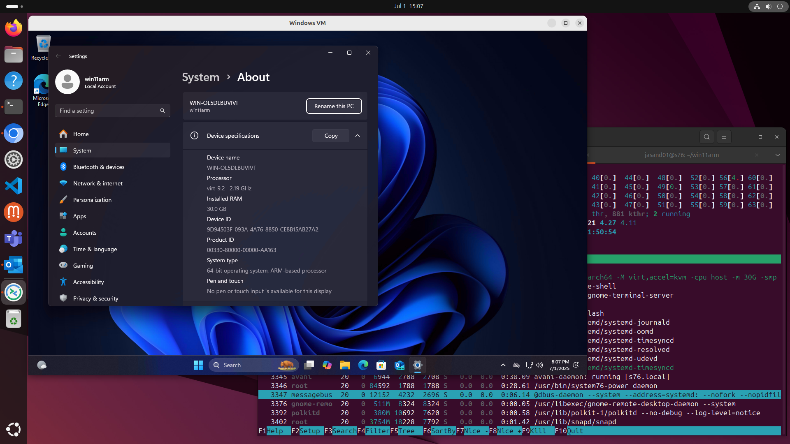

## Basic VM launch command

After your Windows 11 Arm VM is created, launching it is simple with the unified run script:

```console
./run-win11-vm.sh $HOME/win11-vm
```

This single command handles the entire VM startup and connection process automatically. 

The script performs three key steps. It does the following: 

- Checks if the VM is already running
- Starts the VM in headless mode if required
- Connects you through RDP using Remmina

When the virtual machine starts you will see it on your Linux desktop:



## What does the run script do? 

Understanding the run script flow helps you troubleshoot issues and customize the VM runtime behavior.

### Step 1: Check if VM is already running

The script first checks if your VM is already running to avoid conflicts.

Here is a fragment of the code:

```bash
# Check for existing VM process
if [ -f "$vm_path/qemu.pid" ]; then
    local vm_pid=$(cat "$vm_path/qemu.pid" 2>/dev/null)
    if process_exists "$vm_pid"; then
        status "VM is already running (PID: $vm_pid)"
    fi
fi
```

The run script looks for the `qemu.pid` file in your VM directory, verifies the process ID is still active, cleans up stale PID files from previous sessions, and skips VM startup if already running.

If this happens you will see output similar to:

```output
VM is already running (PID: 12345)
Waiting for RDP service on port 3389...
```

### Step 2: Start VM in headless mode

If the VM isn't running, the script starts it in headless mode (no GUI window) using QEMU. 

The arguments to QEMU are shown below:

```bash
qemu-system-aarch64 \
    -M virt,accel=kvm \
    -cpu host \
    -m ${vm_mem}G \
    -smp $num_cores \
    -name "Windows on Arm" \
    -pidfile "$vm_path/qemu.pid" \
    -display none \
    -netdev user,id=nic,hostfwd=tcp:127.0.0.1:${rdp_port}-:3389 \
    -device virtio-net-pci,netdev=nic \
    -bios /usr/share/qemu-efi-aarch64/QEMU_EFI.fd \
    -drive file="$vm_path/disk.qcow2",if=virtio,discard=unmap,aio=threads,cache=none \
    -daemonize
```

The important arguments to QEMU are:
- `-M virt,accel=kvm` - Uses ARM virtualization with KVM acceleration
- `-cpu host` - Passes through your host CPU features for best performance
- `-display none` - Runs headless (no QEMU window)
- `-daemonize` - Runs QEMU as a background daemon
- `-netdev user,hostfwd=...` - Sets up port forwarding for RDP access
- `-pidfile` - Creates a PID file for process management

The script automatically detects and allocates CPU and memory resources.

The code is shown below:

```bash
# Memory: Half of available RAM (minimum 2GB)
local total_ram_gb=$(awk '/MemTotal/ {print int($2/1048576)}' /proc/meminfo)
local vm_mem=$((total_ram_gb / 2))
[ "$vm_mem" -lt 2 ] && vm_mem=2

# CPU: Half of available cores (minimum 4)
local total_cores=$(grep -c ^processor /proc/cpuinfo)
local num_cores=$((total_cores / 2))
[ "$num_cores" -lt 4 ] && num_cores=4
```

When the run script executes, you will see the CPU and RAM allocated:

```output
Starting Windows VM in headless mode...
Using 8GB RAM and 4 CPU cores
VM started successfully
```

### Step 3: Connect via RDP

Once the VM is running, the script waits for the RDP service and connects automatically.

Here is the function which waits for the port to be ready:

```bash
# Wait for RDP service to be available
wait_for_rdp() {
    local port="$1"
    local max_attempts=60
    
    while [ $attempt -le $max_attempts ]; do
        if timeout 3 bash -c "echo >/dev/tcp/localhost/$port" 2>/dev/null; then
            return 0
        fi
        sleep 2
        attempt=$((attempt + 1))
    done
}
```

Once the RDP service is ready, Remmina is started and connects. 

The related output is shown below:

```output
Waiting for RDP service on port 3389...
RDP service is available!
Connecting to VM via RDP (localhost:3389)...
Username: win11arm
```

## Run script options and examples

The run script supports several options for different use cases:

### Custom RDP port

```console
./run-win11-vm.sh /path/to/vm --rdp-port 3390
```
Uses a custom RDP port, useful when running multiple VMs or avoiding port conflicts.

### Help information

```console
./run-win11-vm.sh --help
```
Displays usage information and all available options.

## Remmina integration

The script uses Remmina as the RDP client and creates a Remmina profile with the connection settings.

The file name is `connect.remmina` and you can review and edit as needed.

```ini
[remmina]
name=VM Connect
protocol=RDP
scale=2
quality=9
disable_fastpath=0
glyph-cache=0
multitransport=0
relax-order-checks=1
ignore-tls-errors=1
cert_ignore=1
window_width=1024
window_height=768
window_maximize=0
disableautoreconnect=1
viewmode=1
network=lan #change viewmode=1 to viewmode=3 for fullscreen
sound=local #to get microphone input working, change to sound=remote, and USB passthrough your m
icrophone to the VM.
colordepth=63
```


## VM shutdown 

The preferred method is to shut down Windows normally from within the virtual machine.

1. Click the Start button in Windows
2. Select Power → Shut down
3. Wait for Windows to complete shutdown
4. VM automatically stops when Windows finishes shutting down
5. Remmina exits automatically when the connection closes

You should avoid killing QEMU directly as it may corrupt the VM disk as well as avoid exiting Remmina as it may leave the VM running in the background.

## Runtime monitoring and management

### Checking VM status

To check if your VM is running without connecting:

```console
# Check for VM process
ps aux | grep "Windows on Arm"

# Check PID file
cat $HOME/win11-vm/qemu.pid

# Test RDP connectivity
timeout 3 bash -c "echo >/dev/tcp/localhost/3389"
```

If the RDP connectivity fails the output is:

```output
bash: connect: Connection refused
bash: line 1: /dev/tcp/localhost/3389: Connection refused
```

### Resource usage monitoring

Monitor VM resource usage while running:

```console
# CPU and memory usage
top -p $(cat $HOME/win11-vm/qemu.pid)

# Detailed process information
ps -p $(cat $HOME/win11-vm/qemu.pid) -o pid,ppid,cmd,%cpu,%mem,etime
```

### Multiple VM management

Running multiple VMs requires different RDP ports:

```console
# First VM (default port 3389)
./run-win11-vm.sh $HOME/vm1

# Second VM (custom port 3390)
./run-win11-vm.sh $HOME/vm2 --rdp-port 3390

# Third VM (custom port 3391)
./run-win11-vm.sh $HOME/vm3 --rdp-port 3391
```

Each VM needs its own directory and unique RDP port to avoid conflicts.

## Troubleshooting runtime issues

### RDP connection failures

If RDP connection fails:

```output
Error: RDP service did not become available after 120 seconds
```

Check VM is actually running: 

```console
ps aux | grep qemu-system-aarch64
```

Verify RDP port: 
```console
netstat -tlnp | grep 3389
```

### Known Remmina crash issue

When disconnecting from RDP, Remmina may crash with:

```output
./run-win11-vm.sh: line 143: 60433 Aborted (core dumped) remmina -c "$remmina_file" $remmina_flags 2> /dev/null
RDP session ended
```

This is a known Remmina issue and does not affect VM functionality.

You have completed the VM execution section. You now know how to run, monitor, and manage Windows on Arm virtual machines on an Arm Linux system. Keep building your skills and explore more advanced automation or troubleshooting as your next step - great work!
