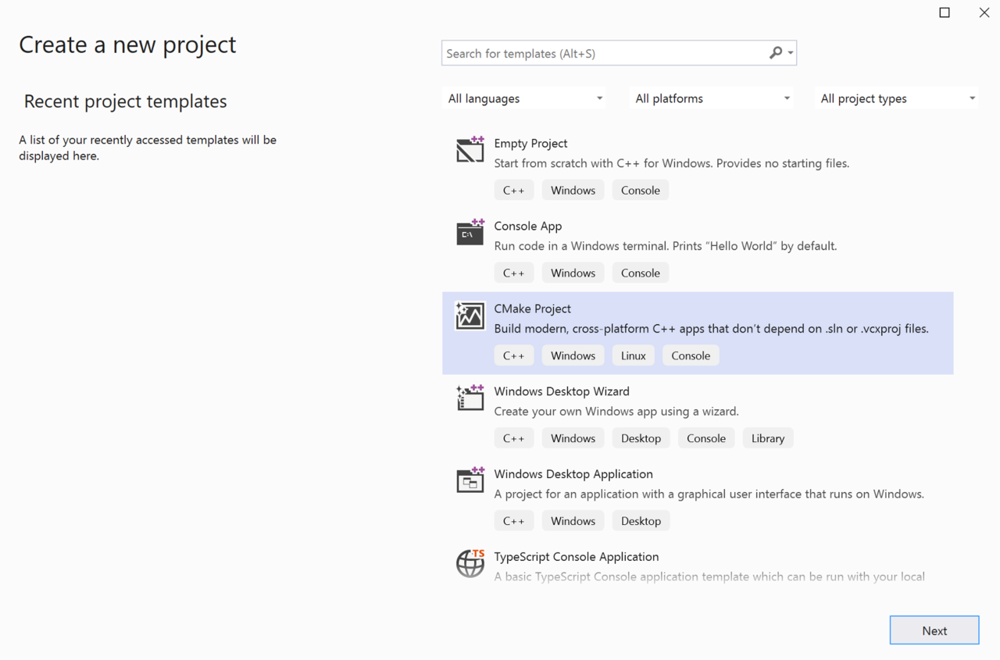
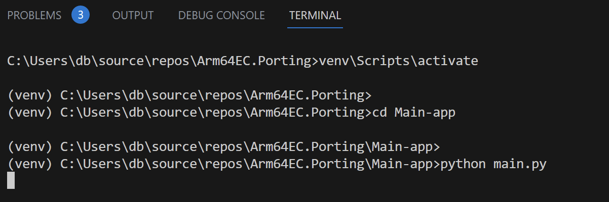
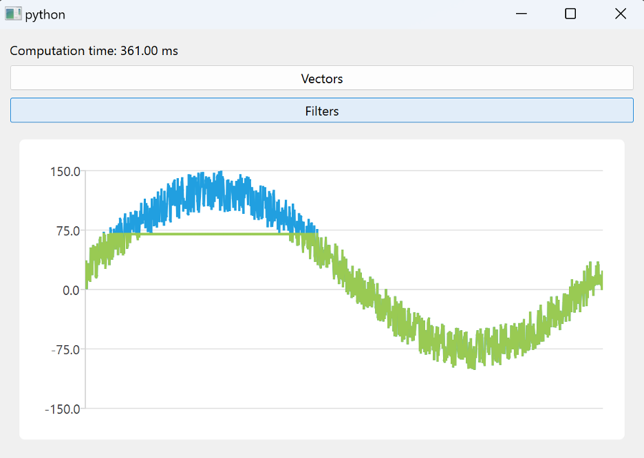

---
# User change
title: "Application"

weight: 2

layout: "learningpathall"
---

## Introduction
Arm64EC is a Windows 11 Application Binary Interface (ABI) that helps you transition existing x64 apps to Arm64. It enables your existing x64 dependencies to load in the same process as the Arm64 binaries, resolving the bottleneck of porting dependencies. This approach improves your app's performance without changing any code.

Using Arm64EC helps migrate large and complex applications with their own ecosystem. The app vendor may not know about the dependencies the app customer requires. For example, professionals may use plugins from many independent vendors in an image processing application. When that image processing application is compatible with Arm64EC, the users can use all the plugins, irrespective of whether the makers have ported them to Arm64. Arm64EC enables shipping applications that link legacy binary dependencies, even if they have missing source code or an unsupported toolchain.

This learning path demonstrates how to employ Arm64EC to port a complete application consisting of the main application and dependencies, including separate dynamic link libraries (DLLs). Namely, you will build a Qt-based Python application with two C/C++-based DLL dependencies. This architecture mimics a typical scenario of using Python and Qt for rapid UI prototyping and DLLs for computation-intense work. The Python application demonstrates an alternative way of building a UI for C/C++ based DLL dependencies since native C/C++ dependencies are typical in the Python ecosystem and may not yet offer native builds. That said, you could still use Qt-based C/C++ UI.

## Before you begin
To follow this learning path:

1. Install [Visual Studio 2022 or higher](/install-guides/vs-woa) with Arm64 build tools.
2. Install [Python](/install-guides/py-woa) on your machine. In this learning path, Python version 3.11.3 was used.

The [complete project code](https://github.com/dawidborycki/ARM64EC.Porting) is hosted on GitHub.

## Project Setup
To set up the project, start by creating the dependencies (the DLLs). In this example you will use CMake in Visual Studio 2022 to create the base project for your dependencies. You can also use MS Build/Visual C++ project templates to compile to Arm64EC by adding the architecture to your build configuration. To access CMake, open Visual Studio 2022 and click Create a new project and look for CMake Project in the window that appears.



Then, click **Next** and set the following configurations:

1. Project name: Arm64EC.Porting
2. Location: Choose any location
3. Solution: Create new solution
4. Solution name: Arm64EC.Porting

Finally, click **Create**.

## Implementation

Once the project is ready, create two folders: **Vectors** and **Filters**. Each folder is for implementing a separate DLL. 

### The First DLL
Start by implementing the first DLL. To do this, create two files in the **Vectors** folder: `Vectors.h` and `Vectors.cpp`. Copy the code below into `Vectors.h`:

```cpp
#pragma once
 
#include <iostream>
#include <chrono>
 
using namespace std;
 
extern "C" __declspec(dllexport) double performCalculations();
```

After the pragma precompiler declaration, the above declaration imports two headers: iostream and chrono. Then, add the `std` namespace and export one function, `performCalculations`. Later on you will call this function from the main Python app.

Now, create `Vectors.cpp` with the code shown below:

```cpp
#include "Vectors.h"
 
int* generateRamp(int startValue, int len) {
    int* ramp = new int[len];
 
    for (int i = 0; i < len; i++) {
        ramp[i] = startValue + i;
    }
 
    return ramp;
}
 
double dotProduct(int* vector1, int* vector2, int len) {
    double result = 0;
 
    for (int i = 0; i < len; i++) {
        result += (double)vector1[i] * vector2[i];
    }
 
    return result;
}
 
double msElapsedTime(chrono::system_clock::time_point start) {
    auto end = chrono::system_clock::now();
 
    return chrono::duration_cast<chrono::milliseconds>(end - start).count();
}
```

In the above code, the first function `generateRamp` creates the synthetic vector of a given length. You set the vector values using the startValue and len functions’ parameters. Then, you define the `dotProduct` function which multiplies two input vectors element-wise. Finally, you add a helper function `msElapsedTime` which uses the C++ chrono library to measure the code execution time.

Next, prepare another helper function to generate two vectors, calculate their dot product, and measure the code execution time. You can use this function later to measure the code performance. Add this function to `Vectors.cpp`:

```cpp
double performCalculations() {
    // Ramp length and number of trials
    const int rampLength = 1024;
    const int trials = 100000;
 
    // Generate two input vectors
    // (0, 1, ..., rampLength - 1)
    // (100, 101, ..., 100 + rampLength-1)
    auto ramp1 = generateRamp(0, rampLength);
    auto ramp2 = generateRamp(100, rampLength);
 
    // Invoke dotProduct and measure performance 
    auto start = chrono::system_clock::now();
 
    for (int i = 0; i < trials; i++) {
        dotProduct(ramp1, ramp2, rampLength);
    }
 
    return msElapsedTime(start);
}
```

Now, create the `CMakeLists.txt` file below in the Vectors directory. You will use this file for building:

```cmake
add_library (Vectors SHARED "Vectors.cpp" "Vectors.h")
 
if (CMAKE_VERSION VERSION_GREATER 3.12)
  set_property(TARGET Vectors PROPERTY CXX_STANDARD 20)
endif()
```

The above file sets the build target to a DLL using the SHARED flag in the add_library statement.

### The Second DLL

Now you can implement a second DLL in the same way. Again, use CMake (see Filters/CMakeLists.txt). First, create the `Filters.h` header file in the Filters folder with the code shown below:

```cpp
#pragma once
#define _USE_MATH_DEFINES
 
#include <math.h>
#include <iostream>
#include <algorithm>
 
using namespace std;
 
#define SIGNAL_LENGTH 1024
#define SIGNAL_AMPLITUDE 100
#define NOISE_AMPLITUDE 50
#define THRESHOLD 70
 
// Global variables
double inputSignal[SIGNAL_LENGTH];
double inputSignalAfterFilter[SIGNAL_LENGTH];
 
// Exports
extern "C" __declspec(dllexport) int getSignalLength();
 
extern "C" __declspec(dllexport) void generateSignal();
extern "C" __declspec(dllexport) void truncate();
 
extern "C" __declspec(dllexport) double* getInputSignal();
extern "C" __declspec(dllexport) double* getInputSignalAfterFilter();
```

The above file declares five exported functions:
1. `getSignalLength` - Returns the length of the synthetic signal defined under SIGNAL_LENGTH
2. `generateSignal` - Creates the synthetic signal and stores it in the inputSignal global variable
3. `truncate` - Filters the signal by truncating all values above a THRESHOLD
4. `getInputSignal` - Returns the generated signal (stored in the inputSignal variable)
5. `getInputSignalAfterFilter` - Returns the filtered signal (stored in the inputSignalAfterFilter variable)

Define these functions in `Filters.cpp` using the code below:

```cpp
#include "Filters.h"

double* getInputSignal() {
    return inputSignal;
}
 
double* getInputSignalAfterFilter() {
    return inputSignalAfterFilter;
}
 
int getSignalLength() {
    return SIGNAL_LENGTH;
}

void generateSignal() {
    auto phaseStep = 2 * M_PI / SIGNAL_LENGTH;
 
    for (int i = 0; i < SIGNAL_LENGTH; i++) {
        auto phase = i * phaseStep;
        auto noise = rand() % NOISE_AMPLITUDE;
 
        inputSignal[i] = SIGNAL_AMPLITUDE * sin(phase) + noise;
    }
}

void truncate() {
    for (int i = 0; i < SIGNAL_LENGTH; i++) {
        inputSignalAfterFilter[i] = min(inputSignal[i], (double)THRESHOLD);
    }
}
```

The first three functions do not require additional descriptions. They simply return the internal DLL values. The third function `generateSignal` creates the sine wave with a random additive noise. These results are stored in the inputSignal variable. 

The last function, `truncate` analyzes the inputSignal and replaces all the values larger than the THRESHOLD with that value. Other values are unmodified. For example, if the value is 100, it will be replaced by 70. On the other hand, the value of 50 will not change.

### Compile
To compile both DLLs, in Visual Studio click the Build/Build All menu item, the DLL files will be available in the **out/build/x64-release** folder (Vectors/Vectors.dll and Filters/Filters.dll). 

### Main application
Once you have generated the DLLs, create a **Main-app** folder (under Arm64EC.Porting, next to **Vectors** and **Filters**). Then, create a subfolder called **Dependencies**. Finally, copy the DLLs to the **Main-app/Dependencies** folder.

Now, you will invoke the functions exported from the two DLLs. To do this, create a new file, `main.py` under the Arm64EC.Porting.

Next, you need to install several dependencies. The first is PySide, which provides Python bindings for Qt. You can install PySide via pip. To do this, open the terminal and type:

```console 
pip install pyside6
```

{} Alternatively, you can install PySide using a virtual environment by running python -m venv path_to_virtual_environment. Then, activate the environment by running path_to_virtual_environment/Scripts/activate.bat and install the dependencies by running pip install -r requirements.txt. Note that for this method, you must first download the [requirements.txt](https://raw.githubusercontent.com/dawidborycki/ARM64EC.Porting/main/Main-app/requirements.txt) file from the companion code.
 {}

In the `main.py` file, import the ctypes, sys, os, and Qt packages:

```python
import ctypes, sys, os
from PySide6 import QtCore, QtWidgets
from PySide6.QtGui import QPainter
from PySide6.QtCharts import QChart, QChartView, QLineSeries, QChartView, QValueAxis
```

Then, get the absolute paths to your DLLs using the code below.

```python
rootPath = os.getcwd() 
 
vectorsLibName = os.path.join(rootPath, "Dependencies\\Vectors.dll")
filtersLibName = os.path.join(rootPath, "Dependencies\\Filters.dll")
```

Next, define the `MainWindowWidget` class and its initializer:

```python
class MainWindowWidget(QtWidgets.QWidget):
    def __init__(self):
        super().__init__()
        
        # Buttons
        self.buttonVectors = QtWidgets.QPushButton("Vectors")
        self.buttonFilters = QtWidgets.QPushButton("Filters")
        
        # Label
        self.computationTimeLabel = QtWidgets.QLabel("", alignment=QtCore.Qt.AlignTop)
 
        # Chart
        self.chart = QChart()
        self.chart.legend().hide()                       
 
        self.chartView = QChartView(self.chart)
        self.chartView.setRenderHint(QPainter.Antialiasing)
 
        # Configure layout
        self.layout = QtWidgets.QVBoxLayout(self)
        self.layout.addWidget(self.computationTimeLabel)
        self.layout.addWidget(self.buttonVectors)
        self.layout.addWidget(self.buttonFilters)
                
        self.layout.addWidget(self.chartView)
 
        # Configure chart y-axis
        self.axisY = QValueAxis() 
        self.axisY.setRange(-150, 150)
 
        self.chart.addAxis(self.axisY, QtCore.Qt.AlignLeft)    
 
        # Signals and slots
        self.buttonVectors.clicked.connect(self.runVectorCalculations)
        self.buttonFilters.clicked.connect(self.runTruncation)
```

The initializer here defines the UI. Specifically, the code above adds two buttons: Vectors and Filters. It also creates a label to display the computation time. Then, it generates the chart.

The code also adds all UI components to the vertical layout. It specifies the y-axis for plotting and associates two methods, `runVectorCalculation`s and `runTruncation`, with the buttons. The user invokes those methods by pressing the corresponding buttons.

Next, define `runVectorCalculations` as follows:

```python
@QtCore.Slot()
def runVectorCalculations(self):
    vectorsLib = ctypes.CDLL(vectorsLibName)
    vectorsLib.performCalculations.restype = ctypes.c_double
    
    computationTime = vectorsLib.performCalculations()
 
    self.computationTimeLabel.setText(f"Computation time: {computationTime:.2f} ms")
```

The method loads the DLL using ctypes. Then, it sets the return type of the `performCalculations` function (which comes from the Vectors.dll library) to double. Finally, the `runVectorCalculations` method invokes the function from the library, and the label displays the resulting computation time.

Next, define the `runTruncation` method in the `main.py` file under MainWindowWidget class:

```python
@QtCore.Slot()
def runTruncation(self):
    filtersLib = ctypes.CDLL(filtersLibName)
    
    # Remove all previous series
    self.chart.removeAllSeries()
 
    # Generate signal
    filtersLib.generateSignal()
    filtersLib.getInputSignal.restype = ctypes.POINTER(ctypes.c_double)        
 
    # Display signal
    signal = filtersLib.getInputSignal()
    seriesSignal = self.prepareSeries(signal, filtersLib.getSignalLength())  
    self.chart.addSeries(seriesSignal)
 
    # Run convolution
    filtersLib.truncate()
    filtersLib.getInputSignalAfterFilter.restype = ctypes.POINTER(ctypes.c_double)        
 
    # Display signal after convolution
    signalAfterFilter = filtersLib.getInputSignalAfterFilter()
    seriesSignalAfterFilter = self.prepareSeries(signalAfterFilter, filtersLib.getSignalLength())                        
    self.chart.addSeries(seriesSignalAfterFilter)        
 
    # Configure y-axis
    seriesSignal.attachAxis(self.axisY)
    seriesSignalAfterFilter.attachAxis(self.axisY)
```

As before, first load the DLL. Then, remove all series from the chart. This way, the chart clears whenever the user clicks the Filters button before plotting new data.

Retrieve the inputSignal and add it to the chart using a helper method `prepareSeries` which copies data from the underlying pointer to the Python array. You should also invoke the `truncate` method, retrieve the filtered signal, and add it to the plot. To do all this, add the following method to the `main.py` file:

```python
def prepareSeries(self, inputData, length):
    series = QLineSeries()
    for i in range(1, length):
        series.append(i, inputData[i]) 
    
    return series
```

The last step is to add the MainWindowWidget to the Qt application and show the application window. Do this by adding the following statements to the bottom of the main.py file:

```python
if __name__ == "__main__":
    app = QtWidgets.QApplication([])
 
    widget = MainWindowWidget()
    widget.resize(600, 400)
    widget.show()
 
    sys.exit(app.exec())
```

## Results

Finally, run the main application by following these steps:
1. Open the terminal and change the folder to the location with your Arm64EC.Porting project (for example, c:\Users\<User-name>\source\repos\Arm64EC.Porting)
2. If you used the virtual environment to install the Python packages, activate the environment by typing Scripts\activate.bat. Ensure that you have installed the Python dependencies by calling pip install -r requirements.txt.
3. Then, change the folder to Main-app, and type: 

```console
python main.py
```

The above commands are summarized in the figure below:



The application now launches.

First, click the button labeled Vectors. The application will run dot product calculations and, after a short while, the total computation time will display on a label. Then, click the second button, Filters. This action will plot the original signal in blue and the filtered signal in green, as per the screenshot below:



You have now confirmed that the Python Qt-based application can load both dependencies. You can use this approach to implement compute-intensive calculations in C++ DLLs and rapidly build the UI using Python bindings for Qt.

## Next steps
Now, you can use Arm64EC to port selected dependencies to Arm64 by simply switching the build target from x64 to Arm64EC. 
