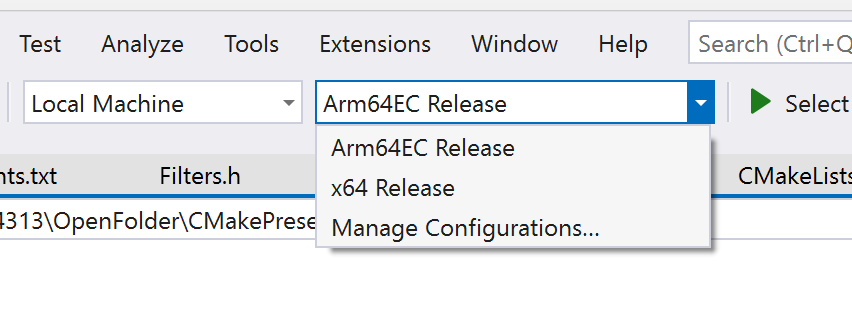
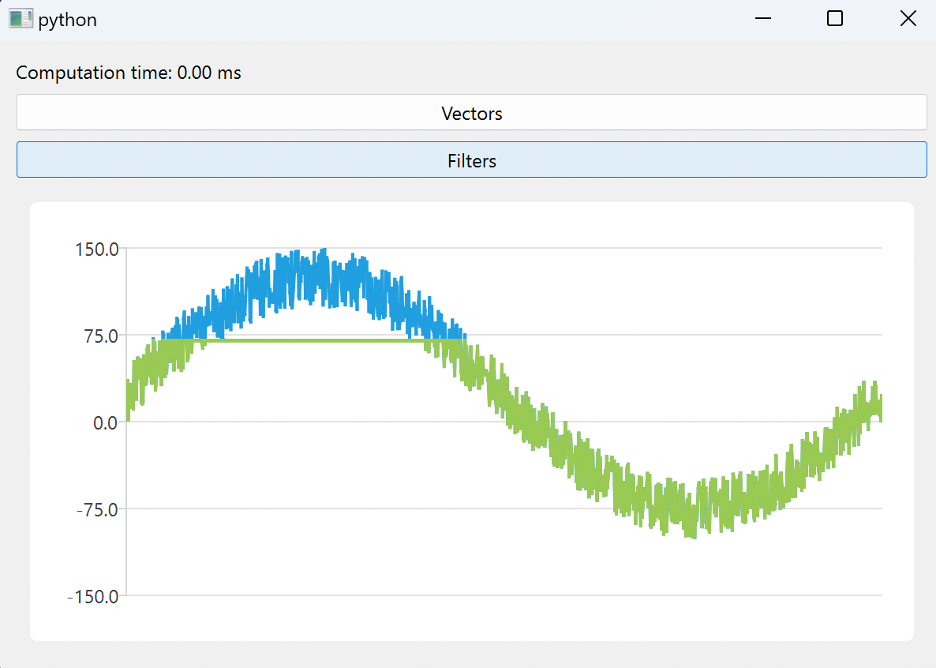

---
# User change
title: "Porting using CMake"

weight: 3

layout: "learningpathall"
---

## Objective
In this section, you will learn how to port each DLL to Arm64 using Arm64EC.

To use Arm64EC, you only need to configure the build target appropriately. As a result, your entire application can mix x64 dependencies with Arm64.

## Porting to Arm64 with Arm64EC

There are two ways of porting DLLs to Arm64 with Arm64EC. Which one you use depends on whether you use MSBuild or CMake projects. In the previous section, you used CMake, so you can use CMake here, too.

To port the DLL, modify the CMakePresets.json​ file by adding a final statement block so that the file looks like the following code snippet:

```cmake
{
  "version": 3,
  "configurePresets": [
    {
      "name": "windows-base",
      "hidden": true,
      "generator": "Ninja",
      "binaryDir": "${sourceDir}/out/build/${presetName}",
      "installDir": "${sourceDir}/out/install/${presetName}",
      "cacheVariables": {
        "CMAKE_C_COMPILER": "cl.exe",
        "CMAKE_CXX_COMPILER": "cl.exe"
      },
      "condition": {
        "type": "equals",
        "lhs": "${hostSystemName}",
        "rhs": "Windows"
      }
    },
    {
      "name": "x64-release",
      "displayName": "x64 Release",
      "inherits": "windows-base",
      "cacheVariables": {
        "CMAKE_BUILD_TYPE": "Release"
      }
    },
    {
      "name": "arm64EC-release",
      "displayName": "Arm64EC Release",
      "inherits": "x64-release",
      "architecture": {
        "value": "arm64ec",
        "strategy": "external"
      },
      "environment": {
        "CXXFLAGS": "/arm64EC",
        "CFLAGS": "/arm64EC"
      }
    }
  ]
}
```

Next, save the CMakePresets.json file. Visual Studio 2022 will automatically recognize this new build configuration and display it in the build configuration drop-down:



From this drop-down menu, select Arm64EC Release and build the application.

Since you are using the single CMake file for both DLLs, you will find both compiled DLLs under the out/build/arm64EC-release folder. Each DLL is located in the corresponding folder: Filters or Vectors. Copy those DLLs and create a new folder called Main-app/Dependencies/Arm64EC-release in the Main-app, as follows:

1. ARM64EC.Porting/out/build/arm64EC-release/Vectors/Vectors.dll to ARM64EC.Porting/Main-app/Dependencies/Arm64EC-release/Vectors.dll
2. ARM64EC.Porting/out/build/arm64EC-release/Filters/Filters.dll to ARM64EC.Porting/Main-app/Dependencies/Arm64EC-release/Filters.dll

To use those DLLs in the main application, update the following two variables in the Main-app/main.py file:

```python
vectorsLibName = os.path.join(rootPath, "Dependencies\\Arm64EC-release\\Vectors.dll")
filtersLibName = os.path.join(rootPath, "Dependencies\\Arm64EC-release\\Filters.dll")
```

Then, you can launch the Python app. Go to the Main-app folder and type 
```console
python main.py
``` 

The app will launch, and you can see it working as before:



Note, though, that the computation time is always 0.00. This is because you loaded the DLLs using the x64 process.

To load them as Arm64, you would need to use Python for Arm64. However, at the time of writing, PySide 6 was not available for Arm64 via pip. You will be able to fully test the porting once it becomes available.

Here are the detailed steps for launching the Python app under the Arm64 virtual environment on Windows:

1. Download [Python for Arm64](https://www.python.org/ftp/python/3.11.4/python-3.11.4-arm64.exe).
2. Configure a virtual environment by running 
```console 
py -3.11-arm64 -m venv venv-arm64
```
3. Activate a virtual environment by running 
```console
venv-arm64\Scripts\activate.bat
```
4. Install dependencies by running 
```console 
py -3.11-arm64 -m pip install -r requirements.txt
```
5. Run the app using:
```console
cd Main-app.
py -3.11-arm64 main.py
```

## Next steps
You learned how to use CMake for porting DLLs to Arm64 with ARM64EC. In the next step you will see how to achieve the same using MSBuild.
