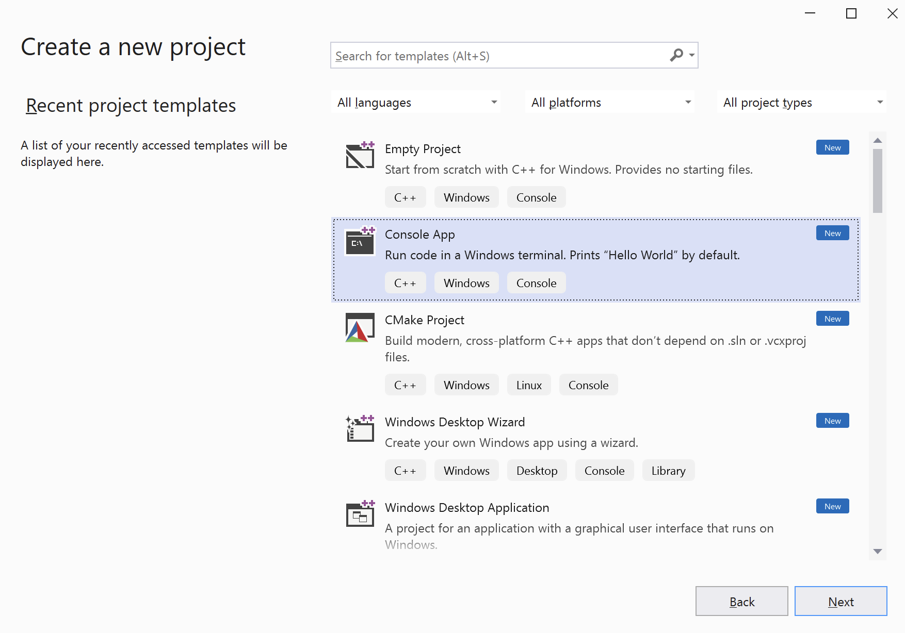
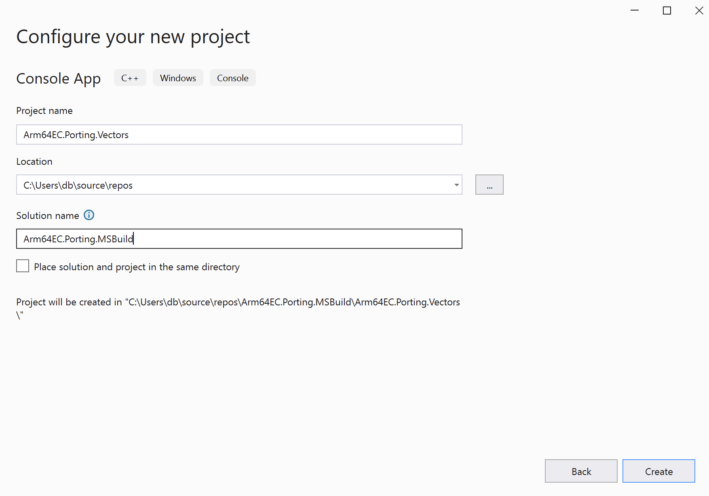
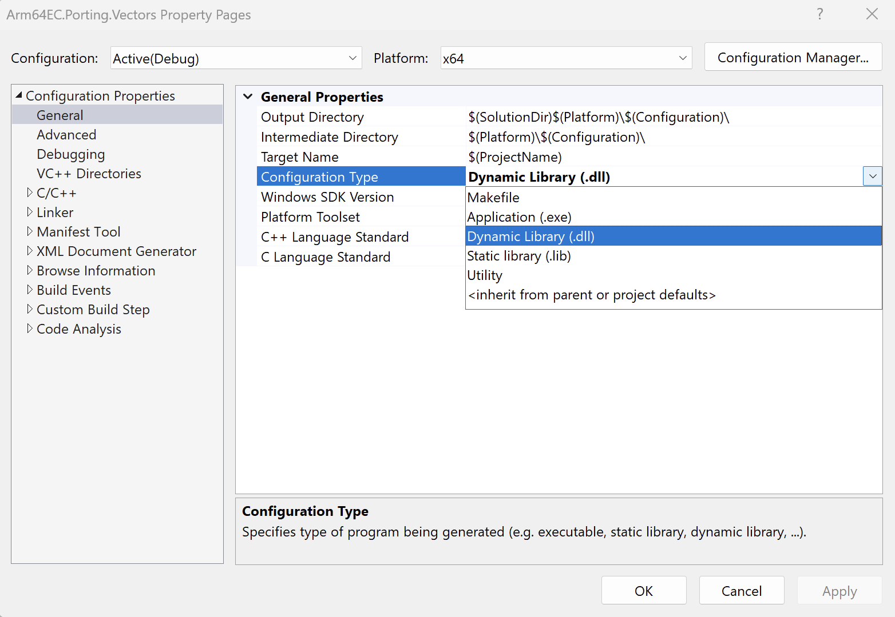
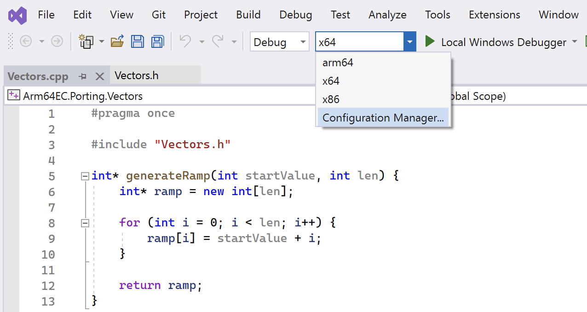
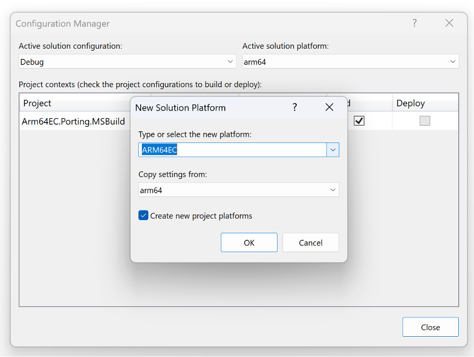

---
# User change
title: "Porting using MSBuild"

weight: 4

layout: "learningpathall"
---

## Objective
In this section, you will learn how to port each DLL to Arm64 using Arm64EC and MSBuild.

To use Arm64EC, you only need to configure the build target appropriately. As a result, your entire application can mix x64 dependencies with Arm64.

## Creating the project

Open Visual Studio 2022, click Create a new project, and look for Console Application Project in the window that appears



Then, configure the project template as follows:

1. Project name: **Arm64EC.Porting.Vectors**
2. Location: Select any location you want
3. Solution name: **Arm64EC.Porting.MSBuild**
4. Remember to uncheck *Place solution and project in the same directory*

The configuration should look this:



Click the Create button. After creating the project, you will have a single source file called `Arm64EC.Porting.Vectors.cpp`. Rename this file as `Vectors.cpp`.

Replace the default content of `Vectors.cpp` with the content shown below:

```cpp
#include "Vectors.h"

int* generateRamp(int startValue, int len) {
    int* ramp = new int[len];

    for (int i = 0; i < len; i++) {
        ramp[i] = startValue + i;
    }

    return ramp;
}

double msElapsedTime(chrono::system_clock::time_point start) {
    auto end = chrono::system_clock::now();

    return chrono::duration_cast<chrono::milliseconds>(end - start).count();
}

double dotProduct(int* vector1, int* vector2, int len) {
    double result = 0;

    for (int i = 0; i < len; i++) {
        result += (double)vector1[i] * vector2[i];
    }

    return result;
}

double performCalculations() {
    // Ramp length and number of trials
    const int rampLength = 1024;
    const int trials = 100000;

    // Generate two input vectors
    // (0, 1, ..., rampLength - 1)
    // (100, 101, ..., 100 + rampLength-1)
    auto ramp1 = generateRamp(0, rampLength);
    auto ramp2 = generateRamp(100, rampLength);

    // Invoke dotProduct and measure performance    
    auto start = chrono::system_clock::now();

    for (int i = 0; i < trials; i++) {
        dotProduct(ramp1, ramp2, rampLength);
    }    

    return msElapsedTime(start);
}
```

Then, open Solution Explorer, right-click Headers, and choose Add/New Item….

In the window that appears, type "Vectors.h" and click Add.

Replace the default contents of the `Vectors.h` file with the following code:

```cpp
#pragma once

#include <iostream>
#include <chrono>

using namespace std;

extern "C" __declspec(dllexport) double performCalculations();
```

By default, the Console App template generates an executable but you will need to change it to a DLL. To do this, go to Solution Explorer and right-click the Arm64EC.Porting.Vectors project. Then, select Properties. In the window that opens, choose Dynamic Library (.dll) from the Configuration Type drop-down list:



Click OK to close the Property Pages window.

Now, build the DLL by clicking Build/Build solution. The DLL should be located in the <platform (x64 or arm64>\<configuration (Debug or Release)> folder, which may appear as Arm64EC.Porting.MSBuild\x64\Debug.

To port this library to Arm64EC, you need to configure the target platform. To do this, click Configuration Manager from the drop-down menu:



In the Configuration Manager, create the new solution platform for Arm64EC:



Then, right-click on the Arm64EC.Porting.Vectors file and open the Properties window. Change the configuration type to DLL (as you did earlier for the x64 configuration). Once you have configured the solution platform, select it from the build target drop-down menu and build the solution.

The compiled DLL will be available under the ARM64EC subfolder. You can then use it in the **Main-app** in the same way as the DLLs built using CMake.

To use MSBuild for the second DLL, proceed in the same way. For your convenience, you can refer to the [full source code on GitHub](https://github.com/dawidborycki/Arm64EC.Porting.MSBuild/).

## Summary
This learning path demonstrated how to port C/C++ DLLs to Arm64 using Arm64EC. It showed you how to use CMake and MSBuild projects. You also learned how to use DLLs in the Python app with ctypes. This information can help you rapidly build UIs and keep computation-intensive work in a separate DLL. You can then build those DLLs for Arm64 and mix them with your existing x64 dependencies.
