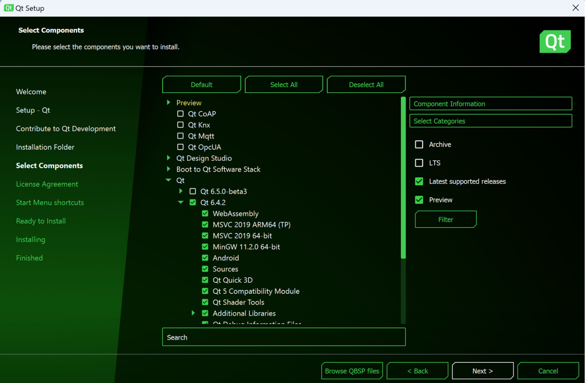
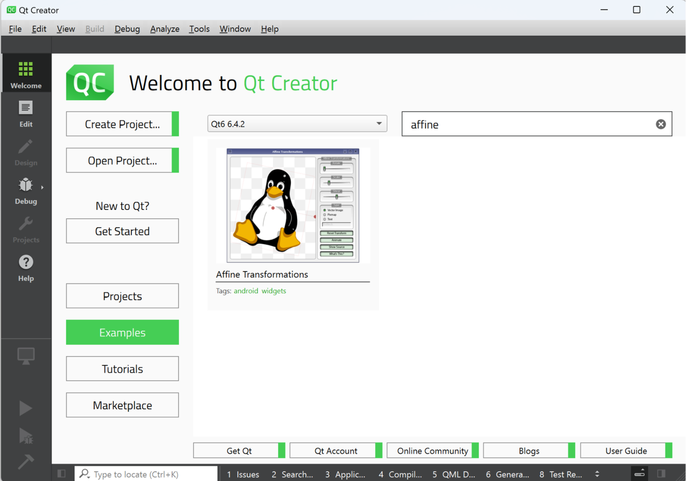
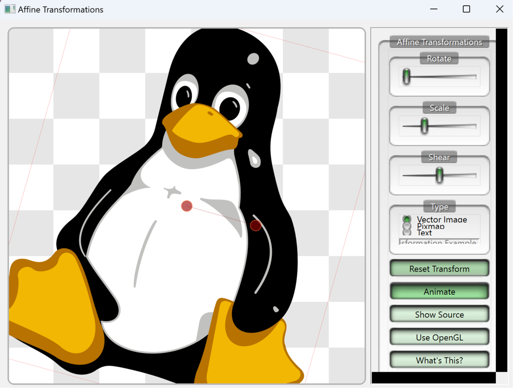
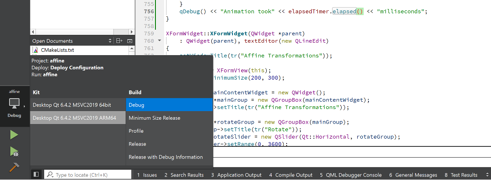
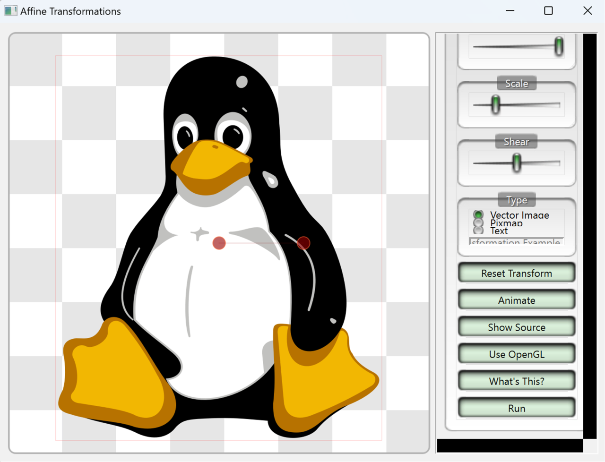
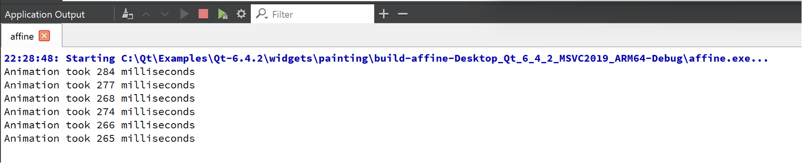

---
# User change
title: "Qt application"

weight: 2

layout: "learningpathall"
---

## Introduction
The Qt Framework (Qt) provides modularized C++ library classes and application programming interfaces (APIs) to accelerate cross-platform application development. Qt enables you to develop maintainable, highly performant, and reusable code. Thanks to its widget toolkit, all apps created with Qt have a native-looking user interface (UI). Qt also provides development tools, including Qt Creator, a cross-platform integrated development environment (IDE).

Qt v6.2 supports native development for Windows on Arm (WoA). To demonstrate the advantages of native development, you will learn how to perform affine transformations on graphic images. The transformations demonstrate the performance boost the AArch64 architecture provides. They include image rotation, scaling, and shearing which are commonly used by AI-powered machine vision systems. You will then learn how to reduce the computation time of the x64 architecture by 40% by making simple changes.

Starting from v6.2, Qt provides native development support for WoA. As a result, you can fully leverage device hardware to accelerate your graphical user interface (GUI)-based applications.

## Before you begin
You will need to install Qt on your Windows on Arm machine. Go to the Qt Group [download page](https://www.qt.io/download), register for the Qt trial, and download Qt. Alternatively, go to the [Qt for Open Source Development](https://www.qt.io/download-open-source) page and download the package from there.

In the Qt Setup window select, as a minimum, Qt version 6.2. In this example, we use version 6.4.



## Create the project
After installation, open the Qt Creator, click Examples, select Qt6, and type “affine” in the search box. The list of examples should include one project: Affine Transformations. Click on it to make the source code available in Qt Creator. 



{} If you are new to Qt Creator, consult the documentation for a quick introduction. Project files are on the left side, and double-clicking them opens them in the editor. The Run and Debug buttons are on the bottom left, or you can press F5 to run and debug your project and Ctrl + R to run it without the debugger.
 {}

Now build and run the app using default settings (F5 or Ctrl + R). After execution, the app should look like this:



The app continuously transforms the image of Tux (Linux's penguin character) by rotating, scaling, and shearing it. You can stop the animation by clicking Animate. It is active when the app runs inside the constructor of the XFormWidget.

Now you can modify this default behavior.

## Develop the application
To modify the Affine Transformations app, you will add one more button with a Run label. When you click this button, it invokes the custom `runAnimation` method. This method will be responsible for executing affine transformations several times. This allows you to measure the performance of these operations when you build the app for x64 and AArch64 architectures.

As with any other C++ app, the application's entry point is the main function, as defined in `main.cpp`. The main function initializes and displays XFormWidget, in `xform.h` and `xform.cpp`.

Start by changing the xform.h file (located inside the Header folder in the project tree on the left side). First, add one `include` directive to import the QElapsedTimer class, which you use to measure the code's execution time:

```Cpp
#ifndef XFORM_H
#define XFORM_H
 
#include "arthurwidgets.h"
 
#include <QBasicTimer>
#include <QPolygonF>

// Add the following
#include <QElapsedTimer>
//
```

Then, modify the declaration of the XFormView class by declaring the `runAnimation` method in the public slots section. You will associate this method with the click signal of the Run button:

```cpp
class XFormView : public ArthurFrame
{
// …
public slots:
    void setAnimation(bool animate);
    
    // Add the following
    void runAnimation();
    // 

    void updateControlPoints(const QPolygonF &);
    void changeRotation(int rotation);
    void changeScale(int scale);
    void changeShear(int shear);
    
    // ...
```

Finally, declare an instance of the QElapsedTimer object in the private section of the `xform.h` header file:

```cpp
private:
    QPolygonF m_controlPoints{{250, 250}, {350, 250}};
    HoverPoints *m_hoverPoints;
    qreal m_rotation = 0;
    qreal m_scale = 1;
    qreal m_shear = 0;
    XFormType m_type = VectorType;
    QPixmap m_pixmap;
    QString m_text;
    QBasicTimer timer;

    // Add the following
    QElapsedTimer elapsedTimer;
    //
```

Now, you need to modify the source file `xform.cpp`. Do this by adding a Run button, binding the `runAnimation` method with the click signal of that button, and disabling the invocation of the `animateClick` method. Disabling the invocation prevents the default animation from running when you launch the app.

Then, modify the XFormWidget constructor (the declaration of this class is after `XFormView`) with the following code:

```cpp
XFormWidget::XFormWidget(QWidget *parent)
    : QWidget(parent), textEditor(new QLineEdit)
{
    setWindowTitle(tr("Affine Transformations"));
 
    // ...
 
    QPushButton *whatsThisButton = new QPushButton(mainGroup);
    whatsThisButton->setText(tr("What's This?"));
    whatsThisButton->setCheckable(true);
 
    // Add the following
    QPushButton *runAnimationButton = new QPushButton(mainGroup);
    runAnimationButton->setText(tr("Run"));
    //

    // ...  
 
    QVBoxLayout *mainGroupLayout = new QVBoxLayout(mainGroup);
    mainGroupLayout->addWidget(rotateGroup);
    mainGroupLayout->addWidget(scaleGroup);
    mainGroupLayout->addWidget(shearGroup);
    mainGroupLayout->addWidget(typeGroup);
    mainGroupLayout->addStretch(1);
    mainGroupLayout->addWidget(resetButton);
    mainGroupLayout->addWidget(animateButton);
    mainGroupLayout->addWidget(showSourceButton);
#if QT_CONFIG(opengl)
    mainGroupLayout->addWidget(enableOpenGLButton);
#endif
    mainGroupLayout->addWidget(whatsThisButton);

    // Add the following
    mainGroupLayout->addWidget(runAnimationButton);
    //

    // ...
 
    connect(resetButton, &QPushButton::clicked, view, &XFormView::reset);
    connect(animateButton, &QPushButton::clicked, view, &XFormView::setAnimation);
    connect(whatsThisButton, &QPushButton::clicked, view, 
        &ArthurFrame::setDescriptionEnabled);

    // Add the following
    connect(runAnimationButton, &QPushButton::clicked, view, &XFormView::runAnimation);
    //

    connect(whatsThisButton, &QPushButton::clicked, view->hoverPoints(), 
        &HoverPoints::setDisabled);
    connect(view, &XFormView::descriptionEnabledChanged, view->hoverPoints(), 
        &HoverPoints::setDisabled);
    connect(view, &XFormView::descriptionEnabledChanged, whatsThisButton,
        &QPushButton::setChecked);
    connect(showSourceButton, &QPushButton::clicked, view, &XFormView::showSource);
#if QT_CONFIG(opengl)
    connect(enableOpenGLButton, &QPushButton::clicked, view, &XFormView::enableOpenGL);
#endif
    view->loadSourceFile(":res/affine/xform.cpp");
    view->loadDescription(":res/affine/xform.html");
 
    // defaults
    view->reset();
    vectorType->setChecked(true);   
    textEditor->setText("Qt Affine Transformation Example");
    textEditor->setEnabled(false);
 
    //animateButton->animateClick(); // Prevent running the default animation
}
```

Next, implement the `runAnimation` method in `xform.cpp` as shown below:

```cpp
void XFormView::runAnimation()
{
    // Restart timer
    elapsedTimer.restart();
    // Run affine transformations 10,000 times
    for(int i = 0; i < 10000; i++) {
        QPointF center(m_hoverPoints->points().at(0));
        QTransform m;
        m.translate(center.x(), center.y());
        m.rotate(0.2);
        m.translate(-center.x(), -center.y());
        m_hoverPoints->setPoints(m_hoverPoints->points() * m);
 
        setUpdatesEnabled(false);
        static qreal scale_inc = 0.003;
        static qreal shear_inc = -0.001;
        emit scaleChanged(int((m_scale + scale_inc) * 1000));
        emit shearChanged(int((m_shear + shear_inc) * 1000));
        if (m_scale >= 4.0 || m_scale <= 0.1)
            scale_inc = -scale_inc;
        if (m_shear >= 1.0 || m_shear <= -1.0)
            shear_inc = -shear_inc;
        setUpdatesEnabled(true);
 
        m_hoverPoints->firePointChange();
    }
    // Measure performance
    qDebug() << "Animation took" << elapsedTimer.elapsed() << "milliseconds";
}
```

The method works the same as the original event handler for the **Animate** button. It translates (`QTransform.translate`), rotates (`QTransform.rotate`), scales (`QTransform.scale`), and shears (`QTransform.shear`) the image. It implements all of these actions using the statements under the *for loop*. `QTransform` uses the transformation matrix to perform the affine transformation. You can also manually set elements of that matrix using the `QTransform.setMatrix` method.

The user interface is updated using signals (via the emit keyword). This update performs the scale and shear changes.

To summarize, you have made three changes:
1. `elapsedTimer.restart` method to restart an instance of the **QElapsedTimer**.
2. Embedded transformations within a *for loop*
3. `qDebug` to print information about the code execution time in the debugger console

All of the above changes are architecture independent. This means that you can use the same features when developing for AArch64 as you would for x64, including debugging. You can also use the provided `CMakeLists.txt` to configure CMake and add unit tests to the project.

## Run the Application

Now it's time to run the application using the AArch64 build. To do this, use the icons in the bottom left corner of the QtCreator. Select **Desktop Qt 6.4.2 MSVC2019 ARM64**:



Start debugging by clicking on the green play icon. The application will launch:



Click **Run** to trigger the animation. The Tux image is transformed 10,000 times. The time needed for the transformations appears in the Application Output window at the bottom of the Qt Creator window. You must click Application Output or press Alt + 3 to view it:



On average, the computation time is approximately 270 milliseconds when the app uses AArch64 architecture.

Now, switch to x64, rebuild, and launch the app. Click **Run** and you will see the computation time for the x64 architecture:


The computations are slower and take about 438 milliseconds on average. This means that your app performs 1.6 times faster on AArch64 than on x64.

## Summary

The Qt Framework, starting from version 6.2, supports native Windows on Arm (WoA) development. This tutorial demonstrates the benefits of using Qt when building for AArch64 processors. Qt enables you to develop maintainable, highly performant, and reusable code, and its support for WoA allows your apps to perform much better. In this learning path, the build on AArch64 was 1.6 times faster than x64.

You can take advantage of this performance boost by switching the build configuration in the Qt interface. Everything else stays the same. You can quickly accelerate your existing Qt applications and process application commands almost twice as fast. 
