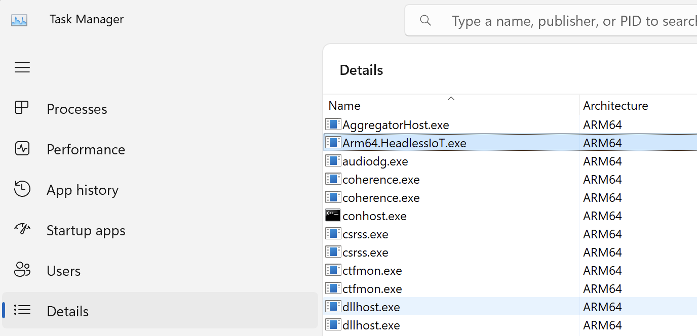
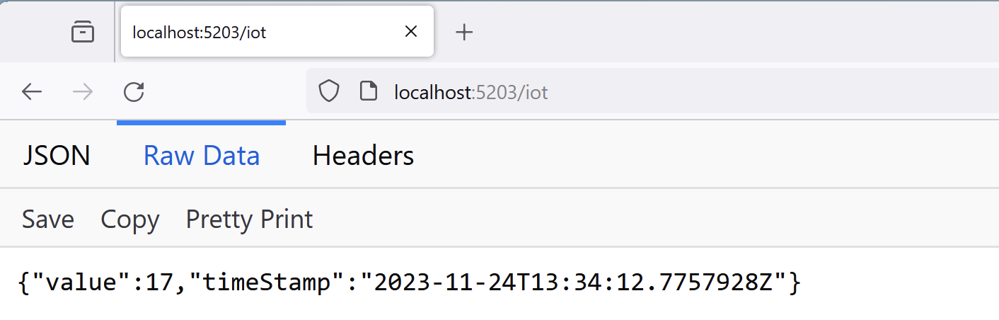
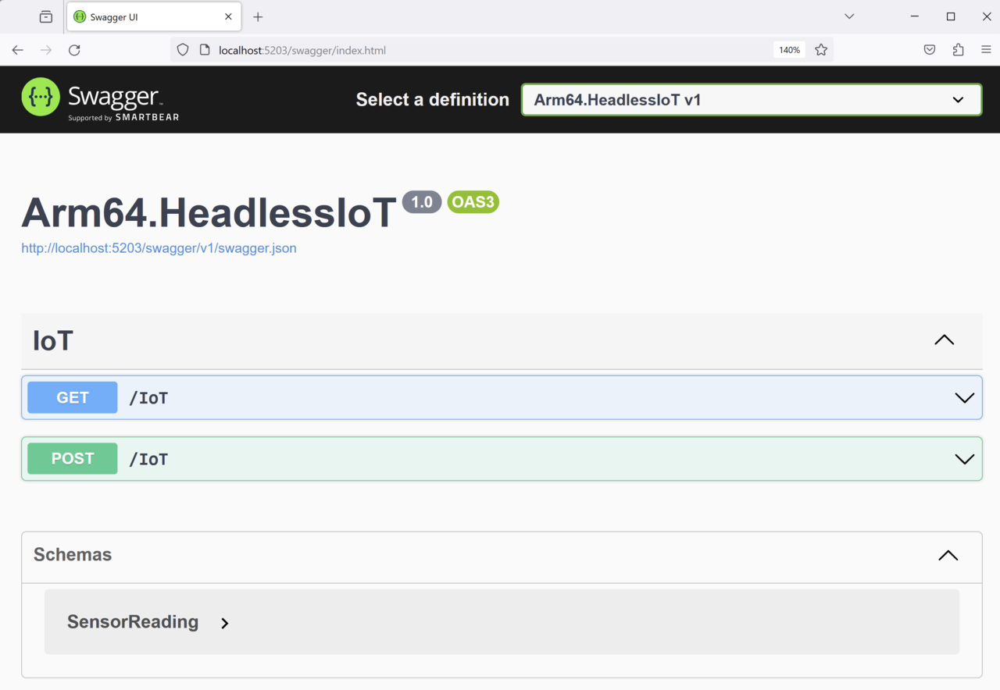
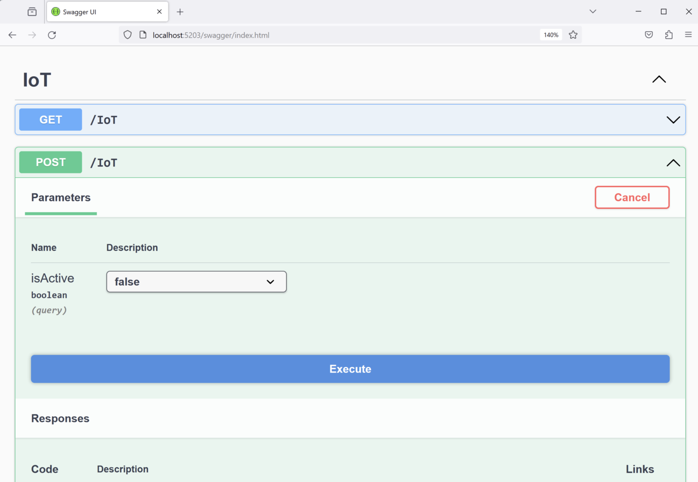

---
# User change
title: "Build, run, and access the web server"

weight: 3

layout: "learningpathall"
---

## Objective
In this section, you will build and run the Arm64.HeadlessIoT project you have just created.

## Building and running the application
To build and run the application proceed as follows. 

Open the command prompt window, go to the project's folder and type:
```console
dotnet run
```

The command will generate the following output:

```output
dotnet run
Building...
info: Microsoft.Hosting.Lifetime[14]
      Now listening on: http://localhost:5203
info: Microsoft.Hosting.Lifetime[0]
      Application started. Press Ctrl+C to shut down.
info: Microsoft.Hosting.Lifetime[0]
      Hosting environment: Development
info: Microsoft.Hosting.Lifetime[0]
      Content root path: C:\Arm64.HeadlessIoT
```

You can check the processor architecture used by the app by opening the Task Manager and clicking on the Details pane:



Here the architecture is **ARM64**.

{} The dotnet run command uses Arm64 architecture by default. If you have multiple SDKs , you must explicitly specify the architecture using the -a parameter. For example: 

```console
dotnet run -a x64
```
{}

## Test the GET request

Now, open the web browser (or use wget) and navigate to http://localhost:<port>/iot, where **port** should match the port value shown after **Now listening** on the output of the dotnet run command (in this example the port is **5203**). Doing this invokes the GET method of IoTController and you can see the sensor reading rendered as a JSON-formatted string:



The web server outputs an emulated sensor reading which in this case reported a temperature value of 17.

## Test the POST request

To test the POST method of the `IoTController` class, use curl, Postman, or Swagger. Swagger is the simplest to use as it's available in the project you just created.

To access Swagger, type http://localhost:<port>/swagger in the web browser's address bar. This URL takes you to the following screen:



Now, expand the **POST** section and click the **Try it out** button. The caption of this button will change to **Cancel**, and the **isActive** drop-down list becomes active. Set **isActive** to false, and then click **Execute**:



This action sends the **POST** request to **IoTController** and disables the emulator. All subsequent **GET** calls to the **IoTController** will return the last known sensor reading (which is the final reading generated before disabling the emulator). When you set **isActive** back to true and send the **GET** request to the web server, you will see the temperature setting update.

## Summary
This learning path has demonstrated how to use ASP.NET Core to implement a web API server for headless IoT apps running on Windows 11 on Arm. It showed how the web server can retrieve simulated sensor readings from a temperature sensor emulator. It also showed how to control the emulator through a web server. Finally, it demonstrated the use of the dependency injection in ASP.NET Core and Swagger to test a web API. ASP.NET Core is cross-platform, allowing you to use a similar approach to run web servers on non-Windows platforms.

By combining ASP.NET Core with Arm64, you can implement high-performance, low-power consumption web servers for all your applications. 
