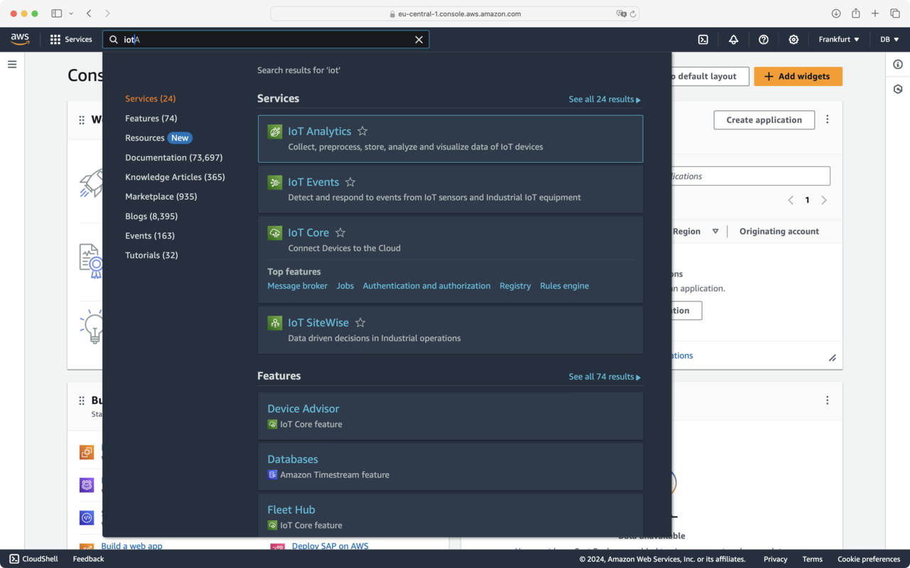
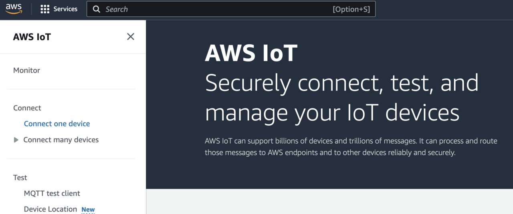
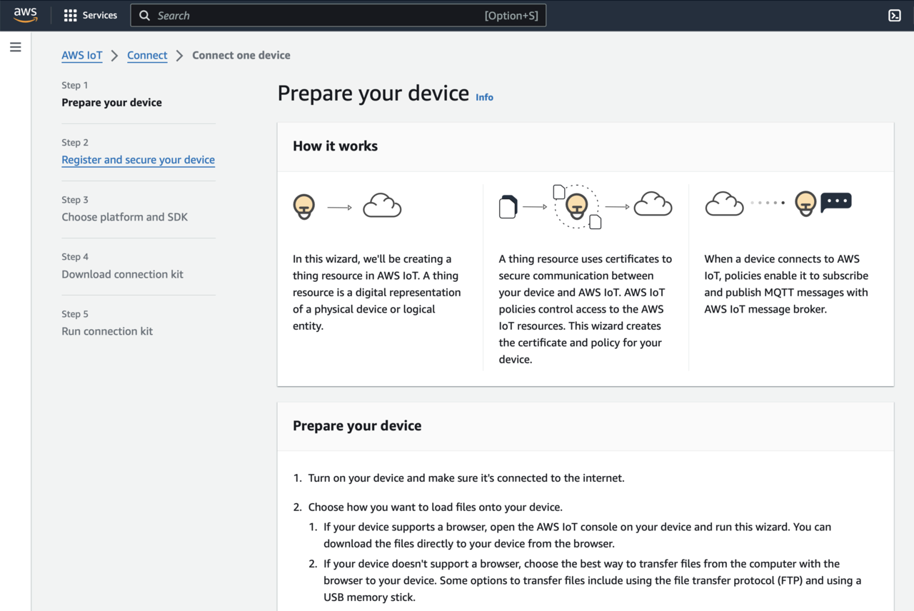
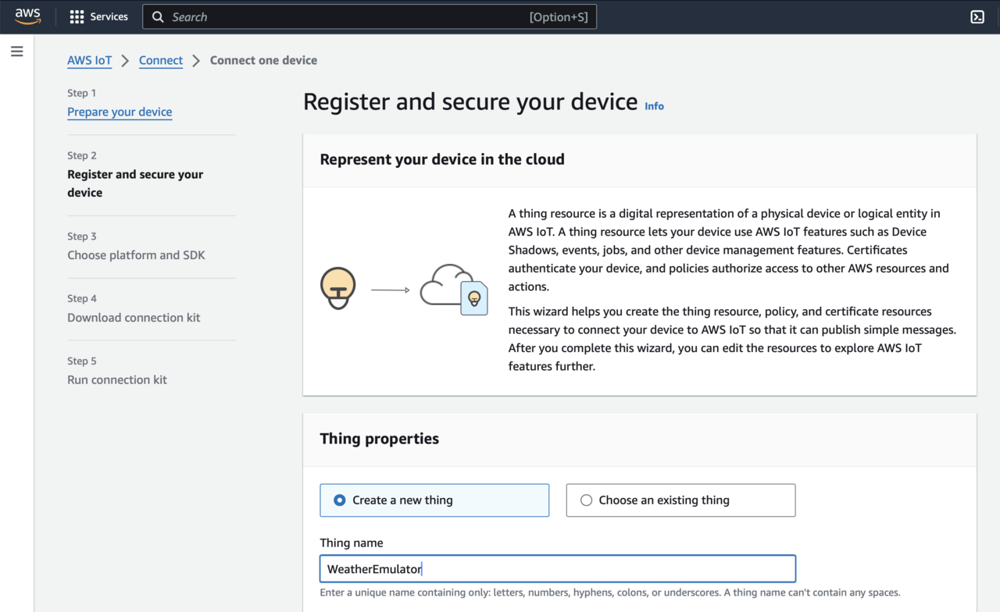
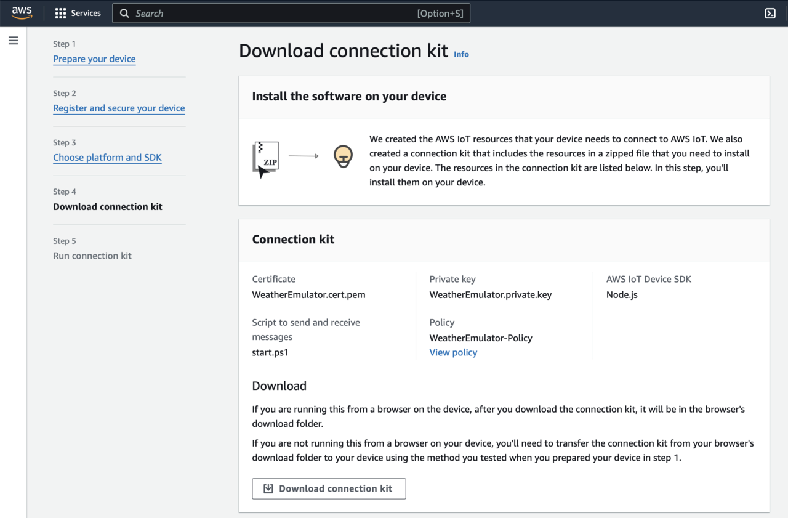
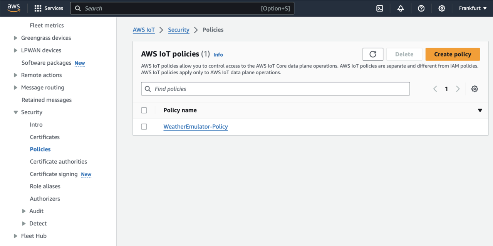
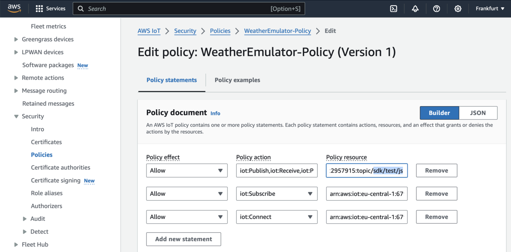

## Objective
In this section, you connect the emulator to AWS IoT Core.

## Connecting the emulator
Log in to the AWS Console at https://aws.amazon.com, and then search for IoT. From the list that appears, select **IoT Core**:



In the AWS IoT console, click **Connect one device**:



This will open the **Connect one device** wizard:



In the first step of this wizard, **Register and secure your device**, you can see the ping command, which you can use to ensure you can connect to AWS services. 

The command looks like this:

```console
ping a6t44uzbanvsz-ats.iot.eu-central-1.amazonaws.com
```

The actual domain depends on the AWS region you use. Open the terminal or command prompt and invoke this command. The command's output looks like this:

```console
ping a6t44uzbanvsz-ats.iot.eu-central-1.amazonaws.com
PING a6t44uzbanvsz-ats.iot.eu-central-1.amazonaws.com (3.73.237.68): 56 data bytes
64 bytes from 3.73.237.68: icmp_seq=0 ttl=240 time=18.906 ms
64 bytes from 3.73.237.68: icmp_seq=1 ttl=240 time=17.835 ms
64 bytes from 3.73.237.68: icmp_seq=2 ttl=240 time=21.945 ms
```

Note that the **a6t44uzbanvsz-ats.iot.eu-central-1.amazonaws.com** is your endpoint. This is where your emulator sends data to. Note this value, as you will need it later to update the application settings.

Click the **Next** button. This takes you to the **Register and secure your device** step, in which you type **WeatherEmulator** under the **Thing** name:



Then, click the **Next** button, which opens the **Choose platform and SDK** window, in which you select:
* **Windows** from the **Device platform operating system**.
* **Node.js** from the **AWS IoT Device SDK**.


Afterwards, click the **Next** button, which takes you to the **Download connection kit** step, in which you click the **Download connection kit** button to get the zip with certificates and the sample code, which sends data to the AWS cloud:



After downloading the kit, click the **Next** button. This takes you to the **Run connection kit**, in which you click the **Continue** button. This takes you back to the AWS IoT screen.

Now, unzip the downloaded file. Save it to the folder **certificates**. Then navigate to the **certificates** folder, and type the following command to download the Amazon Root CA certificate:

```console
Invoke-WebRequest -Uri https://www.amazontrust.com/repository/AmazonRootCA1.pem -OutFile AmazonRootCA1.pem
```

Open the common.js file and update the rootCertDir to point to your certificates folder. Then, update the host to match the host name you got during device creation. Here, that was a6t44uzbanvsz-ats.iot.eu-central-1.amazonaws.com:

```JavaScript
const awsConnectionInfo = {
    keyPath: `${rootCertDir}WeatherEmulator.private.key`,
    certPath: `${rootCertDir}WeatherEmulator.cert.pem`,
    caPath: `${rootCertDir}AmazonRootCA1.pem`,
    host: 'a6t44uzbanvsz-ats.iot.eu-central-1.amazonaws.com', 
    clientId: 'WeatherStationEmulator'
};
```

Make sure you save the file.

## Configure the connection policy
Before you can connect the device to the AWS IoT Core, you need to configure the security policy, which was attached to the certificate you created along the device in AWS IoT Core. The default policy, however, only allows connections from the device with the clientId contained in either 'sdk-java', 'basicPubSub', or 'sdk-nodejs-*'. In this case, however, the device identifier was set to WeatherStationEmulator (see common.js). Moreover, the default policy was configured such that it enables the device to publish and subscribe to the following topics: 'sdk/test/java', 'sdk/test/python', and 'sdk/test/js'. Again, the application was configured to use different topics: 'Emulators/Weather/SensorReadings' to stream the sensor readings, and 'Emulators/Weather/Control' to control the device. So, we need to appropriately configure the security policy.

To update the policy, under the AWS IoT console, click **Security** -> **Policies**:



There should be one policy, **WeatherEmulator-Policy**. Click that policy. This opens another view, in which you can see the policy details. In that view, click **Edit active version** button, which opens the Edit policy view:



Modify the first entry ('iot:Publish,iot:Receive,iot:PublishRetain') such that you replace the 'topic/sdk/test/js' with 'topic/*'. This will enable the application to publish and receive messages from any topic. Similarly, modify the second entry, and replace 'topicfilter/sdk/test/js' with 'topicfilter/*'. 

Finally, modify the third entry, in which you replace 'client/sdk-nodejs-*' with 'client/*'. Then, check **Set the edited version as the active version for this policy**, and click the **Save as new version** button.

## Running the application
You can now run the application. To do so, open the terminal or the command prompt, change the working directory to AWS.WeatherStation, and then type:

```console
npm install
```

This installs the dependencies. Then you launch the application by typing:

```console
npm start
```

The output of the application looks as follows:
```output
PS C:\Users\db\AWS.WeatherStation> npm start  
Debugger attached.

> aws.weatherstation@1.0.0 start
> node app.js

Debugger attached.
Connected to AWS IoT
{"deviceId":"WeatherStationEmulator","timestamp":"2024-04-25T08:10:28.413Z","temperature":"32.75","humidity":"52","pressure":"1014.4"}
{"deviceId":"WeatherStationEmulator","timestamp":"2024-04-25T08:10:29.420Z","temperature":"28.33","humidity":"52","pressure":"1039.3"}
{"deviceId":"WeatherStationEmulator","timestamp":"2024-04-25T08:10:30.424Z","temperature":"24.64","humidity":"58","pressure":"1033.8"}
```

The device is sending data to the AWS IoT Core.

## Summary
You have successfully connected the weather station emulator to AWS IoT Core. In the next step, you ensure that the data is successfully retrieved on the AWS side.