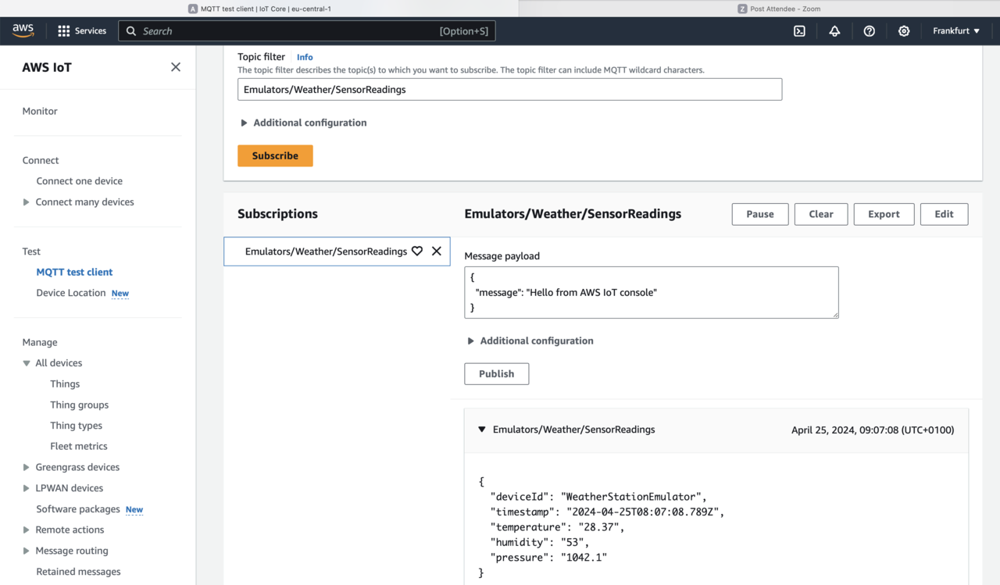

## Objective
In this section, you verify that data from the emulator is being sent to AWS IoT Core.

## MQQT Test Client
To check the data transmission, you can use the MQTT Test Client available in the AWS IoT Core console. Follow these steps:

Under AWS IoT Core, click on **MQTT test client** under the **Test** menu.
In the 'Topic Filter' field, type 'Emulators/Weather/SensorReadings', and click the **Subscribe** button.
You will see the data sent by the emulator displayed:

