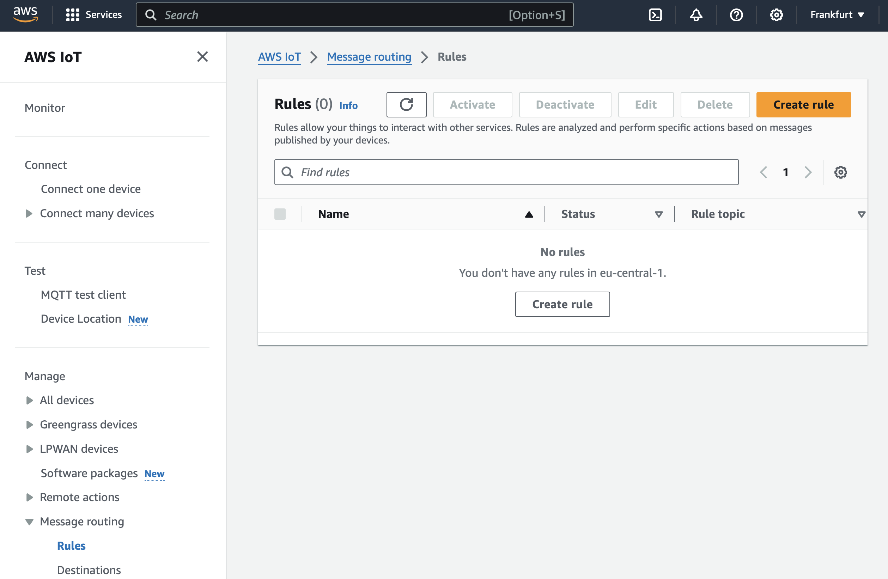
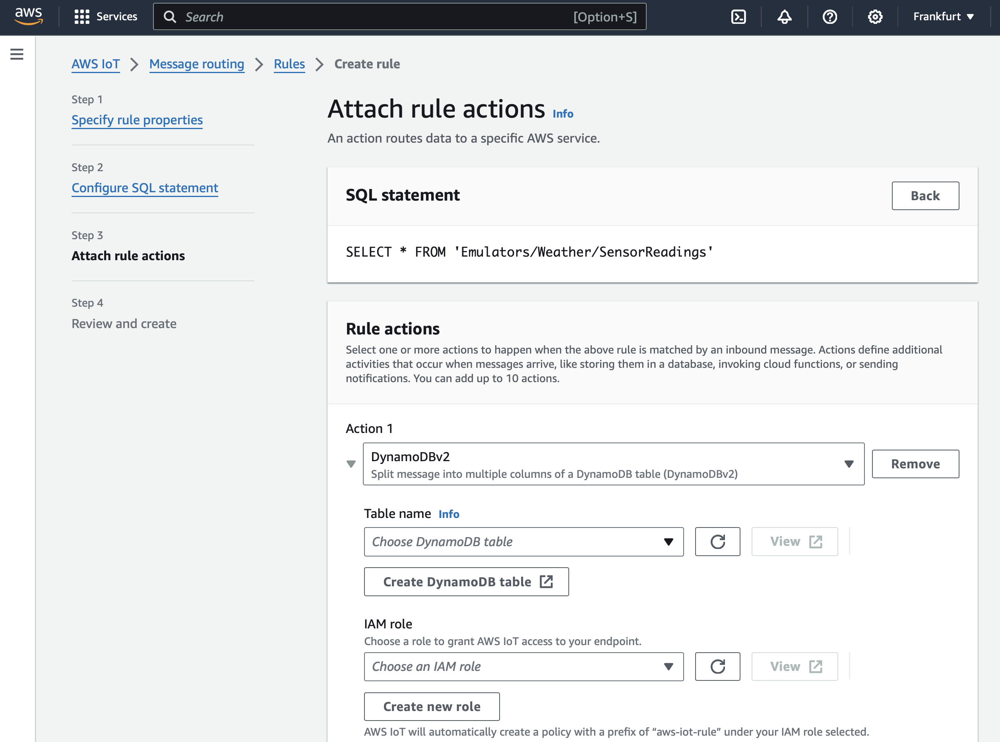
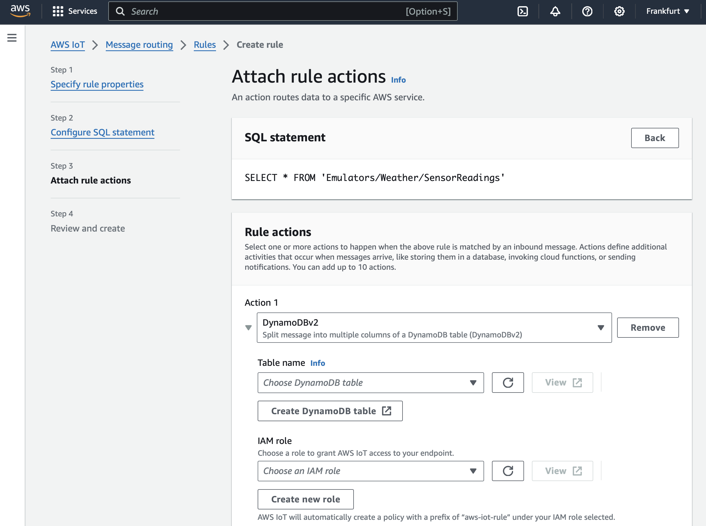
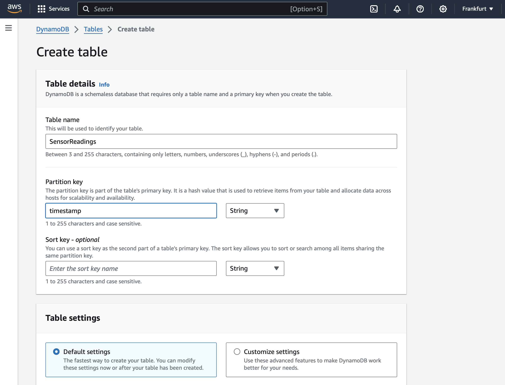
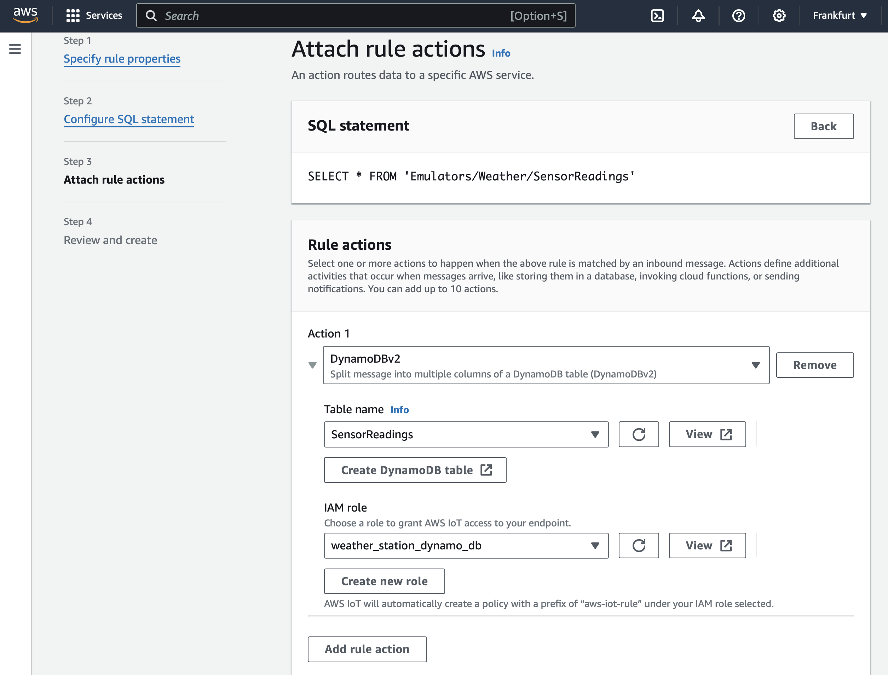
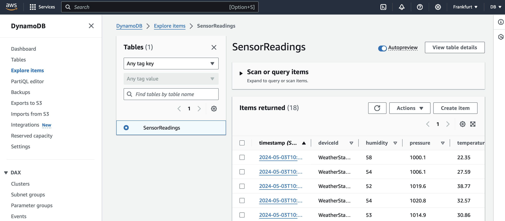

---
# User change
title: "Create a ASP.NET Core Web API project"

weight: 2

layout: "learningpathall"
---

## Introduction
Amazon DynamoDB is a fully managed NoSQL database service provided by Amazon Web Services (AWS), designed to deliver fast and predictable performance with seamless scalability. DynamoDB allows users to offload the administrative burdens of operating and scaling a distributed database, so they don't have to worry about hardware provisioning, setup and configuration, replication, software patching, or cluster scaling. It offers built-in security, backup and restore, and in-memory caching for internet-scale applications. DynamoDB supports key-value and document data structures, making it an ideal choice for IoT, and many other applications that require low-latency data access at any scale.

Amazon DynamoDB uses partitioning, which is a mechanism that allows the database to scale horizontally and distribute large amounts of data across multiple servers while ensuring quick data access and high availability. The system automatically manages the partitioning of data based on the table's primary key. DynamoDB tables use a primary key that can either be a single-attribute (partition key) or a composite (partition key and sort key). The partition key's value is used by DynamoDB as input to an internal hash function, which outputs the partition in which the data will be stored. Each item's partition key value is hashed, and the resulting hash value determines the physical partition where the item and its associated values are stored. This approach helps in evenly distributing data across partitions, maximizing scalability and performance. As the amount of data in DynamoDB grows, or the throughput requirements change, DynamoDB can increase the number of partitions to distribute data across additional nodes. This enables the database to maintain consistent performance, even as the workload increases. Users do not need to manually manage partitions. DynamoDB automatically partitions the data in the background, adjusting its placement to optimize performance and storage efficiency. This feature is particularly useful in handling uneven data access patterns or what is often referred to as "hot keys." When you provision read and write throughput capacity on your DynamoDB table, the service ensures that this capacity is evenly distributed across all partitions. This feature helps to avoid performance bottlenecks and ensures that the database can handle large volumes of concurrent read and write operations.

The Rules Engine in AWS IoT Core is a powerful feature designed to process and route data between IoT devices and other AWS services or external endpoints. It provides the necessary tools to create scalable and efficient IoT applications by enabling real-time data processing and decision-making based on the messages published to AWS IoT Core. 

The Rules Engine evaluates incoming MQTT messages published to AWS IoT Core based on the rules you define. Each rule is essentially an SQL-like query that selects data from specific MQTT topics as messages arrive. Users define rules using an SQL-like syntax that allows selecting and processing data from the MQTT messages. For instance, you can specify conditions to filter and extract data from the message payload. After processing the messages, the Rules Engine can perform various actions based on the data and conditions specified in the rule. Actions include sending data to other AWS services such as Lambda, DynamoDB, S3, or external HTTP endpoints, making it highly versatile in integrating with broader AWS capabilities. The Rules Engine can transform or enrich the incoming data before sending it to another service. This includes operations like concatenating strings, calculating new values, or even using functions to modify the data format.

The AWS IoT Core Rules Engine dramatically simplifies the development of IoT solutions by efficiently managing data flow and enabling complex, condition-based actions directly within the IoT infrastructure. This leads to more responsive, dynamic, and efficient IoT systems.

In this learning path, you will learn how to use the Rules Engine from AWS IoT Core to capture data sent from the IoT emulator running on an Arm64-powered device. The data will be automatically written to the DynamoDB database.

## Before you begin
Before you begin, make sure to prepare the weather station emulator and connect it to AWS IoT Core by completing this [learning path](/learning-paths/laptops-and-desktops/win_aws_iot) 

## Create the rule
Start by creating the rule: 
1. Open AWS IoT Core, and then look for the Rules under Message routing:

2. Click the Create rule button. This will open another view, in which you configure the rule:

3. Use the Create rule view to configure the rule as follows. First, under the rule name, type: send_message_to_dynamodb. Then, click the Next button. This will take you to the Configure SQL statement, where you use the following SQL query:

```sql
SELECT * FROM 'Emulators/Weather/SensorReadings'
```


4. Click the Next button.



5. This opens the Attach rule actions, where under Action 1, select DynamoDBv2. This will activate additional controls (see figure below):



6. Click the Create DynamoDB table. This will open another tab, where you type SensorReadings for the Table name and timestamp for the partition key. Ensure to check Default settings, scroll down, and click the Create table button. Wait a few moments for the table to be created. Then, return to the Create rule view.



7. In the Create rule view, click the Refresh button next to the Choose DynamoDB table name dropdown. Then, select the SensorReadings table from that dropdown. Afterward, click the Create new role button (located below the IAM role). This activates the Create role popup.

8. In the Create role popup window, type 'weather_station_dynamo_db', and click the Create button. At this point, the Attach rule actions screen should look as follows:



9. Scroll down and click the Next button. This displays the summary screen, where you click the Create button.

## Test the rule
Now, everything is set up. The messages sent from the device will be automatically inserted as new rows into the SensorReadings table. To check this, run the application you created in [insert missing link here]. Namely, open the command prompt, change the working directory to AWS.WeatherStation, and then type:

```console
npm start
```

This starts the emulator, which streams data to the AWS IoT Core. The output of the emulator will look as follows:

```output
{"deviceId":"WeatherStationEmulator","timestamp":"2024-05-03T10:40:51.239Z","temperature":"22.35","humidity":"58","pressure":"1000.1"}
{"deviceId":"WeatherStationEmulator","timestamp":"2024-05-03T10:40:52.274Z","temperature":"27.59","humidity":"54","pressure":"1006.1"}
{"deviceId":"WeatherStationEmulator","timestamp":"2024-05-03T10:40:53.296Z","temperature":"38.77","humidity":"52","pressure":"1019.6"}
{"deviceId":"WeatherStationEmulator","timestamp":"2024-05-03T10:40:54.305Z","temperature":"32.57","humidity":"54","pressure":"1020.8"}
{"deviceId":"WeatherStationEmulator","timestamp":"2024-05-03T10:40:55.305Z","temperature":"30.86","humidity":"53","pressure":"1014.9"}
```

To ensure this data is written to the DynamoDB table, go to the AWS console, and in the search box type 'DynamoDB'. Select DynamoDB from the list. This will take you to the DynamoDB dashboard, where you click Explore items on the left. Then, check the SensorReadings radio button, and you will see the items in the table:



Note that the values in the table are the same as those generated by the emulator. This ensures that you have successfully integrated AWS IoT Core with DynamoDB.

## Summary
In this learning path, you learned how to use the Rules Engine to write data from the weather station emulator to DynamoDB. This process involved creating a database in Amazon DynamoDB and using the Rules Engine to establish rules that automatically transfer the data to a DynamoDB table. Through these steps, you gained practical experience in managing real-time IoT data workflows and enhancing the scalability and responsiveness of IoT applications.